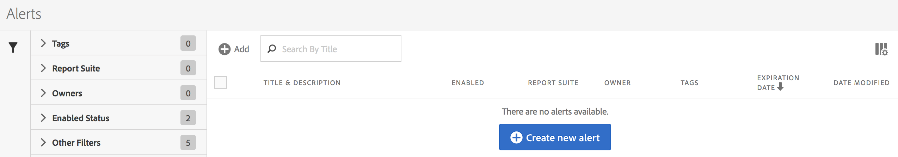

## Manage alerts

You can manage existing alerts in the Alerts manager. You can perform various management tasks on alerts, such as tagging, renaming, deleting, and more.

The Alerts manager is structured very much like the [Segment Manager](https://experienceleague.adobe.com/docs/analytics/components/segmentation/segmentation-workflow/seg-manage.html) and the [Calculated Metric Manager](https://experienceleague.adobe.com/docs/analytics/components/calculated-metrics/calcmetric-workflow/cm-manager.html).

## Create alerts

To create alerts from the Alerts manager:

1. Select **[!UICONTROL Components]** > **[!UICONTROL Alerts]** to access the Alerts manager in Adobe Analytics.

   

1. Select [!UICONTROL **Add**] (or [!UICONTROL **Create new alert**] if you don't have any existing alerts).

1. Continue with [Create alerts](/help/analyze/analysis-workspace/c-intelligent-alerts/alert-builder.md) for more details about creating alerts.

## Manage existing alerts 

To manage existing alerts in the Alerts manager:

1. Select **[!UICONTROL Components]** > **[!UICONTROL Alerts]** to access the Alerts manager in Adobe Analytics.

   

1. Select one or more alerts that you want to manage.

   

1. In the action bar, select any of the following options:

   | Action | Function | 
   |---------|----------|
   | [!UICONTROL **Tag**] | Apply a tag to an alert. This helps you to organize alerts for ease of use. | 
   | [!UICONTROL **Delete**] | Deletes the alert. | 
   | [!UICONTROL **Rename**] | Renames the alert. |
   | [!UICONTROL **Approve**] | Mark the alert as Approved. |
   | [!UICONTROL **Copy**] | Creates a copy (duplicate) of the alert. |
   | [!UICONTROL **Disable**] | Disables an alert that is currently enabled. |
   | [!UICONTROL **Enable**] | Enables an alert that is currently disabled. |
   | [!UICONTROL **Renew**] | Renews the alert expiration date. This extends the  expiration date to be 1 year from the day you selected this option, regardless of the original expiration date. |
   | [!UICONTROL **Export to CSV**] | Exports the alert to a .CSV file. |
