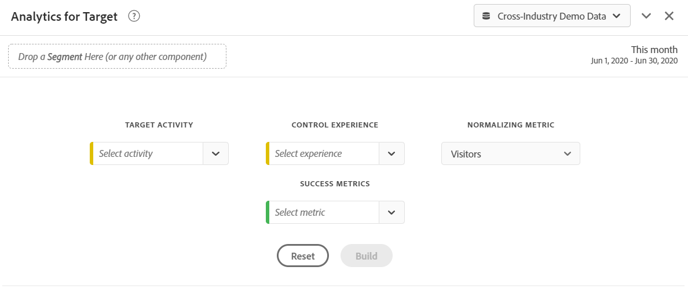

# Analytics for Target panel {#analyze-for-target-panel}

<!-- markdownlint-disable MD034 -->

>[!CONTEXTUALHELP]
>id="workspace_a4t_button"
>title="Analytics for Target"
>abstract="Analyze Target activities and experiences in Analysis Workspace."

<!-- markdownlint-enable MD034 -->

<!-- markdownlint-disable MD034 -->

>[!CONTEXTUALHELP]
>id="workspace_a4t_panel"
>title="Analytics for Target panel"
>abstract="Analyze Target activities and experiences in Analysis Workspace.  **Parameters** **Target activity**: The Target activity that will be analyzed. **Control experience**: Control experience for the selected Target activity. **Normalizing metric**: Visitors, visits, or impressions. This metric (also referred to as the counting methodology) becomes the denominator of the lift calculation. It also affects how the data is aggregated before the confidence calculation is applied. **Success metrics**: Up to 3 standard (non-calculated) success metrics to analyze the Target activity against."

<!-- markdownlint-enable MD034 -->

>[!BEGINSHADEBOX]

*This article documents the Analytics for Target panel in  **Adobe Analytics**. See [Experimentation panel](https://experienceleague.adobe.com/en/docs/analytics/analyze/analysis-workspace/panels/a4t-panel) for information on how to compare different user experiences, marketing, or messaging variations in  **Customer Journey Analytics**.*

>[!ENDSHADEBOX]

The Analytics for Target panel lets you analyze your Adobe Target activities and experiences in Analysis Workspace. The panel also enables you to see lift & confidence for up to 3 success metrics. To access the Analytics for Target panel, navigate to a report suite with Analytics for Target components enabled. Then, select the panel icon on the far left and drag the Analytics for Target panel into your Analysis Workspace Project.

+++Here is a short video overview of the Analytics for Target panel:

>[!VIDEO](https://video.tv.adobe.com/v/37247/?quality=12)

+++

## Use

To use an **[!UICONTROL Analytics for Target]** panel:

1. Create an **[!UICONTROL Analytics for Target]** panel. For information about how to create a panel, see [Create a panel](panels.md#create-a-panel).

1. Specify the [input](#panel-input) for the panel.

1. Observe the [output](#panel-output) for the panel.

### Panel input {#panel-nput}

You can configure the Analytics for Target panel using these input settings:

|Setting|Description|
|---|---|
|**[!UICONTROL Target Activity]**|Select from a list of Target Activities, or drag & drop an activity from the left rail. Note: The list is populated with the last 6 months of activities that had at least 1 hit. If you do not see an activity in the list, it may be older than 6 months. It can still be added from the left rail, which has a look-back period of up to 18 months.|
|**[!UICONTROL Control Experience]**|Select your control experience. You can change it if necessary in the drop-down list.|
|**[!UICONTROL Normalizing metric]**| Choose from Unique Visitors, Visits, or Activity Impressions. Unique visitors is recommended for most analysis use cases. This metric (also referred to as the counting methodology) becomes the denominator of the lift calculation. It also affects how the data is aggregated before the confidence calculation is applied.|
|**[!UICONTROL Success metrics]**| Select up to 3 standard (non-calculated) success events from the drop-downs, or drag & drop metrics from the left rail. Each metric will have a dedicated table and visualization in the rendered panel.|
|C**[!UICONTROL alendar date range]**| This will auto-populate based on the Activity date range from Adobe Target. You can change it if necessary.|

### Panel output {#panel-output}

The Analytics for Target panel returns a rich set of data and visualizations to help you better understand how your Adobe Target activity and experiences are performing. At the top of the panel, a summary line is provided to remind you of the panel settings you selected. At any time, you can edit the panel by clicking the edit pencil in the top right.

For each success metric you selected, one freeform table and one conversion rate trend will be shown:

Each freeform table shows the following metric columns:

|Metric|Description|
|---|---|
|**[!UICONTROL Normalizing metrics]**| Unique Visitors, Visits, or Activity Impressions.|
|**[!UICONTROL Success metric]**|The metric selected in the builder|
|**[!UICONTROL Conversion rate]**|Success metric/Normalizing metric|
|**[!UICONTROL Lift]**|Compares the conversion rate for each experience against the control experience. Note: Lift is a "locked metric" to Target Experiences; it cannot be broken down or used with other dimensions.|
|**[!UICONTROL Lift (Lower)]**|Represents the worst lift a variant experience could have over the control, at a 95% confidence interval. See [Statistical calculations](https://experienceleague.adobe.com/docs/target/using/reports/statistical-methodology/statistical-calculations.html) and [Complete Confidence Calculator](https://experienceleague.adobe.com/docs/target/assets/complete_confidence_calculator.xlsx) Excel file for more information. |
|**[!UICONTROL Lift (Mid)]**| Represents the midpoint lift a variant experience could have over the control, at a 95% confidence interval.  See [Statistical calculations](https://experienceleague.adobe.com/docs/target/using/reports/statistical-methodology/statistical-calculations.html) and [Complete Confidence Calculator](https://experienceleague.adobe.com/docs/target/assets/complete_confidence_calculator.xlsx) Excel file for more information. |
|**[!UICONTROL Lift (Upper]**)| Represents the best lift a variant experience could have over the control, at a 95% confidence interval. See [Statistical calculations](https://experienceleague.adobe.com/docs/target/using/reports/statistical-methodology/statistical-calculations.html) and [Complete Confidence Calculator](https://experienceleague.adobe.com/docs/target/assets/complete_confidence_calculator.xlsx) Excel file for more information. |
|**[!UICONTROL Confidence]**| The students t-test calculates the confidence level, which indicates the likelihood that the results would be duplicated if the test were run again. A fixed conditional formatting range of 75%/85%/95% has been applied to the metric. This formatting can be customized if needed under Column settings. Note: Confidence is a "locked metric" to Target Experiences; it cannot be broken down or used with other dimensions. See [Statistical calculations](https://experienceleague.adobe.com/docs/target/using/reports/statistical-methodology/statistical-calculations.html) and [Complete Confidence Calculator](https://experienceleague.adobe.com/docs/target/assets/complete_confidence_calculator.xlsx) Excel file for more information. |

Like with any panel in Analysis Workspace, you can continue your analysis by adding additional tables and [visualizations](https://experienceleague.adobe.com/docs/analytics/analyze/analysis-workspace/visualizations/freeform-analysis-visualizations.html) that will help you analyze your Adobe Target activities. You can also apply a segment either at the panel level or within the freeform table. Note that if you add it within the freeform table, you must overlay it across the entire table to preserve the lift and confidence calculations. Column level segments are not supported at this time.

## FAQs {#FAQ}

|Question|Answer|
|---|---|
|What activity types are supported in Analytics for Target?| [Learn more](https://experienceleague.adobe.com/docs/target/using/integrate/a4t/a4t-faq/a4t-faq-activity-setup.html) about what activity types are supported.|
|Are calculated metrics supported in lift and confidence calculations?|No. [Learn more](https://experienceleague.adobe.com/docs/target/using/integrate/a4t/a4t-faq/a4t-faq-lift-and-confidence.html) about why calculated metrics are unsupported in lift & confidence. Calculated metrics can be used in Analytics for Target reporting outside of these metrics, however.|
|Why would unique visitors vary between Target and Analytics?|[Learn more](https://experienceleague.adobe.com/docs/target/using/integrate/a4t/a4t-faq/a4t-faq-viewing-reports.html) about variances of unique visitors between products.|
|When I apply a hit segment for a specific Target activity in my analysis, why do I see unrelated experiences returned?|The Analytics for Target dimension is a list variable, which means it can contain many activities (and experiences) at once. [Learn more](https://experienceleague.adobe.com/docs/target/using/integrate/a4t/a4t-faq/a4t-faq-viewing-reports.html)|
|Does the confidence metric account for extreme orders or apply a Bonferroni correction for multiple offers?|No. [Learn more](https://experienceleague.adobe.com/docs/target/using/integrate/a4t/a4t-faq/a4t-faq-lift-and-confidence.html) about how Analytics calculates confidence.|
|Can lift and confidence metrics be used with other dimensions or breakdowns?|Lift and confidence are "locked metrics" to the Target Experiences dimension because they require a control and variant to calculate across. As such, they cannot be broken down or used with other dimensions.|
|When do lift and confidence re-calculate?|Lift and confidence re-calculate anytime the panel is run (or re-run), the panel date range changes, or a segment is applied to the panel or table. When applying a segment filter to the freeform table, it must be applied across all columns or lift and confidence will not update correctly. Column-level segments are not supported at this time.|

For more information regarding Analytics for Target reporting, visit [Analytics for Target reporting](https://experienceleague.adobe.com/docs/target/using/integrate/a4t/reporting.html)
