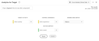
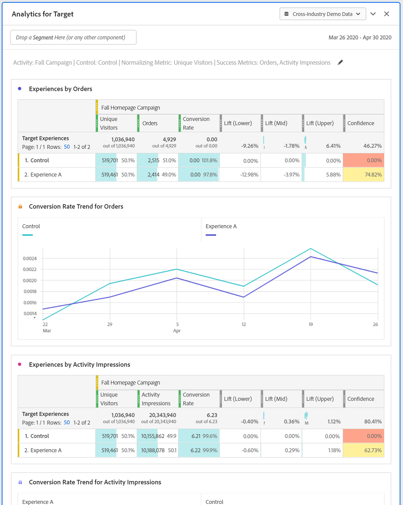

# Analytics for Target (A4T) Panel

>[!IMPORTANT]
>
>**[!UICONTROL Analytics for Target panel]** is currently in limited testing. [Learn more...]( https://docs.adobe.com/content/help/en/analytics/landing/an-releases.html)

The Analytics for Target (A4T) panel lets you analyze your Adobe Target activities and experiences in Analysis Workspace. It also enables you to see lift & confidence for up to 3 success metrics. To access the A4T Panel, click the panel icon on the far left and drag the Analytics for Target panel into your Analysis Workspace Project.

## Panel Builder

You can configure the A4T panel using these settings:

|Setting|Description|
|---|---|
|Target Activity|Select from a list of Target Activities, or drag & drop an activity from the left rail. **Note:** The list is populated with the last 6 months of activities that had at least 1 hit. If you do not see an activity in the list, it may be older than 6 months. It can still be added from the left rail, which has a look-back period of up to 18 months.|
|Control Experience|Select your control experience. You can change it if necessary in the dropdown.|
|Normalizing metric| Choose from Unique Visitors, Visits, or Activity Impressions.|
|Success metrics| Select up to 3 standard success events from the drop-downs, or drag & drop metrics from the left rail. Each metric will have a dedicated table and visualization in the rendered panel.|
|Calendar| This will auto-populate based on the Activity date range from Adobe Target. You can change it if necessary.|

## Panel Output

The Analytics for Target panel returns a rich set of data and visualizations to help you better understand how your Adobe Target activity and experiences are performing. At the top of the panel, a summary line is provided to remind you of the panel settings you selected. At any time, you can edit the panel by clicking the edit pencil in the top right.

For each success metric you selected, one freeform table and one conversion rate trend will be shown: 

Each freeform table shows the following metric columns:

|Metric|Description|
|---|---|
|Normalizing metrics| Unique Visitors, Visits, or Activity Impressions|
|Success metric - conversion rate|Success metric/Normalizing metric|
|Lift|Compares the conversion rate for each experience against the control experience. **Note:** Lift is a "locked metric" to Target experiences; it cannot be broken down or used with other dimensions.|
|Lift (Lower)|Represents the worst lift a variant experience could have over the control.|
|Lift (Mid)| Represents the midpoint lift a variant experience could have over the control, at a 95% confidence interval. This is "Lift" in Reports & Analytics.|
|Lift (Upper)| Represents the best lift a variant experience could have over the control.|
|Confidence| The students t-test calculates the confidence level, which indicates the likelihood that the results would be duplicated if the test were run again. **Note:** Confidence is a "locked metric" to Adobe Target experiences. It cannot be broken down or used with other dimensions.|

Like with any panel in Analysis Workspace, you can continue your analysis by adding additional tables and visualizations that will help you analyze your Adobe Target activities. 

For more options regarding Analytics for Target reporting, visit A4T reporting (link to come soon.) 