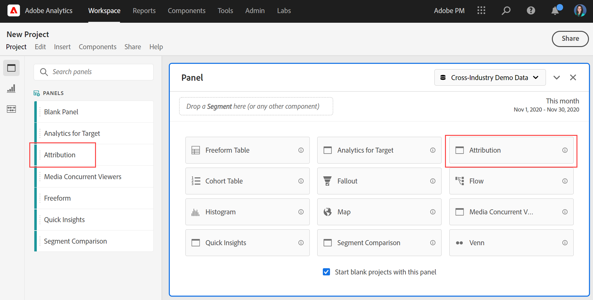
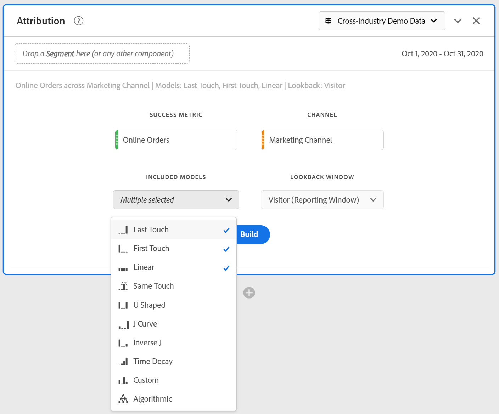
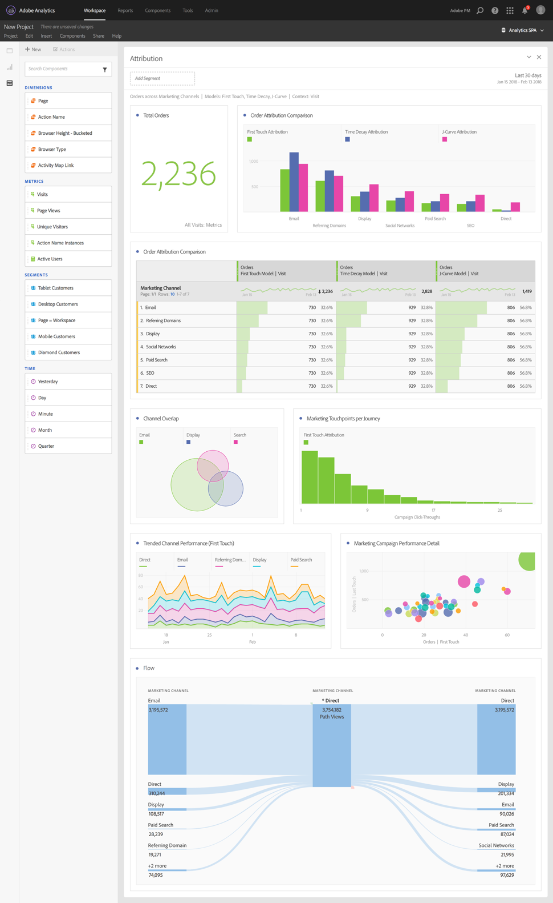

# Attribution panel

The [!UICONTROL Attribution] panel is an easy way to build an analysis comparing various attribution models. It is a feature in [Attribution IQ](../attribution/overview.md) that gives you a dedicated workspace to use and compare attribution models.

[!VIDEO](https://video.tv.adobe.com/v/23139/?quality=12)

## Create an attribution panel

1. Click the panel icon on the left.
1. Drag the [!UICONTROL Attribution] panel into your Analysis Workspace Project.

   

1. Add a metric that you want to attribute and add any dimension to attribute against. Examples include Marketing Channels or custom dimensions, such as internal promotions.

   

1. Select the [attribution models and lookback window](../attribution/models.md) you want to compare.

1. The Attribution panel returns a rich set of data and visualizations that compare attribution for the selected dimension and metric.

   

## Attribution visualizations

* **Total metric**: The total number of conversions that occurred over the reporting time window. These are the conversions that are attributed across the dimension you selected.
* **Attribution Comparison Bar**: Visually compares the attributed conversions across each of the dimension items from your selected dimension. Each bar color represents a distinct attribution model.
* **Attribution Comparison Table**: Shows the same data as the bar chart, represented as a table. Selecting different columns or rows in this table filters the bar chart as well as several of the other visualizations in the panel. This table acts similar to any other Freeform Table in Workspace - allowing you to add components such as metrics, segments, or breakdowns.
* **Overlap Diagram**: A Venn Diagram showing the top three dimension items and how often they participate jointly in a conversion. For example, the size of the bubble overlap indicates how often conversions occurred when a visitor was exposed to both dimension items. Selecting other rows in the adjacent Freeform table updates the visualization to reflect your selection.
* **Performance Detail**: Lets you to compare up to three attribution models visually using a scatter plot.
* **Trended Performance**: By default, shows the conversion performance trend by attribution model for the first dimension listed in the adjacent Freeform table. You can select different dimension rows in the Freeform table to show the trend for the selected dimensions (such as Total Revenue for each attribution model for Social Campaigns and Paid Search). Alternately, you can select cells in the columns for any metric and attribution type combinations in the Freeform table to see the trended performance by dimension value for the specified attribution models (such as Total Revenue by Marketing Channel using Last Touch and First Touch attribution).
* **Flow**: Lets you see which channels are interacted with most commonly, and in what order across a visitor's journey.
