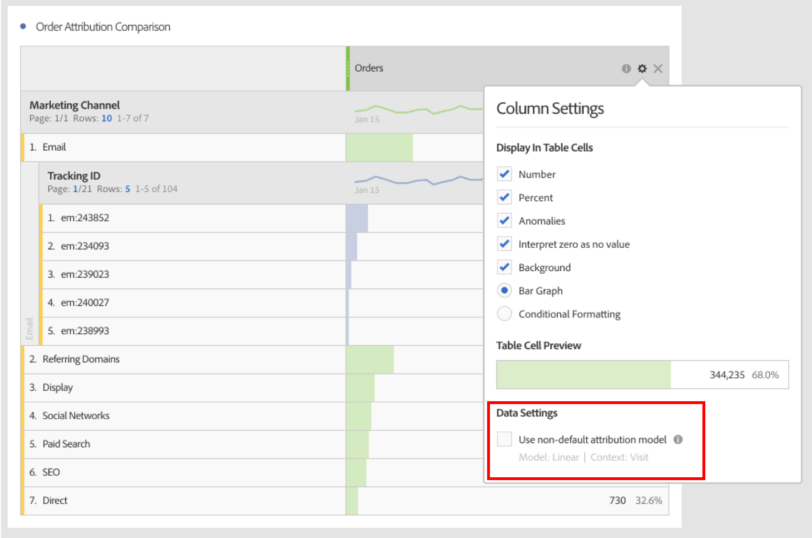
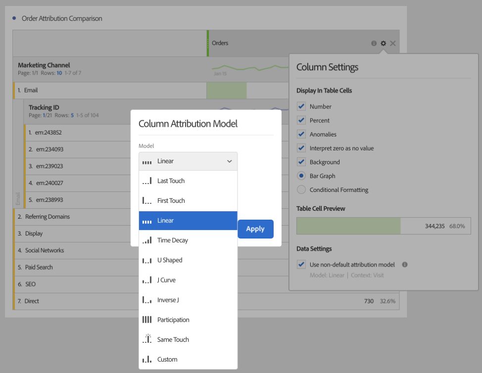

# Use Attribution in Analysis Workspace

Attribution IQ in Analysis Workspace lets you compare any supported attribution model to each other, visualize the key marketing sequences leading to conversion with advanced fallout and flow visualizations, trend any marketing channel or campaign easily to see performance over time, and find statistical anomalies in channel/campaign performance, be alerted when performance drops or goes up.

## Use attribution in freeform tables {#section_F2F72AE840EB4EA781302A559726E6F4}

Analysis Workspace Freeform Tables support attribution models that can be used on almost any metric. Attribution models can be set on a Freeform Table column metric in Column Settings:

1. Click the Settings (gear) icon in a Freeform Table column.

   

1. Under **[!UICONTROL Data Settings]**, check **[!UICONTROL Use non-default attribution model]**. For more information on the different attribution models, see [Attribution IQ Overview](attribution.md).

   

## Apply attribution models to breakdowns {#section_ED1E7532CF084B5AB0942BD80B4770C9}

Any breakdown within a Freeform Table can also have any attribution model applied to it which can be the same or different from the parent column. For example, you may want to analyze linear Orders on your Marketing Channels dimension but apply U-Shaped Orders to the specific tracking codes within a Channel. To edit the attribution model applied to a breakdown, simply hover over the breakdown model and click "Edit":

## Compare one attribution model to another {#section_1D74C09549CC4EC8A952A7392C76D375}

If you'd like to quickly and easily compare one attribution model to another, right click a metric and select **[!UICONTROL Add comparative attribution model]**:

This lets you quickly and easily compare one attribution model to another without having to drag in a metric and configure it twice.

## Attribution panel and visualizations {#section_6B02F28182F14ECC9FC5020F224726E6}

The attribution panel is an easy way to build an analysis comparing various attribution models. To access the Attribution Panel,

1. Click the panel icon on the far left.
1. Drag the Attribution Panel into your Analysis Workspace Project.

   

1. Add a success metric that you want to attribute and add any channel dimension to attribute against (such as Marketing Channels or Internal Promotions).

   

1. Select the [attribution models](attribution.md) you wish to compare, and the lookback window.

   The Attribution Panel will return a rich set of data and visualizations to help you better understand how your Marketing Channels (or other dimensions) work together:

   

   Here is a description of each visualization:

| Visualization | Description |
|--- |--- |
|Total Metric|The total number of conversions that occurred over the reporting time window. These are the conversions that are attributed across the dimension you selected.|
|Metric Attribution Comparison Bar Chart|Lets you visually compare the attributed conversions across each of the dimension items from your selected dimension. Each bar color represents a distinct attribution model that was selected.|
|Metric Attribution Freeform Table|Shows the same data as the bar chart - selecting different columns or rows in this table will filter the bar chart as well as several of the other visualizations in the panel. This table acts just as any other Freeform Table in Workspace - allowing you to add metrics, segments, breakdowns, etc.|
|Dimension Overlap Chart|A Venn Diagram showing the top three dimension items (e.g. Channels) and how often they participate jointly in a conversion. For example, the size of the bubble overlap indicates how often conversions occurred when a visitor was exposed to both dimension items (e.g. Channels). Selecting other rows in the Freeform table will update the visualization to reflect your selection.|
|Marketing Touchpoints Per Journey|A Histogram indicating the number of marketing (or any dimension) touchpoints a Visitor had in the reporting date range. This is useful to see how impactful multi-touch attribution is for your dataset. If nearly all visitors have only a single touchpoint, different attribution models will not be very different from one another in their results.|
|Marketing Channel Performance Detail|Lets you to compare up to three attribution models visually using a scatter plot.|
|Marketing Channel Flow|Lets you see which channels are interacted with most commonly, and in what order across a visitor's journey.|
