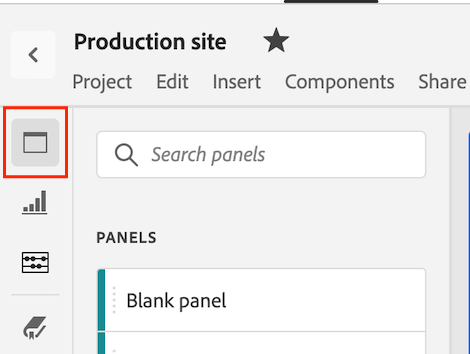

# Media average minute audience panel

>[!NOTE]
>
>The Media average minute audience panel is available only to customers who have purchased the Media Analytics add-on for Adobe Analytics. 
>
>Contact your Adobe Sales Representative or Adobe Account Team to purchase Media Analytics. 

In Analysis Workspace, average minute audience is the time spent viewing your media stream divided by the duration of the content or the total selection of the period and selected granularity.

The Media average minute audience panel enables you to better understand average consumption of your content by comparing programs of any length or genre. For example, you can understand average consumption when comparing a 30-minute sitcom with a 3-hour sporting event.

In addition, you can use the Media average minute audience panel to compare or append this digital average minute audience to linear TV average minute metrics. 

The Media average minute audience panel provides the following benefits over the Average Minute Audience metric:

* Supports custom time periods

* Allows for updating the duration classification after views are processed

## Access the Media average minute audience panel

1. In Analysis Workspace, go to a report suite that has Media Analytics components enabled. 

1. In the left nav, select the **Panels** icon.

   

1. Drag the [!UICONTROL **Media average minute audience**] panel onto the canvas in Analysis Workspace.

1. To configure the panel, continue with [Panel inputs](#panel-inputs).

## Panel inputs {#Input}

Use the input settings described in this section to configure the Media average minute audience panel.

1. Begin creating a Media average minute audience panel, as described in [Access the Media average minute audience panel](#access-the-media-average-minute-audience-panel).

1. Configure the following input settings:

   | Setting | Description |
   |---------|------------|
   | **Panel date range** | The panel date range default is [!UICONTROL **This month**]. You can edit it to view a single day or many months at a time.    This visualization is limited to 1440 rows of data (for example, 24-hours at minute-level granularity). If a date range and granularity combination results in more than 1440 rows, the granularity is automatically updated to accommodate the full date range. |
   | [!UICONTROL **Drop a segment here (or any other component)**] | Like other panels, this setting filters your selections based on segments you've created. This is a great way to look at specific platforms, live streams, or other common media segments. |
   | [!UICONTROL **Calculate metric for**] | Choose whether you want to see the average minute audience for a specific piece of content, or if you want to see the average minute audience for a custom period of time:<ul><li>**Specific content:** This is available only if the duration has been updated using Classifications. If the duration is unavailable, or if you want to view the average minute audience for a time series with multiple pieces of content or content without a specific assigned duration (like during a live stream or event), then you should select [!UICONTROL **Custom time period**]. (Durations can be set using Classifications either before or after processing time.)</li><li>**Custom time period:** This is available regardless of whether the durations is made available using Classifications.</li></ul> 
This setting changes the workflow and report output.
  |

1. Continue with [Specific content](#specific-content) or [Custom time period](#custom-time-period), depending on the option you chose in the [!UICONTROL **Calculate metric for**] drop-down menu.

### Specific content

1. If you selected [!UICONTROL **Specific content**] in the [!UICONTROL **Calculate metric for**] drop-down menu when [configuring panel inputs](#panel-inputs), specify the following configuration options:

   | Setting | Description |
   |---------|------------|
   | [!UICONTROL **Reporting dimension**] | When you choose specific content, you can select the report output to use either the video name or content ID fields to show the content and its associated average minute audience for the time period selected. |
   | [!UICONTROL **Filter content by (optional)**] | Choose how to filter the specific content, depending on the view you want or the way your data is structured. <ul>[!UICONTROL **Show, season, episode**]: Displays your available shows in the drop-down, which you can filter using a search (or by dragging and dropping the show name from the left column). You can end your selection there to see all the seasons of your show, or you can filter by individual seasons and then by individual episodes. This setting shows the data for those shows, seasons, or episodes for the selected time period.</li><li>[!UICONTROL **Custom dimension**]: If your show name is under a custom dimension, you can find it either by searching in the dimension (optional) drop down or by using the left column search. The dimension item automatically populates based on that selection and is treated as an episode.</li><li>[!UICONTROL **None**]: Shows all the video names that have average minute audience data for the selection you've chosen. (This options is selected by default.)</li></ul>  |

1. Continue with [Specific content advanced settings](#specific-content-advanced-settings) to configure advanced settings. 

### Specific content advanced settings

1. With [!UICONTROL **Specific content**] selected in the [!UICONTROL **Calculate metric for**] drop-down menu, select [!UICONTROL **Show advanced settings**], then specify the following configuration options:

   Setting | Description |
   |---------|------------|
   | Table settings | The default setting shows the calculation values in the table, which shows the numerator and denominator of the average minute audience as the preceding columns in the table. Deselecting this option removes those two columns, leaving only the average minute audience next to the video name or content ID. |
   | Time spent metric | You can choose the default content time spent, which includes only content time, or you can choose to use the media time spent, which includes content and ad time together as the numerator calculation for the average minute audience. |

1. Select [!UICONTROL **Build**] to finish creating the Media average minute audience panel.

1. Continue with [Panel output](#panel-output) for information about how to use the Media average minute audience panel.

### Custom time period

1. If you selected [!UICONTROL **Custom time period**] in the [!UICONTROL **Calculate metric for**] drop-down menu when [configuring panel inputs](#panel-inputs), specify the following configuration options:

   | Setting | Description |
   |---------|------------|
   | Granularity | The default granularity is [!UICONTROL **5-Minute**], but you can choose any of the granularities that are used as the denominator for the time series within your overall time period selection made in the calendar selection. For example, selecting 12:00 pm to 12:30 pm with a 5-minute granularity returns the average minute audience over the full half hour as well as six rows with the average minute audience for each 5-minute period. These rows are used as the datapoints for the time series chart. |
   | [!UICONTROL **Filter content by (optional)**] | Choose how to filter the specific content, depending on the view you want or the way your data is structured. <ul>[!UICONTROL **Show, season, episode**]: Displays your available shows in the drop-down, which you can filter using a search (or by dragging and dropping the show name from the left column). You can end your selection there to see all the seasons of your show, or you can filter by individual seasons and then by individual episodes. This setting shows the data for those shows, seasons, or episodes for the selected time period.</li><li>[!UICONTROL **Custom dimension**]: If your show name is under a custom dimension, you can find it either by searching in the dimension (optional) drop down or by using the left column search. The dimension item automatically populates based on that selection and is treated as an episode.</li><li>[!UICONTROL **None**]: Shows all the video names that have average minute audience data for the selection you've chosen. (This options is selected by default.)</li></ul>  |

1. Continue with [Custom time period advanced settings](#custom-time-period-advanced-settings) to configure advanced settings. 

### Custom time period advanced settings

1. With [!UICONTROL **Custom time period**] selected in the [!UICONTROL **Calculate metric for**] drop-down menu, select [!UICONTROL **Show advanced settings**], then specify the following configuration option:

   | Setting | Description |
   |---------|------------|
   | Table settings | The default setting displays the calculation values in the table, which displays the numerator and denominator of the average minute audience as the preceding columns in the table. Deselecting this option removes those two columns leaving only the average minute audience next to the time period. |

1. Select [!UICONTROL **Build**] to finish creating the Media average minute audience panel.

1. Continue with [Panel output](#panel-output) for information about how to use the Media average minute audience panel.

## Panel output

The panel output differs depending on whether you chose [!UICONTROL **Specific content**] or [!UICONTROL **Custom time period**] in the [!UICONTROL **Calculate metric for**] drop-down menu when [configuring panel inputs](#panel-inputs).

Regardless of which option you chose for calculating the metric

### Specific content

The Media Average Minute Audience panel returns the following:

* Total average minute audience for your entire selection
* Filters and average minute audience for the individual videos displayed in a table
* Content time spent and video length (duration) if that advanced setting was selected

To edit and rebuild the panel at any time, click the Edit (pencil) icon in the top right.

### Specific content data source

The only metric that can be used in this panel is Average Minute Audience metric.

| Metric | Description |
|--------|-------------|
| Average Minute Audience | The time spent viewing your media stream divided by the video length (duration) supplied via Classifications. |

### Custom time period {#custom-time-period-output}

The Media Average Minute Audience panel returns the total average minute audience for your entire selection, the maximum and minimum average minute audience, and the line series graph showing the average minute audience over the entire selection. The table below shows the filters and average minute audience for the granularities, as well as the content time spent and granularity for each time period if that advanced setting was selected.

To edit and rebuild the panel at any time, click the edit pencil on the top right.

### Custom time period data source

The only metric that can be used in this panel is the Average Minute Audience metric:

|Metric|Description|
|---|---|
|Average Minute Audience| The time spent viewing your media stream divided by the total selection or selected granularity in minutes.|

<!-- For more information about Media Average Minute Audience, visit [MA doc page]( https://url). -->
