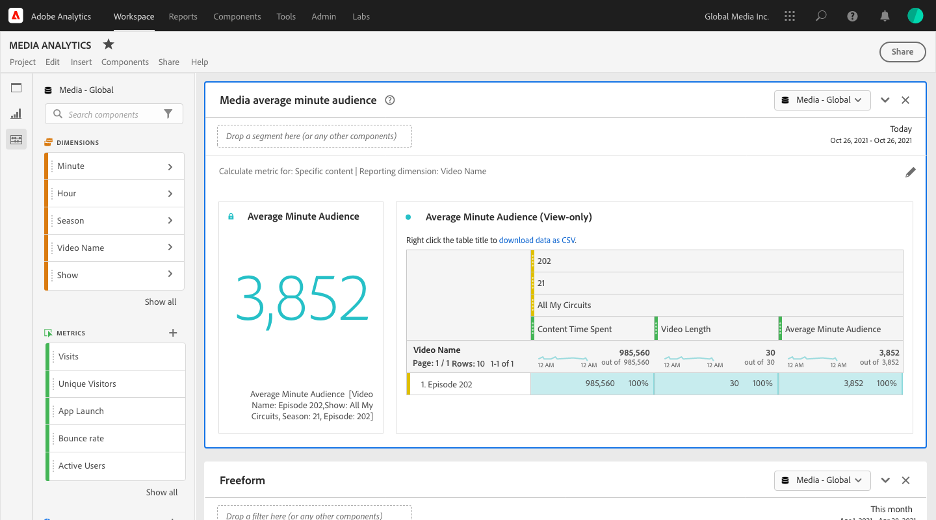
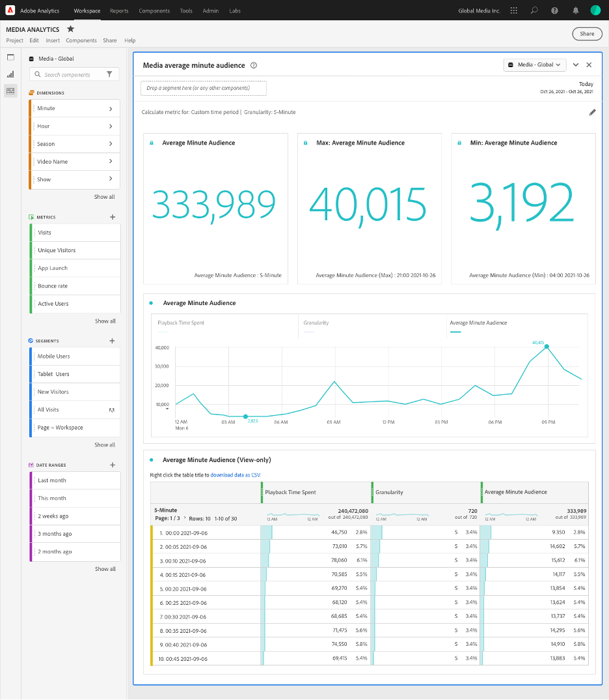

# Media Average Minute Audience panel

Media Analytics customers can use average minute audience to better understand average consumption of their content. Using average minute audience, customers can compare similar programming, for example, sports to sports or comedy to comedy. Customers can also compare completely different programming. For example, customers can compare live events to drama or reality programs to sport programs. In addition, customers can compare linear TV average minute metrics.

In Analysis Workspace, average minute audience is the time spent viewing your media stream divided by the duration of the content or the total selection of the period and selected granularity.

The Media Average Minute Audience panel provides average minute audience analytics by the specific content selected if the duration is made available using Classifications.
The Average Minute Audience panel also provides analytics over a selected time period which can be filtered by specific content—whether or not the duration is available using Classifications. To access the Media Average Minute Audience Panel, navigate to a report suite with Media Analytics components enabled. Then, click the panel icon on the far-left and drag the panel into your Analysis Workspace project. Learn more…<< link to workspace panel docs >>.

For more information, see the Media Average Minute Audience introduction video:

>[!VIDEO](https://video.tv.adobe.com/v/330177/?quality=12)

## Panel Inputs {#Input}

You can configure the Media Average Minute Audience panel using these input settings:

| Setting | Description |
|---------|------------|
| Panel date range | The panel date range default is Today. You may edit it to view a single day or many months at a time.    This visualization is limited to 1440 rows of data (for example, 24-hours at minute-level granularity). If a date range and granularity combination results in more than 1440 rows, the granularity is automatically updated to accommodate the full date range. |
| Drag a segment here (or any other components) | Like other panels, this setting filters your selections based on segments you’ve created. This is a great way to look at specific platforms, live streams, or other common media segments. |
| Calculate metric for | This setting enables you to choose whether you want to see the average minute audience for a specific piece of content, by selecting *specific content*, or if you want to see the average minute audience for a specific period of time, by selecting *custom time period*.   Specific content works only if the duration has been updated using Classifications. If the duration is unavailable, or if you want to view the average minute audience for a time series with multiple pieces of content or content without a specific assigned duration (like during a live stream or event), then you should select custom time period. This setting changes the workflow and report output. |

### Specific content

| Setting | Description |
|---------|------------|
| Reporting dimensions | When you choose specific content, you can select the report output to use either the video name or content ID fields to show the content and its associated average minute audience for the time period selected. |
| Filter content by (optional) | You can filter the specific content depending on the view you want or the way your data is structured. |
| Show, season, episode | Selecting “Show, season, episode” displays your available shows in the dropdown, which you can filter using a search (or by dragging and dropping the show name from the left column). You can end your selection there to see all the seasons of your show, or you can filter by individual seasons and then by individual episodes. This setting shows the data for those shows, seasons, or episodes for the selected time period. |
| Custom dimension | If your show name is under a custom dimension, you can find it either by searching in the dimension (optional) drop down or by using the left column search. The dimension item automatically populates based on that selection and is treated as an episode. |
| None | You can choose *None* to show all the video names that have average minute audience data for the selection you’ve chosen. |

### Specific content advanced settings

| Setting | Description |
|---------|------------|
| Table settings | The default setting shows the calculation values in the table, which shows the numerator and denominator of the average minute audience as the preceding columns in the table. Deselecting this option removes those two columns, leaving only the average minute audience next to the video name or content ID. |
| Time spent metric | You can choose the default content time spent, which includes only content time, or you can choose to use the media time spent, which includes content and ad time together as the numerator calculation for the average minute audience. |

### Custom time period

| Setting | Description |
|---------|------------|
| Granularity | The default granularity is 5-minute, but you can choose any of the granularities that are used as the denominator for the time series within your overall time period selection made in the calendar selection. For example, selecting 12:00 pm to 12:30 pm with a 5-minute granularity will return the average minute audience over the full half hour as well as six rows with the average minute audience for each 5-minute period. These rows are used as the datapoints for the time series chart. |
| Filter content by (optional) | You can filter the specific content depending on the view you want or the way your data is structured. |
| Show, season, episode | Selecting *Show, season, episode* displays your available shows in the dropdown, which you can filter via search (or by dragging and dropping the show name from the left column). You can end your selection there to see all the seasons of your show, or you can filter by individual seasons and then by individual episodes. This setting shows the data for those shows, seasons, or episodes for the selected time period. |
| Custom dimension | If your show name is under a custom dimension, you can find it either by searching in the dimension (optional) drop down or by using the left column search. The dimension item automatically populates based on that selection and is treated as an episode. |
| None | You can choose *None* to show all the video names over the time period you’ve chosen. |

### Custom time period advanced settings

| Setting | Description |
|---------|------------|
| Table settings | The default setting displays the calculation values in the table, which displays the numerator and denominator of the average minute audience as the preceding columns in the table. Deselecting this option removes those two columns leaving only the average minute audience next to the time period. |

## Specific Content Panel Output

The Media Average Minute Audience panel returns the following:

* Total average minute audience for your entire selection
* Filters and average minute audience for the individual videos displayed in a table
* Content time spent and video length (duration) if that advanced setting was selected

To edit and rebuild the panel at any time, click the edit pencil on the top right.

### Specific Content Data Source

The only metric that can be used in this panel is Average Minute Audience.

| Metric | Description |
|--------|-------------|
| Average Minute Audience | The time spent viewing your media stream divided by the video length (duration) supplied via Classifications. |

## Custom Time Period Panel Output {#custom-time-period-output}

The Media Average Minute Audience panel returns the total average minute audience for your entire selection, the maximum and minimum average minute audience, and the line series graph showing the average minute audience over the entire selection. The table below shows the filters and average minute audience for the granularities, as well as the content time spent and granularity for each time period if that advanced setting was selected.

To edit and rebuild the panel at any time, click the edit pencil on the top right.

### Custom Time Period Data Source

The only metric that can be used in this panel is Average Minute Audience:

|Metric|Description|
|---|---|
|Average Minute Audience| The time spent viewing your media stream divided by the total selection or selected granularity in minutes.|

<!-- For more information about Media Average Minute Audience, visit [MA doc page]( https://url). -->
