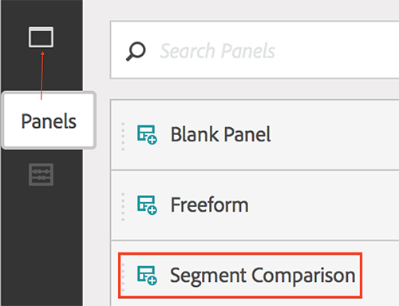
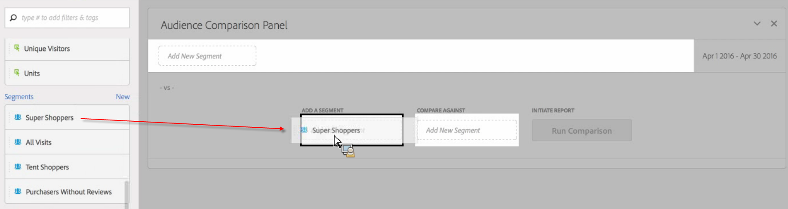
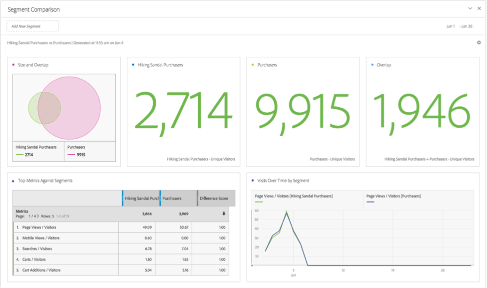
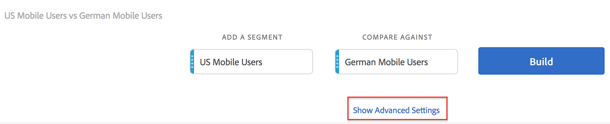
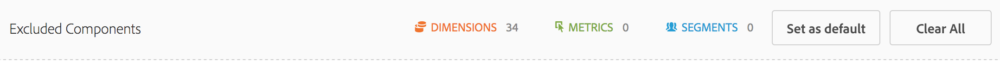

# Compare segments

Explains how to compare segments in Analysis Workspace.

>[!NOTE]
>
>You can also compare segments within a [fallout analysis](../../../../analyze/analysis-workspace/fallout/compare-segments-fallout.md#section_E0B761A69B1545908B52E05379277B56).

* [Compare Segments](../../../../analyze/analysis-workspace/c-panels/c-segment-comparison/compare-segments.md#section_8F2BFC45131C49B4A2E08A063CD7A91F) 
* [Exclude Components from Comparison](../../../../analyze/analysis-workspace/c-panels/c-segment-comparison/compare-segments.md#section_5E98FFA0744140C08D83700E3F025937)

## Compare segments {#section_8F2BFC45131C49B4A2E08A063CD7A91F}

1. Navigate to **[!UICONTROL Analytics]** > **[!UICONTROL Workspace]** and open a project. 

1. From the **[!UICONTROL Panels]** rail on the left margin, select **[!UICONTROL Segment Comparison]** and drag it into a new or existing project.

   

1. Make sure the comparison date range is set appropriately. 
1. Select segments to compare and drop them into the panel. For example, let's say you have a "Super Shoppers" segment.

   

   After you drag the segment into the panel, Analytics automatically creates an **[!UICONTROL Everyone Else]** segment that includes everyone NOT in the segment you chose - in this case, all "Non Super Shoppers." This saves you the effort of having to create this segment. Everyone Else is automatically added to the panel in the **[!UICONTROL Compare Against]** field. You are free to delete it and to compare the Super Shopper to any other segment of your choice.

   

1. Click **[!UICONTROL Show Advanced Options]** to exclude components (dimensions, metrics, or segments) from your segment comparison analysis. For more information, see [Exclude Components from Comparison](../../../../analyze/analysis-workspace/c-panels/c-segment-comparison/compare-segments.md#section_5E98FFA0744140C08D83700E3F025937). 

1. After you've selected the right "Compare Against" segment, click **[!UICONTROL Build]**.

   This action starts a back-end process that goes through every dimension, metric, and other segments, looking for statistical differences between the segments. At the top of the tool, we display a progress bar indicating the remaining time until we’ve scanned every metric and dimension for important differences. Additionally, we prioritize your most frequently used metrics, dimensions, and segments to run first so that we can give you the most relevant results as fast as possible.

   Once the back-end process has completed its scan, you’ll notice a number of new visuals:

   

   

1. Interpret the results of your Segment Comparison by reviewing [new visualizations, tables, and summaries](../../../../analyze/analysis-workspace/c-panels/c-segment-comparison/segment-comparison.md#concept_74FAC1C6D0204F9190A110B0D9005793).

## Exclude components from comparison {#section_5E98FFA0744140C08D83700E3F025937}

Sometimes, you might want to exclude some dimensions, metrics, or segments from segment comparisons. For example, let's say you wanted to compare the US Mobile Users segment to German Mobile Users. It wouldn't make sense to include any geography-related dimensions since there will be obvious differences in location between these two segments. You can exclude them. Here's how:

1. After you have dragged the segments you want to compare into the panel, click **[!UICONTROL Show Advanced Options]** to exclude components (dimensions, metrics, or segments) from your segment comparison analysis.

   

1. Drag and drop components you want to exclude anywhere into the **[!UICONTROL Excluded Components]** panel. (You can see this as a "blacklist" of components to exclude.) You can set these components as defaults or **[!UICONTROL Clear All]** to start over.

   

1. Click **[!UICONTROL Set as default]** to exclude these components from **all** segment comparisons. 

1. If you ever need to revise the list of excluded components, just double click, for example, Dimensions, and the list of excluded dimensions displays:

   

1. Just delete any unwanted dimensions by clicking the x next to them, then save the list by clicking **[!UICONTROL Set as Default]**.

