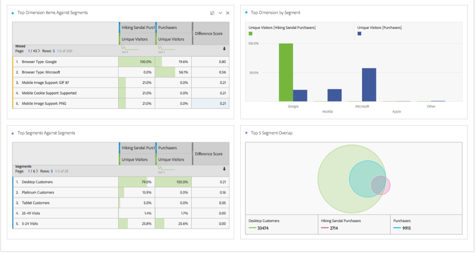

# Segment comparison panel overview {#segment-comparison-overview}

<!-- markdownlint-disable MD034 -->

>[!CONTEXTUALHELP]
>id="workspace_segmentcomparison_button"
>title="Segment comparison"
>abstract="Quickly compare two segments across all data points to automatically find relevant differences"

<!-- markdownlint-enable MD034 -->

<!-- markdownlint-disable MD034 -->

>[!CONTEXTUALHELP]
>id="workspace_segmentcomparison_panel"
>title="Segment comparison panel"
>abstract="Quickly compare two segments across all data points to automatically find relevant differences.  **Parameters** **Add a segment**: The first segment you want to analyze. **Compare against**: The second segment you want to compare against. This will automatically populate with *Everyone Else* which is the inverse of your first segment. You can replace this with a different segment if desired. **Advanced settings**: The ability to exclude components from being analyzed in the segment comparison."
<!-- markdownlint-enable MD034 -->

>[!BEGINSHADEBOX]

*This article documents the Segment comparison panel in  **Adobe Analytics**. There is no equivalent panel in  **Customer Journey Analytics**.*

>[!ENDSHADEBOX]

The Segment comparison panel is a tool part of [Segment IQ](../../segment-iq.md) that discovers the most statistically significant differences among an unlimited number of segments. The feature iterates through an automated analysis of all dimensions and metrics that you have access to. It automatically uncovers key characteristics of the audience segments that are driving your company's KPIs and lets you see how much any segments overlap.

+++ Here is a video on segment comparison:

>[!VIDEO](https://video.tv.adobe.com/v/23976/?quality=12)

+++

## Use

To use an **[!UICONTROL Attribution]** panel:

1. Create an **[!UICONTROL Attribution]** panel. For information about how to create a panel, see [Create a panel](../panels.md#create-a-panel).

1. Specify the [input](#panel-input) for the panel.

1. Observe the [output](#panel-output) for the panel.

### Panel input 

   

1. Select segments to compare and drop them into the panel.

   

   After you drag a segment into the panel, Analytics automatically creates an [!UICONTROL 'Everyone Else'] segment that includes everyone NOT in the segment you chose. It is a frequently used segment in the comparison panel, but you are free to remove it and compare a different segment of choice.

   

1. Once you have determined which two segments to compare, click [!UICONTROL Build].

   This action starts a backend process that looks for statistical differences between the two segments selected and all dimensions, metrics and other segments. A progress bar at the top of the panel indicates the remaining time until every metric and dimension is analyzed. The most frequently used metrics, dimensions, and segments are prioritized to run first so the most relevant results are returned in a timely manner.

## Exclude components from comparison

Excluding some dimensions, metrics, or segments from segment comparisons is sometimes desired. For example, you want to compare the segment 'US Mobile Users' to 'German Mobile Users'. Including geography-related dimensions would not make sense since these segments already imply those differences.

1. After the desired two segments are in the panel, click [!UICONTROL 'Show Advanced Options'].
1. Drag and drop components you want to exclude into the [!UICONTROL Excluded Components] panel.

   

Click [!UICONTROL 'Set as default'] to automatically exclude your current components in all future segment comparisons. If you want to edit excluded components, click a component type, then click the 'X' next to a component to re-include it in your analysis. Click 'Clear All' to re-include all components in your segment comparison.

   

### Panel output

Once Adobe finishes analyzing the two desired segments, it shows its results through several visualizations:

   

   

#### Size and overlap

Illustrates the comparative sizes of each selected segment and how much they overlap with each other using a venn diagram. You can hover over the visual to see how many visitors were in each overlapping or non-overlapping section. You can also right click on the overlap to create a brand new segment for further analysis. If the two segments are mutually exclusive, no overlap is shown between the two circles (typically seen with segments using a hit container).

#### Population summaries

To the right of the Size and Overlap visualization, the total unique visitor count in each segment and overlap is shown.

#### Top metrics

Displays the most statistically significant metrics between the two segments. Each row in this table represents a differentiating metric, ranked by how different it is between each segment. A difference score of 1 means it is statistically significant, while a difference score of 0 means there is no statistical significance.

This visualization is similar to freeform tables in Analysis Workspace. If deeper analysis on a specific metric is desired, hover over a line item and click 'Create visual'. A new table is created to analyze that specific metric. If a metric is irrelevant to your analysis, hover over the line item and click the 'X' to remove it.

>[!NOTE]
>
>Metrics added to this table after the segment comparison has finished do not receive a Difference Score.

#### Metric over time by segment

To the right of the metrics table is a linked visualization. You can click a line item in the table on the left, and this visualization updates to show that metric trended over time.

#### Top dimensions

Shows the most statistically significant dimension items across all of your dimensions. Each row shows the percentage of each segment exhibiting this dimension item. For example, this table might reveal that 100% of visitors in 'Segment A' had the dimension item 'Browser Type: Google', whereas only 19.6% of 'Segment B' had this dimension item. A difference score of 1 means it is statistically significant, while a difference score of 0 means there is no statistical significance.

This visualization is similar to freeform tables in Analysis Workspace. If deeper analysis on a specific dimension item is desired, hover over a line item and click 'Create visual'. A new table is created to analyze that specific dimension item. If a dimension item is irrelevant to your analysis, hover over the line item and click the 'X' to remove it.

>[!NOTE]
>
>Dimension items added to this table after the segment comparison has finished do not receive a Difference Score.

#### Dimension items by segment

To the right of the dimensions table is a linked bar chart visualization. It shows all displayed dimension items in a bar chart. Clicking a line item in the table on the left updates the visualization on the right.

#### Top segments

Shows which other segments (other than the two segments selected for comparison) have statistically significant overlap. For example, this table can show that a third segment, 'Repeat Visitors', overlaps highly with 'Segment A' but does not overlap with 'Segment B'. A difference score of 1 means it is statistically significant, while a difference score of 0 means there is no statistical significance.

This visualization is similar to freeform tables in Analysis Workspace. If deeper analysis on a specific segment is desired, hover over a line item and click 'Create visual'. A new table is created to analyze that specific segment. If a segment is irrelevant to your analysis, hover over the line item and click the 'X' to remove it.

>[!NOTE]
>
>Segments added to this table after the segment comparison has finished do not receive a Difference Score.

#### Segment overlap

To the right of the segments table is a linked venn diagram visualization. It shows the most statistically significant segment applied to your compared segments. For example, 'Segment A' + 'Statistically significant segment' vs. 'Segment B' + 'Statistically significant segment'. Clicking a segment line item in the table on the left updates the venn diagram on the right.

