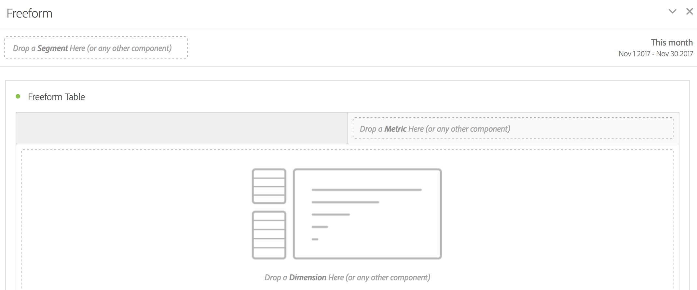

# Freeform panel

>[!BEGINSHADEBOX]

_This article documents the Freeform panel in_  _**Adobe Analytics**._ _See [Freeform panel](/help/analyze/analysis-workspace/c-panels/freeform-panel.md) for the_  _**Customer Journey Analytics** version of this article._

>[!ENDSHADEBOX]

A **[!UICONTROL Freeform panel]** is a blank panel with a [Freeform table](/help/analyze/analysis-workspace/visualizations/freeform-table/freeform-table.md) visualization as the default starting state.

## Use

To use an **[!UICONTROL Freeform panel]**:

1. Create an **[!UICONTROL Freeform panel]**. For information about how to create a panel, see [Create a panel](panels.md#create-a-panel).

   

1. See [Analytics components guide](/help/components/home.md) how you can add components to the freeform panel and [Freeform table](/help/analyze/analysis-workspace/visualizations/freeform-table/freeform-table.md) visualization.

>[!MORELIKETHIS]
>
>[Create a panel](/help/analyze/analysis-workspace/c-panels/panels.md#create-a-panel)
>[Analytics components guide](/help/components/home.md)
>[Freeform table visualization](/help/analyze/analysis-workspace/visualizations/freeform-table/freeform-table.md)
>
