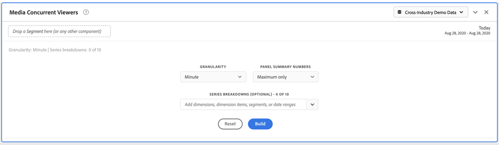
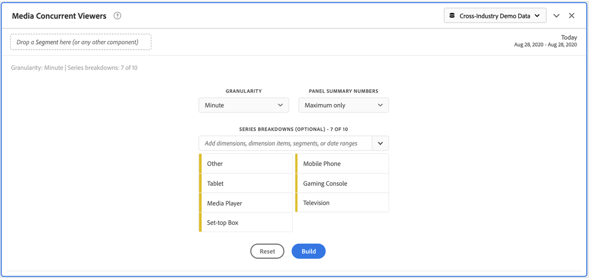
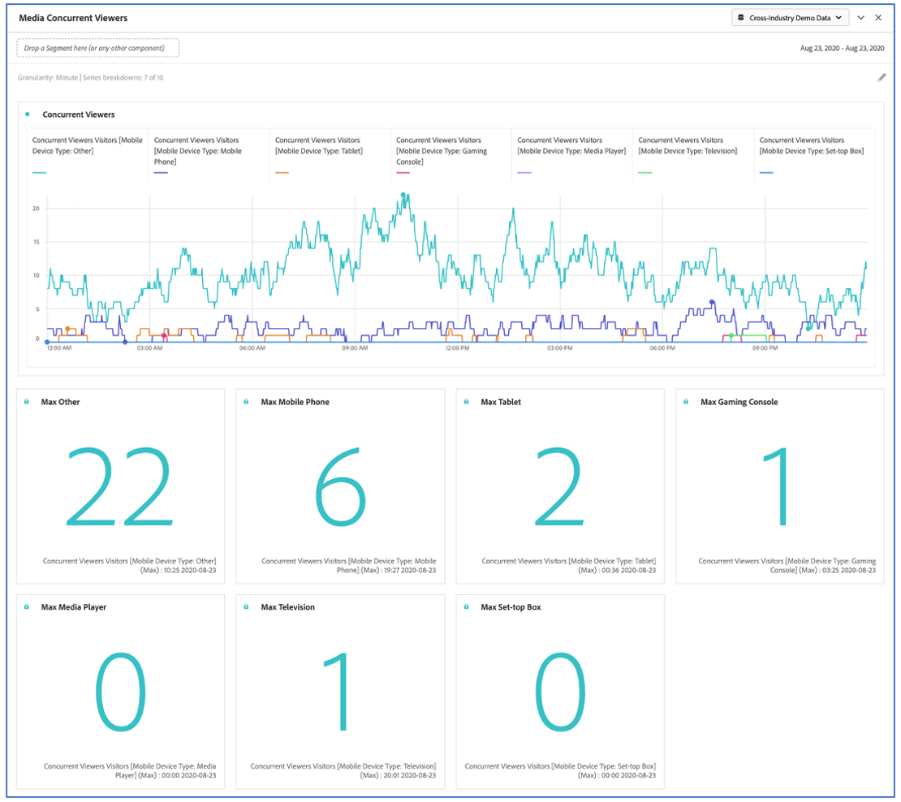
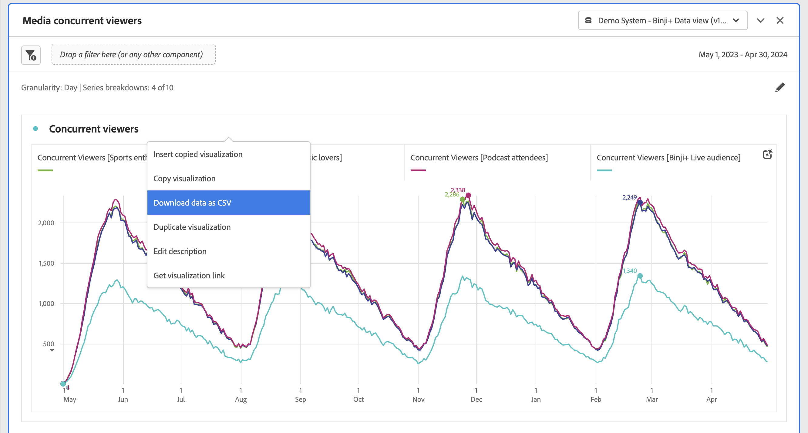

# Media Concurrent Viewers panel

Media Analytics customers can analyze concurrent viewers to understand where peak concurrency occurred or where drop-offs happened to provide valuable insight into the quality of content and viewer engagement, and to help with troubleshooting or planning for volume or scale.

In Analysis Workspace, Concurrent Viewers is the number of unique visitors viewing your media stream(s) at a specific point in time, regardless of the number of sessions.

The Media Concurrent Viewers panel enables analysis of concurrent viewers over time, with details on peak concurrency and the ability to break down and compare.  To access the Media Concurrent Viewers panel, navigate to a report suite with Media Analytics components enabled. Then, click the panel icon on the far-left and drag the panel into your Analysis Workspace project.

## Panel Inputs {#Input}

You can configure the Media Concurrent Viewers panel using these input settings:

|Setting|Description|
|---|---|
|Panel date range|The panel date range default is Today.  You may edit it to view a single day or many months at a time.    This visualization is limited to 1440 rows of data (for example, 24-hours at minute-level granularity).  If a date range and granularity combination results in more than 1440 rows, the granularity is automatically updated to accommodate the full date range.|
|Granularity|The granularity default is Minute.    This visualization is limited to 1440 rows of data (for example, 24-hours at minute-level granularity).  If a date range and granularity combination results in more than 1440 rows, the granularity is automatically updated to accommodate the full date range.|
|Panel summary numbers| To see date or time details for concurrent viewers, a summary number is available. The Maximum shows details for peak concurrency. The Minimum shows details for the trough.  The panel default shows Maximum only, but you can change it to show Minimum or both Maximum and Minimum.  If you are using breakdowns, a summary number is displayed for each.|
|Series breakdown| Optionally, you can break down your visualization by segments, dimensions, dimension items, or date ranges.   - You may view up to 10 lines at a time. Breakdowns are limited to a single level.  - When dragging a dimension, the top dimension items will be automatically selected based on the selected panel date range.  - To compare date ranges, drag 2 or more date ranges into the series breakdown filter.|

### Default view

### Series breakdown view

## Panel Output {#Output}

The Media Concurrent Viewers panel returns a line chart and summary numbers to include details for the maximum and/or minimum concurrent viewers.  At the top of the panel, a summary line is provided to remind you of the panel settings you selected.

At any time, you can edit and rebuild the panel by clicking the edit pencil on the top right.

If you selected series breakdown, a line on the line chart and a summary number is displayed for each:

### Data Source

The only metric that can be used in this panel is Concurrent Viewers:

|Metric|Description|
|---|---|
|Concurrent Viewers| Number of unique visitors viewing your media stream(s) at a specific point in time, regardless of the number of sessions.  This is different than Concurrent Viewer reporting in the Reports section, which uses Concurrent Active Sessions.  Using unique visitors accounts for removal of unwanted ‘spikes’ at show boundaries (where sessions are ending and starting at the same time).|

A Freeform table is not available in this view.  In order to view the data source, you may right-click on the line chart and download as a .csv file.  Series breakdowns will be included.

## FAQs {#FAQ}

|Question|Answer|
|---|---|
|Where is the Freeform table? How can I see the data source?| The Freeform table is not available in this view.  You can download the data source by right-clicking on the line chart and downloading the CSV file.|
|Why did my granularity change?|This visualization is limited to 1440 rows of data (for example, 24-hours at minute-level granularity).  If a date range and granularity combination results in more than 1440 rows, the granularity will be automatically updated to accommodate the full date range.  When changing from a larger date range to a smaller one, the granularity will be updated to the lowest detail allowable once the date range is changed. To view a higher granularity, edit the panel and rebuild.|
|How do I compare video names, segments, content types, etc?|To compare these in a single visualization, drag segments, dimensions, or specific dimension items in the series breakdown filter.  The view is limited to 10 breakdowns.  To view more than 10, you must use multiple panels.|
|How do I compare date ranges?|To compare date ranges in a single visualization, use the series breakdowns by dragging 2 or more date ranges.  These date ranges will override the panel date range.|
|How do I change the visualization type?|This panel only allows for the line visualization for the time series.|
|Can I run anomaly detection?|No.  Anomaly detection is not available for this panel.|
|Why use unique visitors instead of active sessions?|Using unique visitors enables removal of unwanted spikes at show boundaries (where sessions are ending and starting at the same time).|
|What does it mean to have concurrent viewers at higher granularity than minute?|With a granularity larger than a minute, concurrent viewers is the sum of unique concurrent viewers for all minutes within that time range.  For example, at hour-level granularity concurrent viewers is the sum of unique concurrent viewers for all minutes within the hour.|
|What if I want to see more than 1 day at the minute-level granularity?|To access data at minute-level granularity for up to 1 month at a time, you can use the Analytics 2.0 APIs. For more information, see [Get Concurrent Viewers JSON report data with Analytics 2.0 APIs](https://experienceleague.adobe.com/docs/ media-analytics/using/media-reports/media-default-reports/get-concurrent-json20.html).|
|Does the workspace panel show the same information as the Concurrent Viewers Report?|No.  In Analysis Workspace, Concurrent viewers is defined as the number of unique visitors viewing your media stream at a specific point in time, regardless of the number of sessions.  This is different than Concurrent Viewer reporting in the Reports section, which uses Concurrent Active Sessions.  Using unique visitors accounts for removal of unwanted spikes at show boundaries—where sessions are ending and starting at the same time.|

<!-- For more information about Media Concurrent Viewers, visit [MA doc page]( https://url). -->
