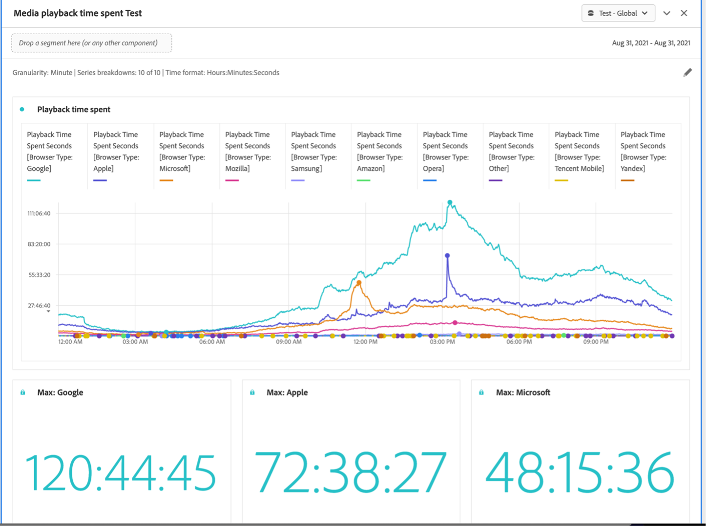

# Media playback time spent panel {#media-playback-time-spent-panel}

<!-- markdownlint-disable MD034 -->

>[!CONTEXTUALHELP]
>id="workspace_mediaplaybacktimespent_button"
>title="Media playback time spent"
>abstract="Create a panel to analyze video consumption over time, with various levels of granularity, and the ability to break down and compare."

<!-- markdownlint-enable MD034 -->

<!-- markdownlint-disable MD034 -->

>[!CONTEXTUALHELP]
>id="workspace_mediaplaybacktimespent_panel"
>title="Media playback time spent"
>abstract="Analyze video consumption over time, select various granularities, breakdown and compare.  **Granularity**: Select time period to view concurrent viewers by. **Panel summary numbers (optional)**: Option to show summary numbers with date or time details for each line. Maximum will show details for peak playback time tpent. Minimum will show details for the trough. Sum will show details for the total sum of playback time spent. **Series breakdown (optional)**: Break down visualization by segments, dimensions, dimension items or date ranges. View up to 10 lines at a time. Breakdowns are limited to a single level. **Time format**: Option to show the time format for visualizations in either hours or minutes."

<!-- markdownlint-enable MD034 -->

>[!BEGINSHADEBOX]

_This article documents the Media playback time spent panel in_  _**Adobe Analytics**._ _See [Media playback time spent panel](/help/analyze/analysis-workspace/c-panels/media-playback-time-spent.md)) for the_  _**Customer Journey Analytics** version of this article._

>[!ENDSHADEBOX]

>[!NOTE]
>
>The Media average minute audience panel is available only to customers who have purchased the Adobe Analytics for Streaming Media Add-on.
>
>Contact your Adobe sales representative or Adobe account team for more information. 
>

The **[!UICONTROL Media playback time spent]** panel enables analysis of playback over time, with details on peak concurrency and the ability to break down and compare. 

In Analysis Workspace, Playback time spent is the amount of time spent viewing your media streams at a specific point in time. It includes pause, buffer, and time to start.

Customers who have purchased the Adobe Analytics for Streaming Media Add-on can analyze playback time spent to gain valuable insight into the quality of content and viewer engagement. And to help when troubleshooting or planning for volume or scale.

Playback time spent can help you understand:

* Where peak concurrency occurred.

* Where drop-offs occurred.

>[!BEGINSHADEBOX]

See  [Media playback time spent panel](https://video.tv.adobe.com/v/338699?quality=12&learn=on){target="_blank"} for a demo video.

>[!ENDSHADEBOX]

## Use

To use an **[!UICONTROL Media playback time spent]** panel:

1. Create a **[!UICONTROL Media playback time spent]** panel. For information about how to create a panel, see [Create a panel](panels.md#create-a-panel).  

1. Ensure you select a data view for the panel that has components configured from the Adobe Analytics for Streaming Media Add-on.

1. Specify the [input](#panel-input) for the panel.

1. Observe the [output](#panel-output) for the panel.

### Panel input

You can configure the Media Playback Time Spent panel using these input settings:

|Setting|Description|
|---|---|
|Panel date range|The panel date range default is Today. You may edit it to view a single day or many months at a time. This visualization is limited to 1440 rows of data (for example, 24-hours at minute-level granularity). If a date range and granularity combination results in more than 1440 rows, the granularity is automatically updated to accommodate the full date range.|
|Granularity|The granularity default is Minute. This visualization is limited to 1440 rows of data (for example, 24-hours at minute-level granularity). If a date range and granularity combination results in more than 1440 rows, the granularity is automatically updated to accommodate the full date range.|
|Panel summary numbers|To see date or time details for playback time spent, a summary number is available. The Maximum shows details for peak concurrency. The Minimum shows details for the trough. Sum adds up the total playback time spent for the selection. The panel default shows Maximum only, but you can change it to show Minimum, Sum, or any combination of the three. If you are using breakdowns, a summary number is displayed for each.|
|Series breakdown|Optionally, you can break down your visualization by filters, dimensions, dimension items, or date ranges.
- You may view up to 10 lines at a time. Breakdowns are limited to a single level.

- When dragging a dimension, the top dimension items are automatically selected based on the selected panel date range.
- To compare date ranges, drag 2 or more date ranges into the series breakdown filter.|
|Time format|You can view the playback time spent in either `Hours:Minutes:Seconds` (default) or in `Minutes` (which is displayed in whole numbers, rounded up at 0.5). |
|Date sequence display|If you've placed at least two date range filters as series breakdowns, you see the option to select either overlay (default) or sequential. Overlay displays the lines with a common x-axis start so that they run in parallel, while sequential displays the lines with their specific x-axis start. If the data lines up (for example, filter 1 ends at 8:44 pm and filter 2 starts at 8:45 pm), then the lines show in sequence. |

### Panel output

The Media Playback Time Spent panel returns a line chart and summary numbers to include details for the maximum, minimum, and/or sum of playback time spent. At the top of the panel, a summary line is provided to remind you of the panel settings you selected.

At any time, select  to edit and rebuild the panel.

If you select series breakdown, a line on the line chart and a summary number is displayed for each:

### Data source

The only metric that can be used in this panel is Playback Time Spent.

|Metric|Description|
|---|---|
|Playback Time Spent|Total `hours:minutes:seconds` (or `minutes`) of content viewed during the selected granularity including pause, buffer, and time to start.|

## FAQs

|Question|Answer|
|---|---|
|Where is the Freeform table? How can I see the data source?|

The Freeform table is not available in this view. To download the data source, from the context menu in the line chart select the option to download the CSV file.
|
|
Why did my granularity change?
|
This visualization is limited to 1440 rows of data (for example, 24-hours at minute-level granularity). If a date range and granularity combination results in more than 1440 rows, the granularity is automatically updated to accommodate the full date range.

When changing from a larger date range to a smaller one, the granularity is updated to the lowest detail allowable once the date range is changed. To view a higher granularity, edit the panel and rebuild.
|
|

How do I compare video names, filters, content types, and more?
|
To compare these in a single visualization, drag filters, dimensions, or specific dimension items in the series breakdown filter.

The view is limited to 10 breakdowns. To view more than 10, you must use multiple panels.
|
|How do I compare date ranges?|To compare date ranges in a single visualization, use the series breakdowns by dragging 2 or more date ranges. These date ranges override the panel date range.|
|How do I change the visualization type?|

This panel only allows for the line visualization for the time series.
|
|Can I run anomaly detection?|

No. Anomaly detection is not available for this panel.
|

>[!MORELIKETHIS]
>
>[Create a panel](/help//analyze/analysis-workspace/c-panels/panels.md#create-a-panel)
>[Media average minute audience panel](average-minute-audience-panel.md)
>[Media concurrent viewers panel](media-concurrent-viewers.md)
>

<!--
# Media Playback Time Spent panel

In Analysis Workspace, Playback Time Spent is the amount of time spent viewing your media streams at a specific point in time. It includes pause, buffer, and time to start.

The Media Playback Time Spent panel enables analysis of playback over time, with details on peak concurrency and the ability to break down and compare. 

Customers who have purchased the Streaming Media Collection Add-on can analyze playback time spent to gain valuable insight into the quality of content and viewer engagement, and to help when troubleshooting or planning for volume or scale.

Playback Time Spent can help you understand:

* Where peak concurrency occurred

* Where drop-offs occurred 

Following is a video overview of this panel:

>[!VIDEO](https://video.tv.adobe.com/v/338699)

## Use the Media Playback Time Spent panel

1. Go to a report suite with streaming media components enabled. 
1. Select the panel icon on the far-left, then drag the panel into your Analysis Workspace project.
1. Continue with the following sections to customize the Media Playback Time Spent panel

   * [Panel Inputs](#panel-inputs)
   * [Panel Output](#panel-output)

## Panel Inputs {#Input}

You can configure the Media Playback Time Spent panel using these input settings:

|Setting|Description|
|---|---|
|Panel date range|The panel date range default is Today. You may edit it to view a single day or many months at a time. This visualization is limited to 1440 rows of data (for example, 24-hours at minute-level granularity). If a date range and granularity combination results in more than 1440 rows, the granularity is automatically updated to accommodate the full date range.|
|Granularity|The granularity default is Minute. This visualization is limited to 1440 rows of data (for example, 24-hours at minute-level granularity). If a date range and granularity combination results in more than 1440 rows, the granularity is automatically updated to accommodate the full date range.|
|Panel summary numbers|To see date or time details for playback time spent, a summary number is available. The Maximum shows details for peak concurrency. The Minimum shows details for the trough. Sum adds up the total playback time spent for the selection. The panel default shows Maximum only, but you can change it to show Minimum, Sum, or any combination of the three. If you are using breakdowns, a summary number is displayed for each.|
|Series breakdown|Optionally, you can break down your visualization by segments, dimensions, dimension items, or date ranges.
- You may view up to 10 lines at a time. Breakdowns are limited to a single level.

- When dragging a dimension, the top dimension items will be automatically selected based on the selected panel date range.
- To compare date ranges, drag 2 or more date ranges into the series breakdown filter.|
|Time format|You can view the playback time spent in either `Hours:Minutes:Seconds` (default) or in `Minutes` (which is displayed in whole numbers, rounded up at .5). |
|Date sequence display|If you've placed at least two date range segments as series breakdowns you'll see the option to select either overlay (default) or sequential. Overlay will display the lines with a common x-axis start so that they run in parallel, while sequential will display the lines with their specific x-axis start. If the data lines up (for example, segment 1 ends at 8:44 pm and segment 2 starts at 8:45 pm), then the lines will show in sequence. |

## Default view

## Panel Output {#Output}

The Media Playback Time Spent panel returns a line chart and summary numbers to include details for the maximum, minimum, and/or sum of playback time spent. At the top of the panel, a summary line is provided to remind you of the panel settings you selected.

At any time, you can edit and rebuild the panel by clicking the edit pencil on the top right.

If you selected series breakdown, a line on the line chart and a summary number is displayed for each:

### Data Source

The only metric that can be used in this panel is Playback Time Spent.

|Metric|Description|
|---|---|
|Playback Time Spent|Total `hours:minutes:seconds` (or `minutes`) of content viewed during the selected granularity including pause, buffer, and time to start.|

## FAQs

|Question|Answer|
|---|---|
|Where is the Freeform table? How can I see the data source?|The Freeform table is not available in this view. You can download the data source by right-clicking on the line chart and downloading the CSV file.|
|Why did my granularity change?|This visualization is limited to 1440 rows of data (for example, 24-hours at minute-level granularity). If a date range and granularity combination results in more than 1440 rows, the granularity will be automatically updated to accommodate the full date range. 
When changing from a larger date range to a smaller one, the granularity will be updated to the lowest detail allowable once the date range is changed. To view a higher granularity, edit the panel and rebuild.
|
| How do I compare video names, segments, content types, etc?| To compare these in a single visualization, drag segments, dimensions, or specific dimension items in the series breakdown filter.The view is limited to 10 breakdowns. To view more than 10, you must use multiple panels.|
|How do I compare date ranges?|To compare date ranges in a single visualization, use the series breakdowns by dragging 2 or more date ranges. These date ranges will override the panel date range.|
|How do I change the visualization type?|This panel only allows for the line visualization for the time series.|
|Can I run anomaly detection?|No. Anomaly detection is not available for this panel.|

-->
