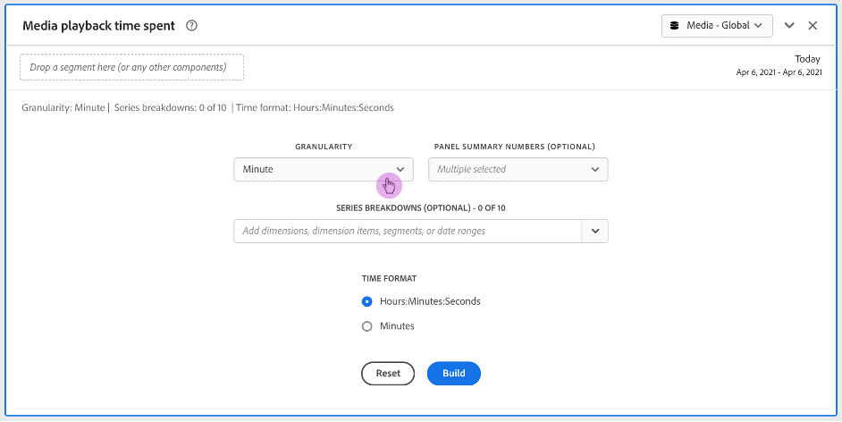
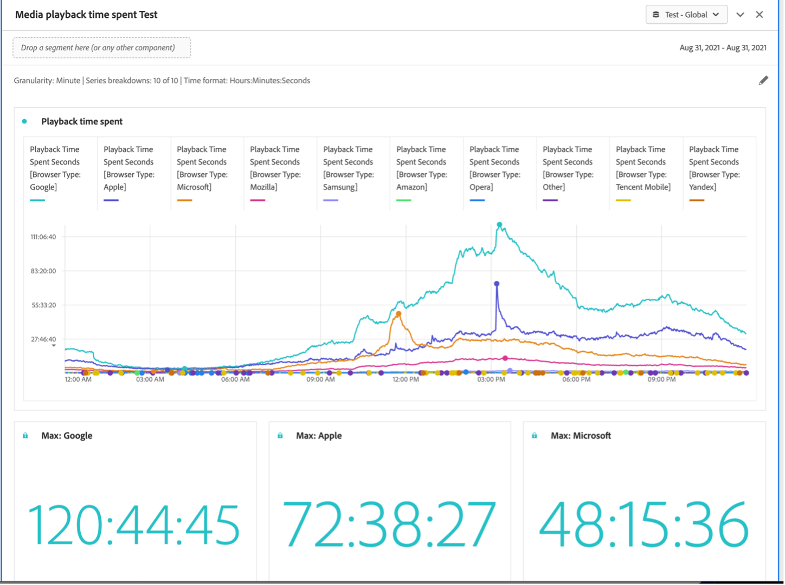

#  Media Playback Time Spent Panel Inputs and Outputs {#Inputs-and-outputs}

You can customize your Media Playback Time Spent panel using the following input and output settings.

## Panel Inputs {#Input}

You can configure the Media Playback Time Spent panel using these input settings:

|Setting|Description|
|---|---|
|Panel date range|The panel date range default is Today. You may edit it to view a single day or many months at a time. This visualization is limited to 1440 rows of data (for example, 24-hours at minute-level granularity). If a date range and granularity combination results in more than 1440 rows, the granularity is automatically updated to accommodate the full date range.|
|Granularity|The granularity default is Minute. This visualization is limited to 1440 rows of data (for example, 24-hours at minute-level granularity). If a date range and granularity combination results in more than 1440 rows, the granularity is automatically updated to accommodate the full date range.|
|Panel summary numbers|To see date or time details for playback time spent, a summary number is available. The Maximum shows details for peak concurrency. The Minimum shows details for the trough. Sum adds up the total playback time spent for the selection. The panel default shows Maximum only, but you can change it to show Minimum, Sum, or any combination of the three. If you are using breakdowns, a summary number is displayed for each.|
|Series breakdown|Optionally, you can break down your visualization by segments, dimensions, dimension items, or date ranges.
- You may view up to 10 lines at a time. Breakdowns are limited to a single level.

- When dragging a dimension, the top dimension items will be automatically selected based on the selected panel date range.
- To compare date ranges, drag 2 or more date ranges into the series breakdown filter.|
|Time format|You can view the playback time spent in either Hours:Minutes:Seconds (default) or in Minutes (which is displayed in whole numbers, rounded up at .5). |
|Date sequence display|If you’ve placed at least two date range segments as series breakdowns you’ll see the option to select either overlay (default) or sequential. Overlay will display the lines with a common x-axis start so that they run in parallel, while sequential will display the lines with their specific x-axis start. If the data lines up (for example, segment 1 ends at 8:44 pm and segment 2 starts at 8:45 pm), then the lines will show in sequence. |

### Default view

## Panel Output {#Output}

The Media Playback Time Spent panel returns a line chart and summary numbers to include details for the maximum, minimum, and/or sum of playback time spent. At the top of the panel, a summary line is provided to remind you of the panel settings you selected.

At any time, you can edit and rebuild the panel by clicking the edit pencil on the top right.

If you selected series breakdown, a line on the line chart and a summary number is displayed for each:

### Data Source

The only metric that can be used in this panel is Playback Time Spent.

|Metric|Description|
|---|---|
|Playback Time Spent|Total hours:minutes:seconds (or minutes) of content viewed during the selected granularity including pause, buffer, and time to start.|
