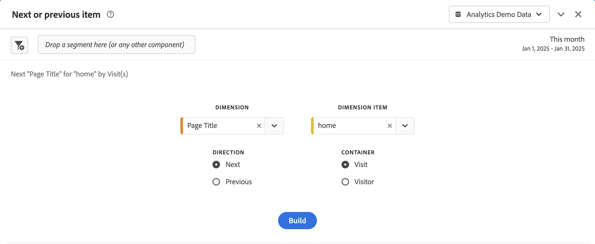
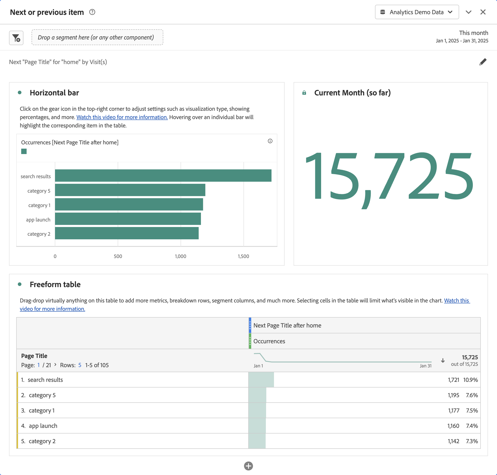

# Next or previous item panel {#next-or-previous-item-panel}

>[!CONTEXTUALHELP]
>id="workspace_nextorpreviousitem_button"
>title="Next or previous item"
>abstract="Create a panel to understand the previous dimensions people come from or next dimension people go to."

>[!CONTEXTUALHELP]
>id="workspace_nextorpreviousitem_panel"
>title="Nest or previous item"
>abstract="Analyze what are the most common places visitors previously came from or go to next.  **Dimension**: Select a dimension. For example **Page**. **Dimension item**: Select a specific dimension item. For example **Homepage**. **Direction**: Select **Next** to see the dimension items immediately next following your selected dimension item. Select **Previous** to see the dimension items leading up to your selected dimension item. **Container**: Select **Session** to see the next/previous dimension items within the same session, or select **Person** to see the next/previous dimension item for the same person."

>[!BEGINSHADEBOX]

_This article documents the Next or previous item panel in_  _**Adobe Analytics**._ _See [Next or previous item panel](https://experienceleague.adobe.com/en/docs/analytics/analyze/analysis-workspace/panels/next-previous)) for the_  _**Customer Journey Analytics** version of this article._

>[!ENDSHADEBOX]

The **[!UICONTROL Next or previous item]** panel contains a number of tables and visualizations to identify the next or previous dimension item for a specific dimension. For example, you might want to explore which pages customers went to most often after they visited the Home page.

## Use

To use a **[!UICONTROL Next or previous item]** panel:

1. Create a **[!UICONTROL Next or previous item]** panel. For information about how to create a panel, see [Create a panel](panels.md#create-a-panel).  

1. Specify the [input](#panel-input) for the panel.

1. Observe the [output](#panel-output) for the panel.

### Panel input

You can configure the [!UICONTROL Next or previous item] panel using these input settings:

| Input | Description |
| --- | --- |
| **[!UICONTROL Dimension]** | Select the dimension for which you want to explore next or previous items. |
| **[!UICONTROL Dimension item]** | Select the specific dimension item at the center of your next / previous inquiry. |
| **[!UICONTROL Direction]** | Specify whether you are looking for the [!UICONTROL Next] or the [!UICONTROL Previous] dimension item. |
| **[!UICONTROL Container]** | Select the container, **[!UICONTROL Visit]** or **[!UICONTROL Visitor]** (default), to determine the scope of your inquiry. |

{style="table-layout:auto"}

Select **[!UICONTROL Build]** to build the panel.

### Panel output

The [!UICONTROL Next or previous item] panel returns a rich set of data and visualizations to help you better understand what occurrences follow or precede specific dimension items.

| Visualization | Description |
| --- | --- |
| **[!UICONTROL Horizontal bar]** | Lists the next (or previous) items based on the dimension item that you select. Hovering over an individual bar highlights the corresponding item in the Freeform table. |
| **[!UICONTROL Summary number]** | High-level summary number of all next or previous dimension item occurrences for the current month (so far.) |
| **[!UICONTROL Freeform table]** | Lists the next (or previous) items based on the dimension item that you select, in a table format. For example, which were the most popular pages (by occurrences) that people went to after (or before) the home page or the workspace page. |

{style="table-layout:auto"}

>[!MORELIKETHIS]
>
>[Create a panel](/help//analyze/analysis-workspace/c-panels/panels.md#create-a-panel)
>

<!--
# Next or previous item panel

This panel contains a number of tables and visualizations to easily identify the next or previous dimension item for a specific dimension. For example, you might want to explore which pages customers went to most often after they visited the Home page.

## Access the panel

You can access the panel from within [!UICONTROL Reports] or within [!UICONTROL Workspace].

| Access point | Description |
| --- | --- |
| [!UICONTROL Reports] | <ul><li>The panel is already dropped into a project.</li><li>The left rail is collapsed.</li><li>If you selected [!UICONTROL Next page], default settings have already been applied, such as [!UICONTROL Page] for [!UICONTROL Dimension], and the top page as the [!UICONTROL Dimension Item], [!UICONTROL Next] for [!UICONTROL Direction] and [!UICONTROL Visit] for [!UICONTROL Container]. You can modify all these settings.</li></ul>|
| Workspace | Create a new project and select the Panel icon in the left rail. Then drag the [!UICONTROL Next or previous item] panel above the Freeform table. Notice that the [!UICONTROL Dimension] and [!UICONTROL Dimension Item] fields are left blank. Select a dimension from the drop-down list. [!UICONTROL Dimension items] are populated based on the [!UICONTROL dimension] you chose. The top dimension item gets added, but you can select a different item. The defaults are Next and Visitor. Again, you can modify these as well.
 |

{style="table-layout:auto"}

## Panel Inputs {#Input}

You can configure the [!UICONTROL Next or previous item] panel panel using these input settings:

| Setting | Description |
| --- | --- |
| Segment (or other component) drop zone | You can drag and drop segments or other components to further filter your panel results. |
| Dimension | The dimension for which you want to explore next or previous items. |
| Dimension Item | The specific item at the center of your next/previous inquiry. |
| Direction | Specify whether you are looking for the [!UICONTROL Next] or the [!UICONTROL Previous] dimension item. |
| Container | [!UICONTROL Visit] or [!UICONTROL Visitor] (default) determine the scope of your inquiry. |

{style="table-layout:auto"}

Click **[!UICONTROL Build]** to build the panel.

## Panel output {#output}

The [!UICONTROL Next or previous item] panel returns a rich set of data and visualizations to help you better understand what occurrences follow or precede specific dimension items.

| Visualization | Description |
| --- | --- |
| Horizontal bar | Lists the next (or previous) items based on the dimension item you chose. Hovering over an individual bar highlights the corresponding item in the Freeform table. |
| Summary number | High-level summary number of all next or previous dimension item occurrences for the current month (so far.) |
| Freeform table | Lists the next (or previous) items based on the dimension item you chose, in a table format. For example, which were the most popular pages (by occurrences) that people went to after (or before) the home page or the workspace page. |

{style="table-layout:auto"}

-->