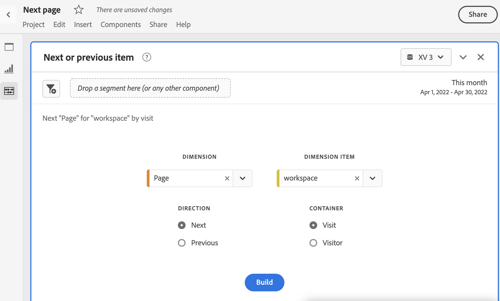
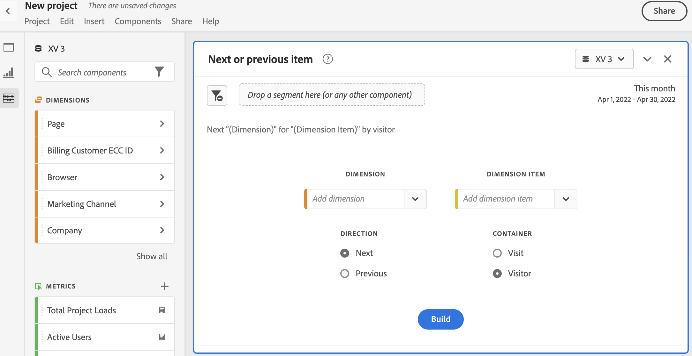
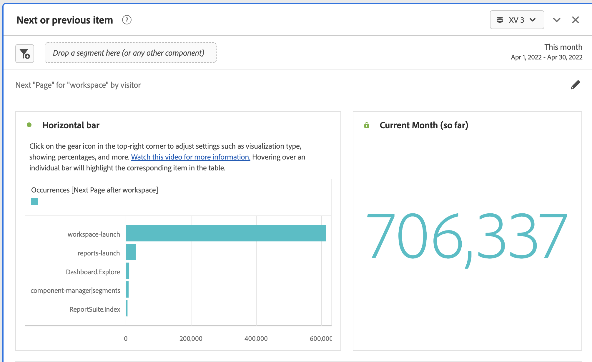
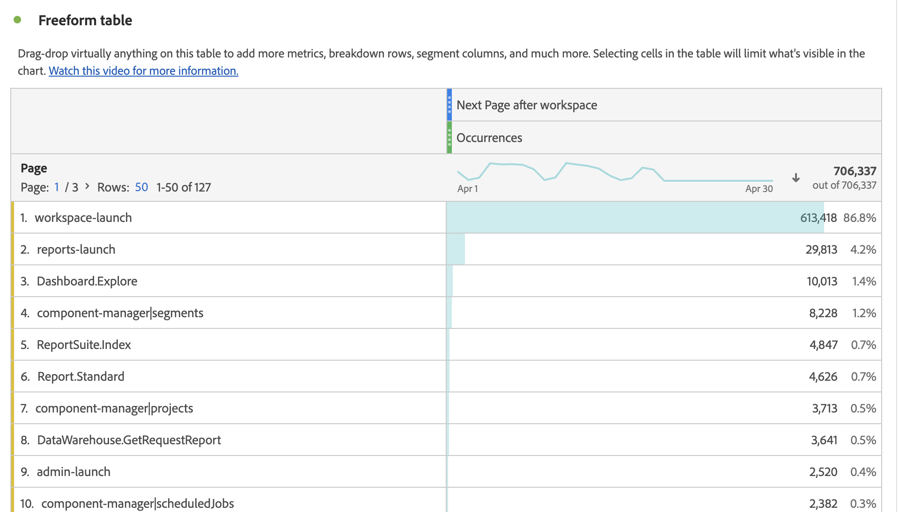

# Next or previous item panel

The [!UICONTROL Next or previous item] panel started out as a report in Reports & Analytics, under [!UICONTROL Reports] > [!UICONTROL Most popular] > [!UICONTROL Next page/Previous page]. This Workspace panel contains a number of tables and visualizations to easily identify the next or previous dimension item for a specific dimension. For example, you might want to explore which pages customers went to most often after they visited the Home page.

## Access the panel

You can access the panel from within [!UICONTROL Reports] or within [!UICONTROL Workspace].

| Access point | Description |
| --- | --- |
| [!UICONTROL Reports] | <ul><li>The panel is already dropped into a project.</li><li>The left rail is collapsed.</li><li>If you selected [!UICONTROL Next page], default settings have already been applied, such as [!UICONTROL Page] for [!UICONTROL Dimension], and the top page as the [!UICONTROL Dimension Item], [!UICONTROL Next] for [!UICONTROL Direction] and [!UICONTROL Visit] for [!UICONTROL Container]. You can modify all these settings.</li></ul>|
| Workspace | Create a new project and select the Panel icon in the left rail. Then drag the [!UICONTROL Next or previous item] panel above the Freeform table. Notice that the [!UICONTROL Dimension] and [!UICONTROL Dimension Item] fields are left blank. Select a dimension from the drop-down list. [!UICONTROL Dimension items] are populated based on the [!UICONTROL dimension] you chose. The top dimension item gets added, but you can select a different item. The defaults are Next and Visitor. Again, you can modify these as well.
 |

{style="table-layout:auto"}

## Panel Inputs {#Input}

You can configure the [!UICONTROL Next or previous item] panel panel using these input settings:

| Setting | Description |
| --- | --- |
| Segment (or other component) drop zone | You can drag and drop segments or other components to further filter your panel results. |
| Dimension | The dimension for which you want to explore next or previous items. |
| Dimension Item | The specific item at the center of your next/previous inquiry. |
| Direction | Specify whether you are looking for the [!UICONTROL Next] or the [!UICONTROL Previous] dimension item. |
| Container | [!UICONTROL Visit] or [!UICONTROL Visitor] (default) determine the scope of your inquiry. |

{style="table-layout:auto"}

Click **[!UICONTROL Build]** to build the panel.

## Panel output {#output}

The [!UICONTROL Next or previous item] panel returns a rich set of data and visualizations to help you better understand what occurrences follow or precede specific dimension items.

| Visualization | Description |
| --- | --- |
| Horizontal bar | Lists the next (or previous) items based on the dimension item you chose. Hovering over an individual bar highlights the corresponding item in the Freeform table. |
| Summary number | High-level summary number of all next or previous dimension item occurrences for the current month (so far.) |
| Freeform table | Lists the next (or previous) items based on the dimension item you chose, in a table format. For example, which were the most popular pages (by occurrences) that people went to after (or before) the home page or the workspace page. |

{style="table-layout:auto"}
