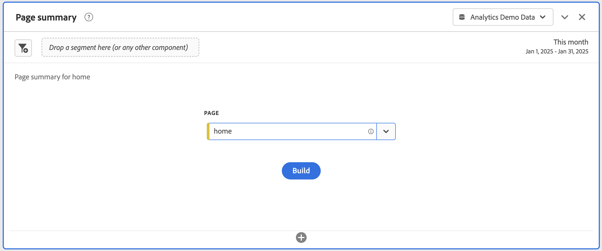
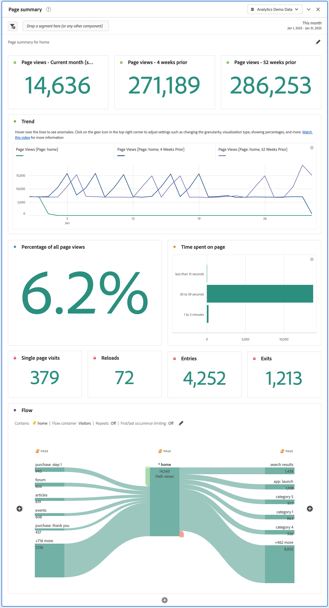

# Page summary panel {#page-summary}

<!-- markdownlint-disable MD034 -->

>[!CONTEXTUALHELP]
>id="workspace_pagesummary_button"
>title="Page summary"
>abstract="Quickly review some of the high-level metrics as well as the movement to and from a specific page."

<!-- markdownlint-enable MD034 -->

<!-- markdownlint-disable MD034 -->

>[!CONTEXTUALHELP]
>id="workspace_pagesummary_panel"
>title="Page summary panel"
>abstract="Quickly review some of the high-level metrics as well as the movement to and from a specific page.  **Parameters** **Add a page dimension item**: Open the component rail, locate the Page dimension and expand it by clicking on the carrot to see the dimension items. Then, drag and drop the specific page you want to learn about into the builder. Once you have drag and dropped the dimension item, the report automatically populates with key information about the page."

<!-- markdownlint-enable MD034 -->

>[!BEGINSHADEBOX]

_This article documents the Page summary panel in_  _**Adobe Analytics**._ _There is no equivalent panel in_  _**Customer Journey Analytics**._

>[!ENDSHADEBOX]

A **[!UICONTROL Page summary]** panel lets you explore key statistics about specific pages.

## Use

To use a **[!UICONTROL Page summary]** panel:

1. Create a **[!UICONTROL Page summary]** panel. For information about how to create a panel, see [Create a panel](panels.md#create-a-panel).  

1. Specify the [input](#panel-input) for the panel.

1. Observe the [output](#panel-output) for the panel.

You can access the panel from within [!UICONTROL Reports] or within [!UICONTROL Workspace].

| Access point | Description |
| --- | --- |
| [!UICONTROL Reports] | <ul><li>The panel is already dropped into a project.</li><li>The left rail is collapsed.</li><li>Only the Page dimension is supported.</li><li>A default setting has already been applied, in this case, the top visited page for the[!UICONTROL Page] dimension. You can modify this setting.</li></ul> |
| Workspace | Create a new project and select the Panel icon in the left rail. Drag the [!UICONTROL Page summary] panel above the Freeform table. Notice that the Page [!UICONTROL Dimension Item] field is left blank. Select a dimension item from the drop-down list. |

### Panel input {#panel-input}

You can configure the [!UICONTROL Page summary] panel using these input settings:

| Input | Description |
| --- | --- |
| **[!UICONTROL Page]** | Select a page dimension for which page you want to explore key statistics. |

{style="table-layout:auto"}

Select **[!UICONTROL Build]** to build the panel.

### Panel output {#panel-output}

The [!UICONTROL Page summary] panel returns a rich set of metrics data and visualizations to help you better understand statistics about specific pages.

| Visualization | Description |
| --- | --- |
| **[!UICONTROL Page views] - Current month (so far)** | A [Summary number](/help/analyze/analysis-workspace/visualizations/summary-number-change.md) visualization that shows the number of page views for this page for the current month. |
| **[!UICONTROL Page views] - 4 weeks prior** | A [Summary number](/help/analyze/analysis-workspace/visualizations/summary-number-change.md) visualization that shows the number of page views for this page over the last month. |
| **[!UICONTROL Page views] - 52 weeks prior** | A [Summary number](/help/analyze/analysis-workspace/visualizations/summary-number-change.md) visualization that shows the number of page views for this page over the last year. |
| **[!UICONTROL Trend]** | A trended [Line](/help/analyze/analysis-workspace/visualizations/line.md) visualization for page views for this month, 4 weeks prior, and 52 weeks prior. |
| **[!UICONTROL Percentage of all page views]** | A summary number for the percentage of all page views that went to this page. |
| **[!UICONTROL Time spent on page]** | A [Horizontal bar](/help/analyze/analysis-workspace/visualizations/horizontal-bar.md) visualization that shows the time spent on this page. |
| **[!UICONTROL Single page visits]** | A [Summary number](/help/analyze/analysis-workspace/visualizations/summary-number-change.md) that shows the number of page views where this page was the only page visited. |
| **[!UICONTROL Reloads]** | A [Summary number](/help/analyze/analysis-workspace/visualizations/summary-number-change.md) that shows the number of times a dimension item was present during a reload. A visitor refreshing their browser is the most common way to trigger a reload. |
| **[!UICONTROL Entries]** | A [Summary number](/help/analyze/analysis-workspace/visualizations/summary-number-change.md) that shows the number of times a given dimension item is captured as the first value in a visit. |
| **[!UICONTROL Exits]** | A [Summary number](/help/analyze/analysis-workspace/visualizations/summary-number-change.md) that shows the number of times a given dimension item is captured as the last value in a visit.  |
| **[!UICONTROL Flow]** | A [Flow](/help/analyze/analysis-workspace/visualizations/c-flow/flow.md) visualization with the selected page as the focal point. You can drill further into the data just like in any [Flow](/help/analyze/analysis-workspace/visualizations/c-flow/create-flow.md) visualization. |

{style="table-layout:auto"}

Use  to reconfigure and rebuild the panel.
