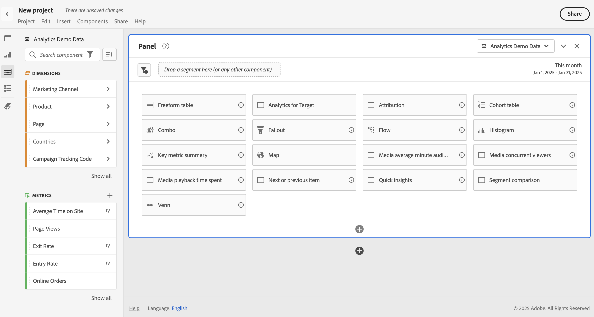
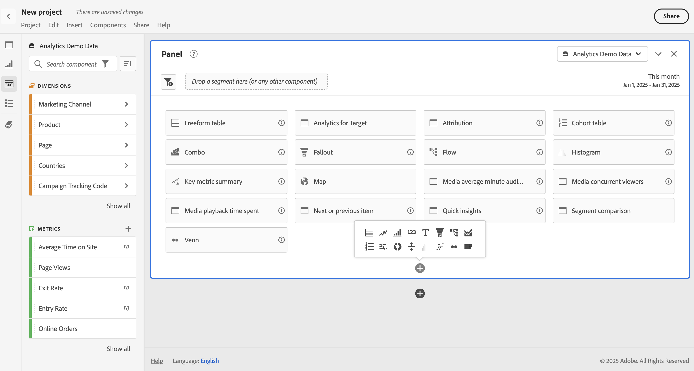
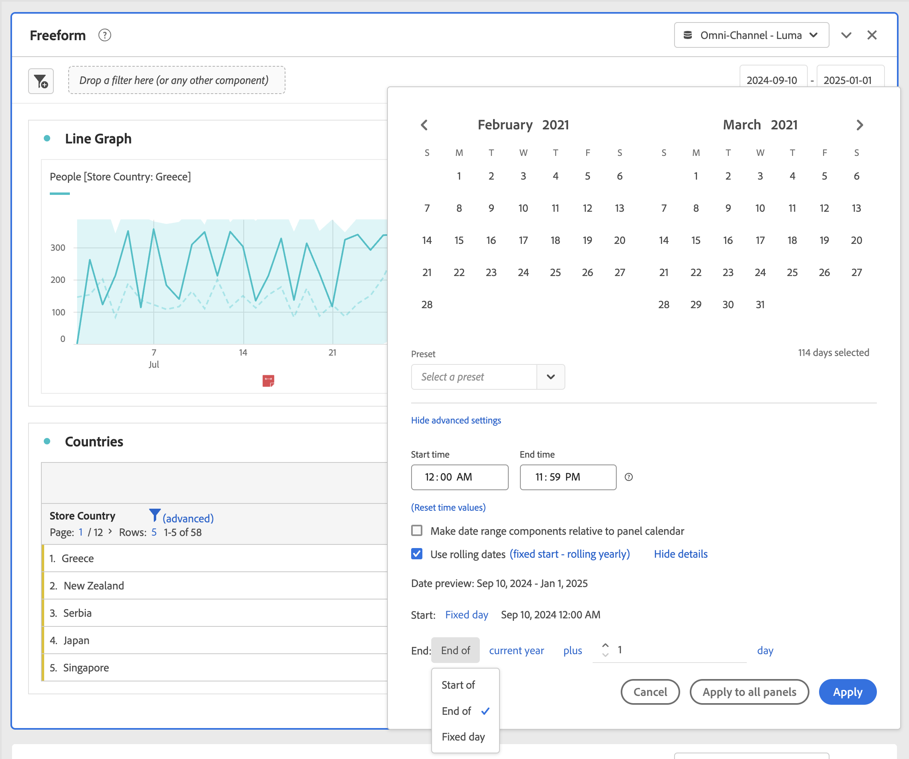

# Panels overview

A [!UICONTROL panel] is a collection of tables and visualizations. You can access panels from the top-left icon in Workspace or a [blank panel](/help/analyze/analysis-workspace/c-panels/blank-panel.md). Panels are helpful when you want to organize your projects according to time periods, report suites, or analysis use case.

## Panel types

The following panel types are available in Analysis Workspace for [!UICONTROL Adobe Analytics]:

| Panel name | Description |
| --- | --- |
| [Blank panel](/help/analyze/analysis-workspace/c-panels/blank-panel.md) | Choose from available panels and visualizations to start your analysis. |
| [Attribution](attribution.md) | Quickly compare and visualize any number of attribution models using any dimension and conversion metric. |
| [Analytics for Target](a4t-panel.md) | Analyze Target activities and experiences in Analysis Workspace. |
| [Freeform](freeform-panel.md) | Perform unlimited comparisons and breakdowns, then add visualizations to tell a rich data story. |
| [Media average minute audience](average-minute-audience-panel.md) | Analyze the average minute audience for a specific piece of content, or over a customized time period. | 
| [Media concurrent viewers](media-concurrent-viewers.md) | Analyze concurrent viewers over time, with details on peak concurrency and the ability to break down and compare. |
| [Media playback time spent](/help/analyze/analysis-workspace/c-panels/media-playback-time-spent.md) | Analyze playback time spent to understand where peak concurrencies occur or where drop-offs happen. |
| [Next or previous item](next-previous.md) | Show the next or previous pages people go to. |
| [Quick insights](quickinsight.md) | Quickly build a freeform table and an accompanying visualization to analyze and uncover insights faster. |
| [Segment comparison](/help/analyze/analysis-workspace/c-panels/c-segment-comparison/segment-comparison.md) | Quickly compare two segments across all data points to automatically find relevant differences. |

[!UICONTROL Quick insights], [!UICONTROL Blank] and [!UICONTROL Freeform] panels are great places to start your analysis, while [!UICONTROL Attribution] lends itself to more advanced analyses. A  is available at the bottom of your canvas, so you can add blank panels at any time.

The default starting panel is the [!UICONTROL Freeform] panel, but you can make the [Blank panel](/help/analyze/analysis-workspace/c-panels/blank-panel.md) or [Quick insights](/help/analyze/analysis-workspace/c-panels/quickinsight.md) your default as well. See [Projects & Analysis preferences](/help/analyze/analysis-workspace/user-preferences.md#projects--analyses-preferences).

## Create a panel

To create a panel :

* Drag and drop a panel from the **[!UICONTROL Panels]** left panel onto your canvas.
* Select a panel from the [Blank panel](blank-panel.md).
* Use **[!UICONTROL Insert]** menu in Workspace and select your panel. Alternatively, you can use any of the [shortcuts](../build-workspace-project/fa-shortcut-keys.md) to insert a panel.

  

You can:

* Select  **within** any panel to add another visualization. A popup appears that allows you to select a visualization.

  

  | Select.. | To create a...  |
  |---|---|
  |  | [Freeform table](/help/analyze/analysis-workspace/visualizations/freeform-table/freeform-table.md) |
  |  | [Line](/help/analyze/analysis-workspace/visualizations/line.md) |
  |  | [Bar](/help//analyze/analysis-workspace/visualizations/bar.md) |
  |  | [Summary number](/help/analyze/analysis-workspace/visualizations/summary-number-change.md) |
  |  | [Text](/help/analyze/analysis-workspace/visualizations/text.md) |
  |  | [Fallout](/help/analyze/analysis-workspace/visualizations/fallout/fallout-flow.md) |
  |  | [Flow](/help/analyze/analysis-workspace/visualizations/c-flow/flow.md) |
  |  | [Area stacked](/help/analyze/analysis-workspace/visualizations/area.md) |
  |  | [Cohort table](/help/analyze/analysis-workspace/visualizations/cohort-table/t-cohort.md) |
  |  | [Bullet](/help/analyze/analysis-workspace/visualizations/bullet-graph.md)|
  |  | [Donut](/help/analyze/analysis-workspace/visualizations/donut.md) |
  |  | [Summary change](/help/analyze/analysis-workspace/visualizations/summary-number-change.md) |
  |  | [Histogram](/help/analyze/analysis-workspace/visualizations/histogram.md) |
  |  | [Scatter](/help/analyze/analysis-workspace/visualizations/scatterplot.md) |
  |  | [Venn](/help/analyze/analysis-workspace/visualizations/venn.md) |
  |  | [Treemap](/help/analyze/analysis-workspace/visualizations/treemap.md) | 

* Select  **outside** the last panel in your workspace to add another [Blank panel](blank-panel.md).

## Report suite

Each panel is associated with a [report suite](/help/admin/admin/c-manage-report-suites/report-suites-admin.md), identified by  **[!UICONTROL *name of report suite*]** in the drop-down menu at the top right of the panel.

When you create a new panel, the default report suite is based on the report suite of the panel you last worked on in the Analysis Workspace project.

Within a project, you can use one or [many report suites](https://experienceleague.adobe.com/docs/analytics/analyze/analysis-workspace/build-workspace-project/multiple-report-suites.html) depending on your analysis use cases.

The list of report suites is sorted on relevancy, which Adobe defines based on how recently and frequently the suite has been used by the current user, and how frequently the suite is used within the organization.

>[!IMPORTANT]
>
>The selected report suite determines what dimensions, metrics, and segments are available for building visualizations in a panel.
>
>
>When you switch a report suite for a panel, some of the components might not be available in that new report suite. This change can cause your visualization not to render properly. You might see warnings like:
>
>* This panel contains components that are not enabled in the selected report suite. Please change the report suite or enable the required components in the report suite. 
>* Unable to render visualization: Please check your columns and rows to ensure they contain valid components.
>

## Calendar

The panel calendar controls the reporting date range for tables and visualizations within a panel.

>[!NOTE]
>
>If a  Date range component is used within a visualization or panel (for example, as a segment), the date range component overrides the panel calendar.
>

1. Select a date range by selecting first the start date and then the end date. 
   Alternatively, you can select a **[!UICONTROL Preset]** from the [!UICONTROL *Select a preset*] drop-down menu.

1. Optionally, select **[!UICONTROL Show advanced settings]** to:

   * Specify **[!UICONTROL Start time]** and **[!UICONTROL End time]** other than the default `12:00 AM` (`0:00`) and `11:59 PM` (`23:59`). End times always include 59 seconds. For a date range that spans many days, the start time applies to the first day of the date range and the end time applies to the last day in your date range. Use **[!UICONTROL (Reset time values)]** to reset start and end time to their defaults.
   * **[!UICONTROL Make date range components relative to panel calendar]**. If disabled, date range components used in the panel are relative to the current time. If enabled, date range components used in the panel are relatve to the panel calendar.
   * **[!UICONTROL Use rolling dates]**. If enabled, preset date ranges like **[!UICONTROL Last 7 full days]** dynamically update as current date and time progress. If disabled, such presets are not updated once applied.
     
     

     You can select the text in brackets (for exampe **[!UICONTROL fixed start - rolling daily]**) to extend the panel and specify details for **[!UICONTROL Start]** and **[!UICONTROL End]**.

       1. Select **[!UICONTROL Start of]**, **[!UICONTROL End of]**, or **[!UICONTROL Fixed day]**.
       1. When you have selected **[!UICONTROL Start of]** or **[!UICONTROL End of]**, you can build a full expression. For example: **[!UICONTROL End of]** **[!UICONTROL current year]** **[!UICONTROL plus]** `1` **[!UICONTROL day]**. Pick the appropriate value for each individual part of the expression.
          * Select a value for current. For example **[!UICONTROL current year]**.
          * Select a value for additional calculation. For example, **[!UICONTROL plus]**.
          * When you have specified additional calculation, specify a value. For example `1`.
          * When you have specified additional calculation, select the time period to use for the calculation. For example **[!UICONTROL day]**.
     
     Select **[!UICONTROL Hide details]** to hide the details for rolling dates calculation.

1. Select **[!UICONTROL Apply]** to apply the date range to the panel from which you invoked the calendar. 
   Select **[!UICONTROL Apply to all panels]** to apply the date range to all panels in the Workspace project.

## Drop zone {#dropzone}

The panel drop zone enables you to apply segments and drop-down segments to all tables and visualizations within a panel. You can apply one or many segments to a panel. 

### Segments

Drag and drop any segments from the left panel into the panel drop zone to begin segmenting your panel. Repeat this process to add additional segments to the panel. Segments appear side by side at the top of the panel.

#### Quick segments 

Non-segment components can also be dragged directly into the drop zone to create quick segments, saving you the time and effort of going to the [Segment builder](/help/components/segmentation/segmentation-workflow/seg-build.md). Segments created in this way are automatically defined as event-level segments. This definition can be quickly modified by selecting  next to the segment name. 

<!-- For more information, see [Quick segments](/help/components/segmentation/). -->

### Drop-down segments

>[!BEGINSHADEBOX]

See  [Dropdown segments](https://video.tv.adobe.com/v/23877?quality=12&learn=on){target="_blank"} for a demo video.

>[!ENDSHADEBOX]

#### Static drop-down segments

Static drop-down segments enable you to interact with the data in a controlled way. For example, you can add a drop-down segment for Mobile Device Types so that you can segment the panel by Tablet, Mobile Phone, or Desktop.

Static drop-down segments can also be used to consolidate many projects into one. For example, if you have many versions of the same project with different Country segments applied, you can consolidate all versions into a single project and add a Country drop-down segment.

##### Create static drop-down segments

* For drop-down segments using dimension items, select a single dimension from the left panel and drop the dimension into the panel drop zone while holding ⇧ (*shift*). This action creates a drop-down segment with all the dimension items that are associated with that dimension. 

  Or, if you want the drop-down segment to include only specific dimension items that are associated with a dimension, select the right arrow icon next to the desired dimension in the left panel. This action exposes all available dimension items. Select multiple dimension items from this list using ⇧+ (*shift* + *select*) or ^+ (*control* + *select*), then drop them into the panel drop zone **while holding** ⇧.

* For drop-down segments using a single component type (for example, only dimensions, or only segments, or only metrics), select multiple items of the same type in the left panel using ⇧+ or ^+. Then drop the items into the panel drop zone **while holding** ⇧.

  A single drop-down segment is created with components that you selected.

* For drop-down segments using a mix of component types (such as 2 metrics and 3 segments), select multiple components using ⇧+ or ^+. Drop the selection into the panel drop zone **while holding** ⇧. In this context, all component types are treated as separate drop-down segments. For example, if you include both metrics and dimension items in your selection, two separate drop-down segments are created: one drop-down segment includes dimension items, and the other includes metrics.

A drop-down segment provides the following context menu options:

* **[!UICONTROL Delete drop-down]**: Removes the drop-down segment from the panel. 
* **[!UICONTROL Delete label]**: Remove the text displayed above a drop-down segment. To modify the label, hover over the label and select .
* **[!UICONTROL Add label]**: When you add a drop-down segment to a project, a label is automatically set to the component name. If you delete the label, you can add it again with this option.
* **[!UICONTROL Require selection]**: Requires that a segment is set on the panel. 

##### Use static drop-down segments

Users can use the drop-down segment menu in any of the following ways to segment the panel:
     
* Apply a single segment to the panel by selecting the segment from the drop-down segment.

* Apply multiple segments to the panel by selecting more than one segment from the drop-down segment. The panel is segmented to include any of the selected segments. 

#### Dynamic drop-down segments

Dynamic drop-down segments allow you to determine available values based on data within the panel's reporting range and values in other drop-down segments. For example, you can create two dynamic drop-downs using a Countries dimension and a Cities dimension. When you select a country from the **[!UICONTROL Countries]** drop-down list, the **[!UICONTROL Cities]** drop-down list dynamically adjusts to show only cities within that country.

This same concept applies to all dimensions; only dimension items that appear within the panel's date range and selected segments are visible. Dimension items selected in static drop-down segments affect available values in dynamic drop-down segments. However, the inverse is not true; Dimension items selected in dynamic drop-down segments do not affect available values in static drop-down segments.

Manual selection of dimension items is available if you anticipate a certain dimension item to be collected in the future. You can also clear a dynamic drop-down segment so that it does not contain a value, allowing other dynamic drop-down segments to contain more values. Select **[!UICONTROL Reset all]** to clear the selection from all drop-down segments for that panel.

To create a dynamic drop-down segment:

* Drag and drop a single dimension into the panel drop zone **while holding** ⇧.

Note that Dynamic drop-down segments are not available for metrics, segments, or date ranges.

A dynamic drop-down segment provides the same context menu options as static drop-down segments.

## Context menu

Additional functionality for a panel is available through a context menu (right-click) on the panel header.

The following options are available:

| Option | Description |
| --- | --- |
| **[!UICONTROL Insert copied panel]** | Let you paste a copied panel to another place within the project, or into a different project.|
| **[!UICONTROL Insert copied visualization]** | Paste a copied visualization to another place within the panel, project, or into a different project. |
| **[!UICONTROL Apply Report Suite to all panels]** | Apply the Report Suite for this panel to all other panels in the project. |
| **[!UICONTROL Copy panel]** | Copy a panel, so that you can insert it to another place within the project, or into a different project.|
| **[!UICONTROL Duplicate panel]** | Makes an exact duplicate of the current panel, which you can then modify. |
| **[!UICONTROL Collapse all panels]** | Collapse all project panels. |
| **[!UICONTROL Expand all panels]** | Expand all project panels. |
| **[!UICONTROL Collapse all visualizations in panel]** | Collapse all visualizations in the current panel. |
| **[!UICONTROL Expand all visualizations in panel]** | Expand all visualizations in the current panel. |
| **[!UICONTROL Edit Description]** | Add (or edit) a text description for the panel. |
| **[!UICONTROL Get Panel Link]** | Direct someone to a specific panel within a project. When the link is selected, the recipient is required to log in before being directed to the exact panel linked to. |

## Configuration

Some panels (like [!UICONTROL Attribution], [!UICONTROL Experimentation], [!UICONTROL Media average minute audience], and others) have a configuration dialog to assist you in building the visualization. Use  at the top of the panel to access and change the configuration.

<!--
## Panel types

The following panel types are available in Analysis Workspace:

| Panel name | Description |
| --- | --- |
| [Blank panel](blank-panel.md) | Choose from available panels and visualizations to start your analysis. |
| [Quick Insights panel](quickinsight.md) | Quickly build a freeform table and an accompanying visualization in order to analyze and uncover insights faster. |
| [Analytics for Target panel](a4t-panel.md) | Analyze Target activities and experiences in Analysis Workspace. |
| [Attribution panel](attribution.md) | Quickly compare and visualize any number of attribution models using any dimension and conversion metric. |
| [Freeform panel](freeform-panel.md) | Perform unlimited comparisons and breakdowns, then add visualizations to tell a rich data story. |
| [Media Average Minute Audience panel](average-minute-audience-panel.md) | Analyze average minute audience over time, with details on peak views and the ability to break down and compare. |
| [Media Concurrent Viewers panel](media-concurrent-viewers.md) | Analyze concurrent viewers over time, with details on peak concurrency and the ability to break down and compare. |
| [Media Playback Timespent panel](/help/analyze/analysis-workspace/c-panels/media-playback-time-spent.md) | Analyze concurrent viewers over time, with details on peak concurrency and the ability to break down and compare. |
| [Segment Comparison panel](c-segment-comparison/segment-comparison.md) | Quickly compare two segments across all data points to automatically find relevant differences. |

[!UICONTROL Quick Insights], [!UICONTROL Blank] and [!UICONTROL Freeform] panels are great places to start your analysis, while [!UICONTROL Analytics for Target], [!UICONTROL Attribution], [!UICONTROL Media Concurrent Viewers] and [!UICONTROL Segment Comparison] lend themselves to more advanced analyses. A `"+"` button is available in projects so you can add blank panels at any time.

The default starting panel is the [!UICONTROL Freeform] panel, but you can make the [blank panel](/help/analyze/analysis-workspace/c-panels/blank-panel.md) your default as well.

## Report suite {#report-suite}

Tables and visualizations within a panel derive data from the [!UICONTROL report suite] selected in the top right of the panel. The report suite also determines what components are available in the left rail. Within a project, you can use one or [many report suites](https://experienceleague.adobe.com/docs/analytics/analyze/analysis-workspace/build-workspace-project/multiple-report-suites.html) depending on your analysis use cases. To apply a single report suite to all panels in a project, **right-click panel header > Apply report suite to all panels**.

The list of report suites is sorted on relevancy, which Adobe defines based on how recently and frequently the suite has been used by the current user, and how frequently the suite is used within the organization.

## Calendar {#calendar}

The panel calendar controls the reporting range for tables and visualizations within a panel.

>[!NOTE]
>If a (purple) date range component is used within a table, visualization or panel drop zone, it overrides the panel calendar.

You can apply a minute-level date range under the advanced settings of your panel calendar. If you are reporting on a date range that spans many days, start time applies to the first day and end time applies to the last day in your range.

## Drop zone {#dropzone}

The panel drop zone enables you to apply segment and drop-down filters to all tables and visualizations within a panel. You can apply one or many filters to a panel. 

### Segment filters

Drag and drop any segments from the left rail into the panel drop zone to begin filtering your panel. Repeat this process to add additional filters to the panel. Filters appear side by side at the top of the panel.

### Ad hoc segment filters

Non-segment components can also be dragged directly into the drop zone to create ad hoc segments, saving you the time and effort of going to the Segment Builder. Segments created in this way are automatically defined as hit-level segments. This definition can be modified by clicking the information icon (i) next to the segment, then the pencil-shaped edit icon and editing it in the Segment Builder.

Ad hoc segments are a type of quick segment, and are local to the project. They do not show up in the left rail unless you make them public.

For more information, see [Quick segments](/help/analyze/analysis-workspace/components/segments/quick-segments.md).

### Static drop-down segments

Static drop-down segments enable you to interact with the data in a controlled way. For example, you can add a drop-down segment for Mobile Device Types so that you can segment the panel by Tablet, Mobile Phone, or Desktop.

Static drop-down segments can also be used to consolidate many projects into one. For example, if you have many versions of the same project with different Country segments applied, you can consolidate all versions into a single project and add a Country drop-down segment.

#### Create static drop-down segments

* For drop-down segments using dimension items, select a single dimension from the left rail and drop it into the panel dropzone **while holding `[Shift]`**. This creates a drop-down segment with all the dimension items that are associated with that dimension. 

  Or, if you want the drop-down segment to include only specific dimension items that are associated with a dimension, click the right arrow icon next to the desired dimension in the left rail. This action exposes all available dimension items. Select multiple dimension items from this list using `[Shift + Click]` or `[Ctrl + Click]`, then drop them into the panel dropzone **while holding** `[Shift]`.

* For drop-down segments using a single component type (for example, only dimensions, or only segments, or only metrics), select multiple items of the same type in the left rail using `[Shift + Click]` or `[Ctrl + Click]`, then drop them into the panel dropzone **while holding `[Shift]`**.

  A single drop-down segment is created with components that you selected.

* For drop-down segments using a mix of component types (such as 2 metrics and 3 filters), select multiple components using `[Shift + Click]` or `[Ctrl + Click]`. Drop the selection into the panel dropzone **while holding `[Shift]`**. In this context, all component types are treated as separate drop-down segments. For example, if you include both metrics and dimension items in your selection, two separate drop-down segments are created: one drop-down segments includes dimension items, and the other includes metrics.

  

Right-clicking a drop-down segment provides the following options:

* **[!UICONTROL Delete drop-down]**: Removes the drop-down segment from the panel. 
* **[!UICONTROL Delete label]**: Remove the text above a drop-down segment. To modify the label, select the pencil icon.
* **[!UICONTROL Add label]**: When you add a drop-down segment to a project, a label is automatically set to the component name. If you delete the label, you can add it again with this option.
* **[!UICONTROL Require selection]**: Requires that a segment is set on the panel. 

[Watch the video](https://experienceleague.adobe.com/docs/analytics-learn/tutorials/analysis-workspace/using-panels/using-panels-to-organize-your-analysis-workspace-projects.html) to learn more about how to add drop-down filters to your project.

#### Use static drop-down segments

Use the drop-down segments menu in any of the following ways in order to filter the panel:
     
* Apply a single segment to the panel by selecting the segment from the drop-down menu.

* Apply multiple segments to the panel by selecting more than one segment from the drop-down menu. The panel is filtered to include any of the selected segments. 

  To remove a segment from the list, select it again in the drop-down menu.

  

### Dynamic drop-down segments

Dynamic drop-down segments allow you to determine available values based on data within the panel's reporting range and values in other drop-down segments. For example, you can create two dynamic drop-downs using the [Countries](/help/components/dimensions/countries.md) dimension and [Cities](/help/components/dimensions/cities.md) dimension. When you select a country from the [!UICONTROL Countries] drop-down list, the [!UICONTROL Cities] drop-down list dynamically adjusts to only show cities within that country.

This same concept applies to all dimensions; only dimension items that appear within the panel's date range and selected segments are visible. Dimension items selected in static drop-down segments affect available values in dynamic drop-down segments. However, the inverse is not true; Dimension items selected in dynamic drop-down segments do not affect available values in static drop-down segments.

Manual selection of dimension items is available if you anticipate a certain dimension item to be collected in the future. You can also clear a dynamic drop-down segment so that it does not contain a value, allowing other dynamic drop-down segments to contain more values. Select **[!UICONTROL Reset all]** to clear the selection from all drop-down segments for that panel.

To create a dynamic drop-down segment:

* Drag and drop a single dimension into the panel dropzone **while holding `[Shift]`**.
* Dynamic drop-down segments are not available for metrics, segments, or date ranges.
* Right-click a drop-down segment and select **[!UICONTROL Delete dropdown]** to delete it.

Right-clicking a dynamic drop-down filter provides the same options as static drop-down filters.

## Right-click menu {#right-click}

Additional functionality for a panel is available by right-clicking on the panel header.

The following settings are available:

| Setting | Description |
| --- | --- |
| Insert Copied Panel/Visualization|Lets you paste ("insert") a copied panel or visualization to another place within the project, or into a different project.|
| Copy Panel | Lets you right-click and copy a panel, so that you can insert it to another place within the project, or into a different project.|
| Apply Report Suite to all panels | Lets you apply the active panel report suite to all panels in the project.|
| Duplicate Panel | Makes an exact duplicate of the current panel, which you can then modify. |
| Collapse/Expand all Panels | Collapses and expands all project panels. |
| Collapse/Expand all Visualizations in Panel | Collapses and expands all visualizations in the current panel. |
| Edit Description | Add (or edit) a text description for the panel. |
| Get Panel Link | Lets you direct someone to a specific panel within a project. When the link is clicked, the recipient will be required to login before being directed to the exact panel linked to. |

-->
