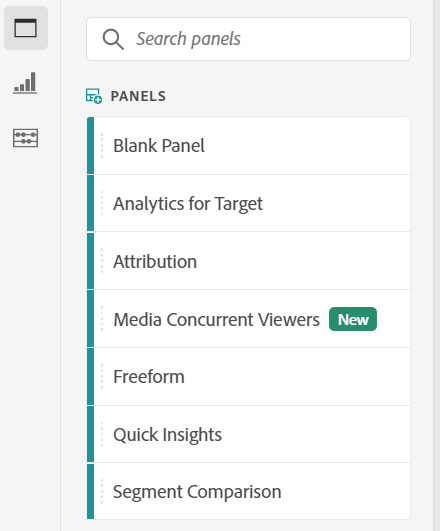
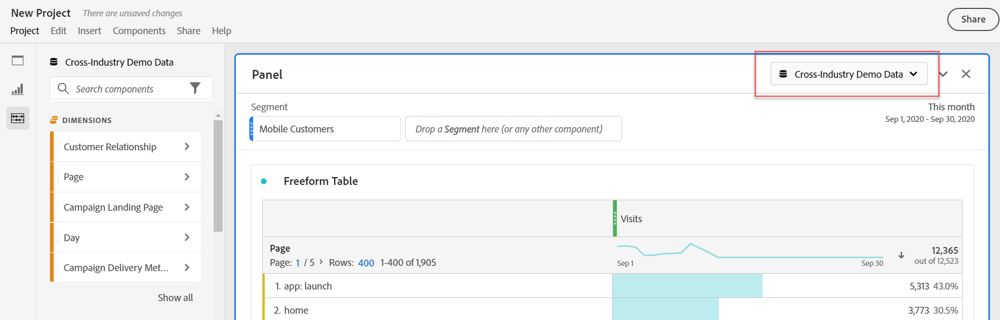
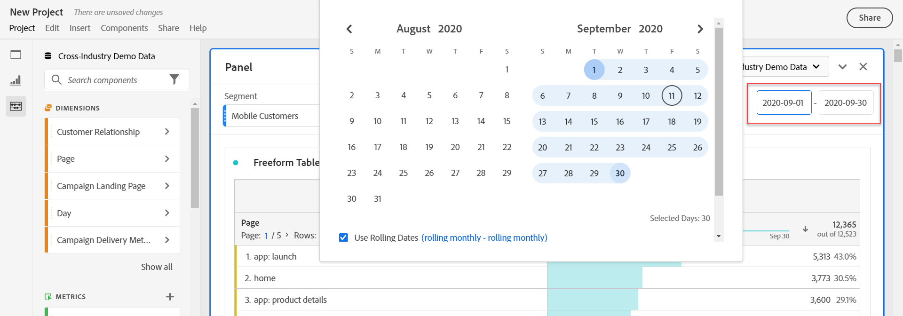
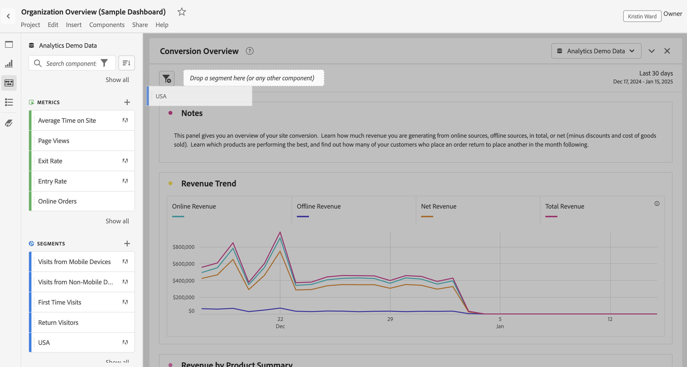
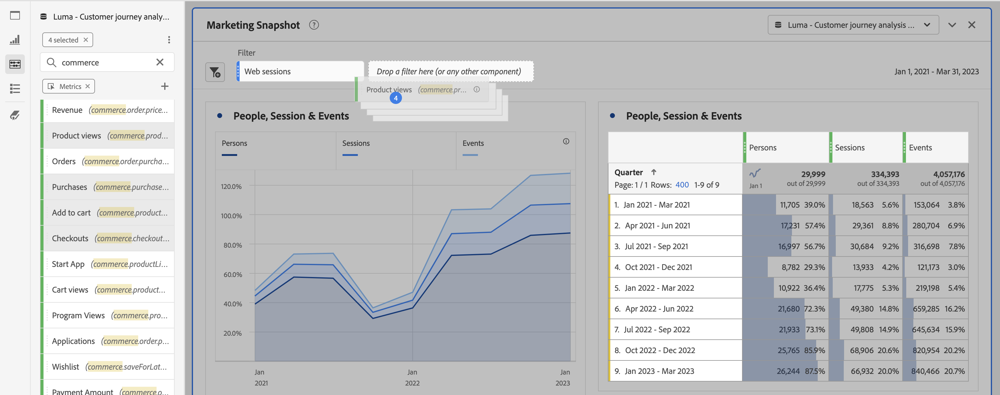
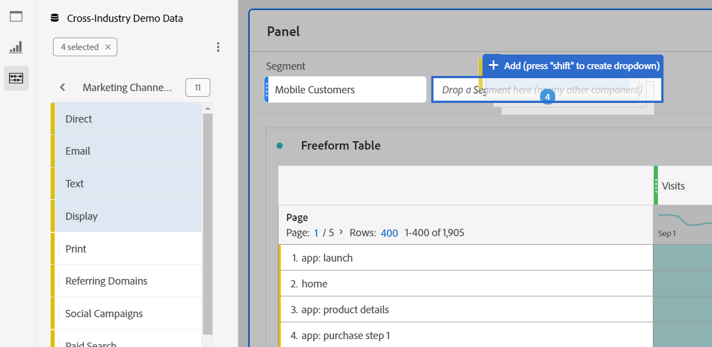
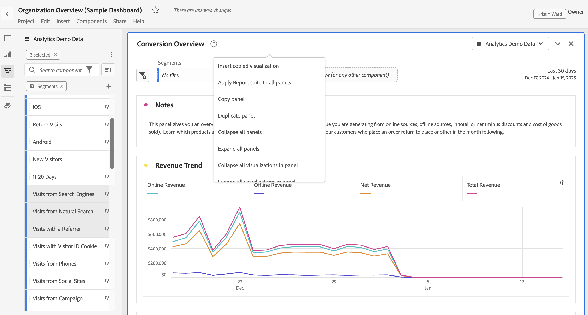

# Panels overview

A [!UICONTROL panel] is a collection of tables and visualizations. You can access panels from the top left icon in Workspace or a [blank panel](blank-panel.md). Panels are helpful when you want to organize your projects according to time periods, report suites, or analysis use case. The following panel types are available in Analysis Workspace:

| Panel name | Description |
| --- | --- |
| [Blank panel](blank-panel.md) | Choose from available panels and visualizations to start your analysis. |
| [Quick Insights panel](quickinsight.md) | Quickly build a freeform table and an accompanying visualization in order to analyze and uncover insights faster. |
| [Analytics for Target panel](a4t-panel.md) | Analyze Target activities and experiences in Analysis Workspace. |
| [Attribution panel](attribution.md) | Quickly compare and visualize any number of attribution models using any dimension and conversion metric. |
| [Freeform panel](freeform-panel.md) | Perform unlimited comparisons and breakdowns, then add visualizations to tell a rich data story. |
| [Media Concurrent Viewers panel](media-concurrent-viewers.md) | Analyze concurrent viewers over time, with details on peak concurrency and the ability to break down and compare. |
| [Segment Comparison panel](c-segment-comparison/segment-comparison.md) | Quickly compare two segments across all data points to automatically find relevant differences. |

[!UICONTROL Quick Insights], [!UICONTROL Blank] and [!UICONTROL Freeform] panels are great places to start your analysis, while [!UICONTROL Analytics for Target], [!UICONTROL Attribution IQ], [!UICONTROL Media Concurrent Viewers] and [!UICONTROL Segment Comparison] lend themselves to more advanced analyses. A `"+"` button is available in projects so you can add blank panels at any time.

The default starting panel is the [!UICONTROL Freeform] panel, but you can make the [blank panel](/help/analyze/analysis-workspace/c-panels/blank-panel.md) your default as well.

## Report suite {#report-suite}

Tables and visualizations within a panel derive data from the [!UICONTROL report suite] selected in the top right of the panel. The report suite also determines what components are available in the left rail. Within a project, you can use one or [many report suites](https://experienceleague.adobe.com/docs/analytics/analyze/analysis-workspace/build-workspace-project/multiple-report-suites.html) depending on your analysis use cases. To apply a single report suite to all panels in a project, **right-click panel header > Apply report suite to all panels**.

The list of report suites is sorted on relevancy, which Adobe defines based on how recently and frequently the suite has been used by the current user, and how frequently the suite is used within the organization.

## Calendar {#calendar}

The panel calendar controls the reporting range for tables and visualizations within a panel. 

>[!NOTE]
>If a (purple) date range component is used within a table, visualization or panel drop zone, it overrides the panel calendar.

You can apply a minute-level date range under the advanced settings of your panel calendar. If you are reporting on a date range that spans many days, start time applies to the first day and end time applies to the last day in your range.

## Drop zone {#dropzone}

The panel drop zone enables you to apply segment and drop-down filters to all tables and visualizations within a panel. You can apply one or many filters to a panel. The title above each filter can be modified by clicking the edit pencil, or you can right-click to remove it altogether.

### Segment filters

Drag and drop any segment from the left rail into the panel drop zone to begin filtering your panel.

### Ad-hoc segment filters

Non-segment components can also be dragged directly into the drop zone to create ad-hoc segments, saving you the time and effort of going to the Segment Builder. Segments created in this way are automatically defined as hit-level segments. This definition can be modified by clicking the information icon (i) next to the segment, then the pencil-shaped edit icon and editing it in the Segment Builder. 

Ad-hoc segments are local to the project and do not show up in your left rail unless you make them public.

### Drop-down filters {#dropdown-filter}

In addition to segment filters, drop-down filters enable you to interact with the data in a controlled way. For example, you can add a drop-down filter for Mobile Device Types so that you can segment the panel by Tablet, Mobile Phone or Desktop. 

Drop-down filters can be used to consolidate many projects into one as well. For example, if you have many versions of the same project with different Country segments applied, you can consolidate all versions into a single project and add a Country drop-down filter.

To create drop-down filters:

1. To create a drop-down filter using [!UICONTROL Dimension items], such as values within the [!UICONTROL Marketing Channel] dimension, click the right-arrow icon next to your dimension in the left rail. This will expose all of the available items. Select one or many component items from the left rail and drop them into the panel dropzone **while holding the Shift key**. This will turn the components into a drop-down filter, rather than into a single segment. 
1. To create a drop-down filter using other component such as metrics, segments, or date ranges, select from one component type in the left rail and drop into the panel dropzone **while holding down the Shift key**. 
1. Select one of the options from the dropdown to change the data in the panel. You can also choose to not filter any of the panel data by selecting **[!UICONTROL No filter]**. 

[Watch the video](https://experienceleague.adobe.com/docs/analytics-learn/tutorials/analysis-workspace/using-panels/using-panels-to-organize-your-analysis-workspace-projects.html) to learn more about how to add drop-down filters to your project.

## Right-click menu {#right-click}

Additional functionality for a panel is available by right-clicking on the panel header. 

The following settings are available:

| Setting | Description |
| --- | --- |
| Insert Copied Panel/Visualization|Lets you paste ("insert") a copied panel or visualization to another place within the project, or into a completely different project.|
| Copy Panel | Lets you right-click and copy a panel, so that you can insert it to another place within the project, or into a completely different project.|
| Apply Report Suite to all panels | Lets you apply the active panel report suite to all panels in the project.|
| Duplicate Panel | Makes an exact duplicate of the current panel, which you can then modify. |
| Collapse/Expand all Panels | Collapses and expands all project panels. |
| Collapse/Expand all Visualizations in Panel | Collapses and expands all visualizations in the current panel. |
| Edit Description | Add (or edit) a text description for the panel. |
| Get Panel Link | Lets you direct someone to a specific panel within a project. When the link is clicked, the recipient will be required to login before being directed to the exact panel linked to. |
