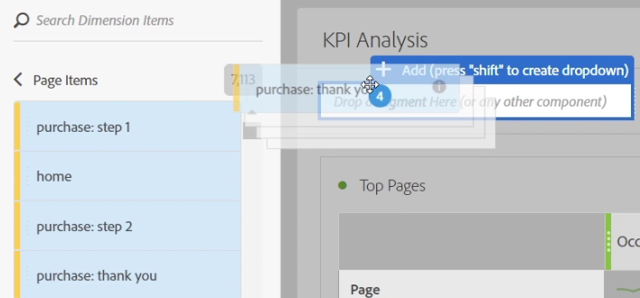
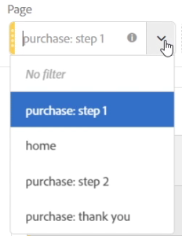
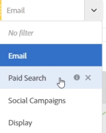

# Panels overview

A panel is a collection of tables & visualizations. You can access panels from the top left icon in Workspace. Panels are helpful when you want to organize your projects according to time periods, business units, geography, etc. These four types of panels are available in Analysis Workspace: Blank Panel, Attribution, Freeform Panel, and Segment Comparison.

Blank panel & Freeform panel are places to start your analysis, while Attribution IQ and Segment Comparison lend themselves to more advanced analyses. We've also added a "+" panel button so you can add blank panels at any time.

The default starting panel is the Freeform panel, but you can make the [blank panel](/help/analyze/analysis-workspace/c-panels/blank-panel.md) you default as well.

## Drop-down Filters in Panels {#section_D2828EEDD52944528E87F470EAB581CF}

The panel drop zone has drop-down filtering capabilities. These filters let you interact with the project data in a controlled way so that you can do deep-dive analysis, simplify your projects, and/or share insights with others.

Here is an example of a simplified project: Suppose you have several versions of a project/panel to provide country-specific reporting. You can now collapse those projects/panels into a single panel, and add in a country drop-down instead to filter between different data sets.

Keep this in mind:

* You can drop in multiple components (or dimension items), and then switch between them in a dropdown to filter the panel contents. 
* You can also create multiple drop-down lists on the same panel. 
* You can customize the title of the drop-down list by clicking the title and modifying it, or remove the title altogether by clicking the x next to it. 
* You can create drop-down filters using any component type: dimensions, date ranges, segments, and metrics. Note that drop-down date ranges will always override the panel date ranges. 
* We maintain the component colors from the left rail: yellow for dimension item dropdowns, green for metrics, blue for segments, and purple for date ranges. 
* The dropzone will still create hit-level segments for items dragged in as segments. You can modify these as usual by clicking the information icon (i) next to the segment, then the pencil-shaped edit icon and editing it in the Segment Builder.

**To create and use drop-down filters:**

1. Select any items from the left rail and, **while holding down the  key**, drop them into the panel drop zone.

   

   This will turn the components into a drop-down list, rather than into a segment. (You can also still add segments by not holding down the  key.)

   

1. Select one of the options from the dropdown to change the data in the panel below. (You can also choose to not filter any of the panel data by selecting **[!UICONTROL No filter]**.) 
1. For example, if you also wanted to slice the data by marketing channel, you could add another dropdown called "Marketing Channel":

   

