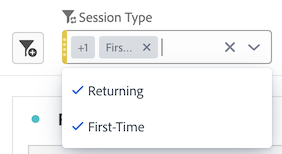

# Panels overview

A [!UICONTROL panel] is a collection of tables and visualizations. You can access panels from the top-left icon in Workspace or a [blank panel](blank-panel.md). Panels are helpful when you want to organize your projects according to time periods, report suites, or analysis use case.

## Panel types

The following panel types are available in Analysis Workspace:

| Panel name | Description |
| --- | --- |
| [Blank panel](blank-panel.md) | Choose from available panels and visualizations to start your analysis. |
| [Quick Insights panel](quickinsight.md) | Quickly build a freeform table and an accompanying visualization in order to analyze and uncover insights faster. |
| [Analytics for Target panel](a4t-panel.md) | Analyze Target activities and experiences in Analysis Workspace. |
| [Attribution panel](attribution.md) | Quickly compare and visualize any number of attribution models using any dimension and conversion metric. |
| [Freeform panel](freeform-panel.md) | Perform unlimited comparisons and breakdowns, then add visualizations to tell a rich data story. |
| [Media Average Minute Audience panel](average-minute-audience-panel.md) | Analyze average minute audience over time, with details on peak views and the ability to break down and compare. |
| [Media Concurrent Viewers panel](media-concurrent-viewers.md) | Analyze concurrent viewers over time, with details on peak concurrency and the ability to break down and compare. |
| [Media Playback Timespent panel](/help/analyze/analysis-workspace/c-panels/media-playback-time-spent.md) | Analyze concurrent viewers over time, with details on peak concurrency and the ability to break down and compare. |
| [Segment Comparison panel](c-segment-comparison/segment-comparison.md) | Quickly compare two segments across all data points to automatically find relevant differences. |

[!UICONTROL Quick Insights], [!UICONTROL Blank] and [!UICONTROL Freeform] panels are great places to start your analysis, while [!UICONTROL Analytics for Target], [!UICONTROL Attribution], [!UICONTROL Media Concurrent Viewers] and [!UICONTROL Segment Comparison] lend themselves to more advanced analyses. A `"+"` button is available in projects so you can add blank panels at any time.

The default starting panel is the [!UICONTROL Freeform] panel, but you can make the [blank panel](/help/analyze/analysis-workspace/c-panels/blank-panel.md) your default as well.

## Report suite {#report-suite}

Tables and visualizations within a panel derive data from the [!UICONTROL report suite] selected in the top right of the panel. The report suite also determines what components are available in the left rail. Within a project, you can use one or [many report suites](https://experienceleague.adobe.com/docs/analytics/analyze/analysis-workspace/build-workspace-project/multiple-report-suites.html) depending on your analysis use cases. To apply a single report suite to all panels in a project, **right-click panel header > Apply report suite to all panels**.

The list of report suites is sorted on relevancy, which Adobe defines based on how recently and frequently the suite has been used by the current user, and how frequently the suite is used within the organization.

## Calendar {#calendar}

The panel calendar controls the reporting range for tables and visualizations within a panel.

>[!NOTE]
>If a (purple) date range component is used within a table, visualization or panel drop zone, it overrides the panel calendar.

You can apply a minute-level date range under the advanced settings of your panel calendar. If you are reporting on a date range that spans many days, start time applies to the first day and end time applies to the last day in your range.

## Drop zone {#dropzone}

The panel drop zone enables you to apply segment and drop-down filters to all tables and visualizations within a panel. You can apply one or many filters to a panel. 

### Segment filters

Drag and drop any segments from the left rail into the panel drop zone to begin filtering your panel. Repeat this process to add additional filters to the panel. Filters appear side by side at the top of the panel.

### Ad hoc segment filters

Non-segment components can also be dragged directly into the drop zone to create ad hoc segments, saving you the time and effort of going to the Segment Builder. Segments created in this way are automatically defined as hit-level segments. This definition can be modified by clicking the information icon (i) next to the segment, then the pencil-shaped edit icon and editing it in the Segment Builder.

Ad hoc segments are a type of quick segment, and are local to the project. They do not show up in the left rail unless you make them public.

For more information, see [Quick segments](/help/analyze/analysis-workspace/components/segments/quick-segments.md).

### Static drop-down segments

Static drop-down segments enable you to interact with the data in a controlled way. For example, you can add a drop-down segment for Mobile Device Types so that you can segment the panel by Tablet, Mobile Phone, or Desktop.

Static drop-down segments can also be used to consolidate many projects into one. For example, if you have many versions of the same project with different Country segments applied, you can consolidate all versions into a single project and add a Country drop-down segment.

#### Create static drop-down segments

* For drop-down segments using dimension items, select a single dimension from the left rail and drop it into the panel dropzone **while holding `[Shift]`**. This creates a drop-down segment with all the dimension items that are associated with that dimension. 

  Or, if you want the drop-down segment to include only specific dimension items that are associated with a dimension, click the right arrow icon next to the desired dimension in the left rail. This action exposes all available dimension items. Select multiple dimension items from this list using `[Shift + Click]` or `[Ctrl + Click]`, then drop them into the panel dropzone **while holding** `[Shift]`.

* For drop-down segments using a single component type (for example, only dimensions, or only segments, or only metrics), select multiple items of the same type in the left rail using `[Shift + Click]` or `[Ctrl + Click]`, then drop them into the panel dropzone **while holding `[Shift]`**.

  A single drop-down segment is created with components that you selected.

* For drop-down segments using a mix of component types (such as 2 metrics and 3 filters), select multiple components using `[Shift + Click]` or `[Ctrl + Click]`. Drop the selection into the panel dropzone **while holding `[Shift]`**. In this context, all component types are treated as separate drop-down segments. For example, if you include both metrics and dimension items in your selection, two separate drop-down segments are created: one drop-down segments includes dimension items, and the other includes metrics.

  

Right-clicking a drop-down segment provides the following options:

* **[!UICONTROL Delete drop-down]**: Removes the drop-down segment from the panel. 
* **[!UICONTROL Delete label]**: Remove the text above a drop-down segment. To modify the label, select the pencil icon.
* **[!UICONTROL Add label]**: When you add a drop-down segment to a project, a label is automatically set to the component name. If you delete the label, you can add it again with this option.
* **[!UICONTROL Require selection]**: Requires that a segment is set on the panel. 

[Watch the video](https://experienceleague.adobe.com/docs/analytics-learn/tutorials/analysis-workspace/using-panels/using-panels-to-organize-your-analysis-workspace-projects.html) to learn more about how to add drop-down filters to your project.

#### Use static drop-down segments

Users can use the drop-down segments menu in any of the following ways in order to filter the panel:
     
* Apply a single segment to the panel by selecting the segment from the drop-down menu.

* Apply multiple segments to the panel by selecting more than one segment from the drop-down menu. The panel is filtered to include any of the selected segments. 

  

### Dynamic drop-down segments

Dynamic drop-down segments allow you to determine available values based on data within the panel's reporting range and values in other drop-down segments. For example, you can create two dynamic drop-downs using the [Countries](/help/components/dimensions/countries.md) dimension and [Cities](/help/components/dimensions/cities.md) dimension. When you select a country from the [!UICONTROL Countries] drop-down list, the [!UICONTROL Cities] drop-down list dynamically adjusts to only show cities within that country.

This same concept applies to all dimensions; only dimension items that appear within the panel's date range and selected segments are visible. Dimension items selected in static drop-down segments affect available values in dynamic drop-down segments. However, the inverse is not true; Dimension items selected in dynamic drop-down segments do not affect available values in static drop-down segments.

Manual selection of dimension items is available if you anticipate a certain dimension item to be collected in the future. You can also clear a dynamic drop-down segment so that it does not contain a value, allowing other dynamic drop-down segments to contain more values. Select **[!UICONTROL Reset all]** to clear the selection from all drop-down segments for that panel.

To create a dynamic drop-down segment:

* Drag and drop a single dimension into the panel dropzone **while holding `[Shift]`**.
* Dynamic drop-down segments are not available for metrics, segments, or date ranges.
* Right-click a drop-down segment and select **[!UICONTROL Delete dropdown]** to delete it.

Right-clicking a dynamic drop-down filter provides the same options as static drop-down filters.

## Right-click menu {#right-click}

Additional functionality for a panel is available by right-clicking on the panel header.

The following settings are available:

| Setting | Description |
| --- | --- |
| Insert Copied Panel/Visualization|Lets you paste ("insert") a copied panel or visualization to another place within the project, or into a different project.|
| Copy Panel | Lets you right-click and copy a panel, so that you can insert it to another place within the project, or into a different project.|
| Apply Report Suite to all panels | Lets you apply the active panel report suite to all panels in the project.|
| Duplicate Panel | Makes an exact duplicate of the current panel, which you can then modify. |
| Collapse/Expand all Panels | Collapses and expands all project panels. |
| Collapse/Expand all Visualizations in Panel | Collapses and expands all visualizations in the current panel. |
| Edit Description | Add (or edit) a text description for the panel. |
| Get Panel Link | Lets you direct someone to a specific panel within a project. When the link is clicked, the recipient will be required to login before being directed to the exact panel linked to. |
