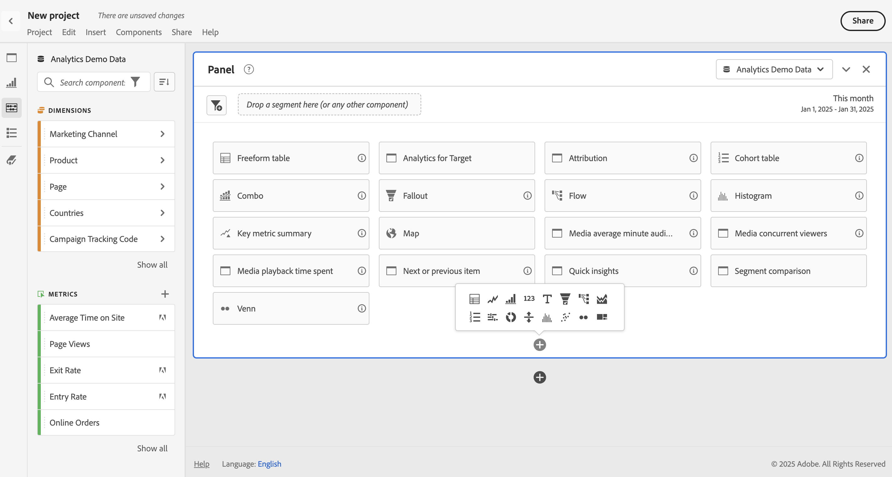
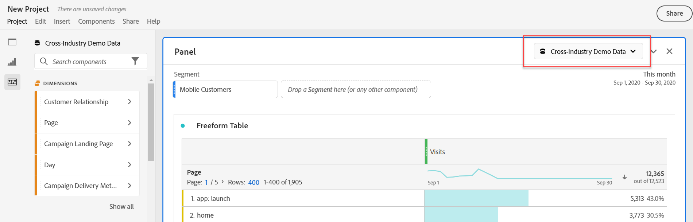
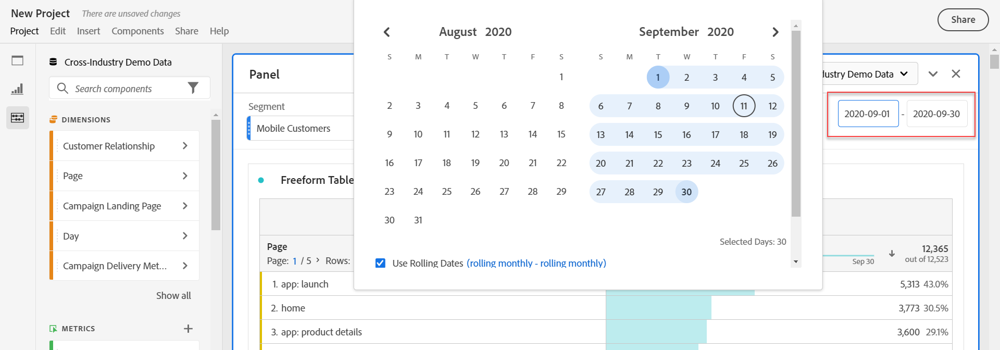
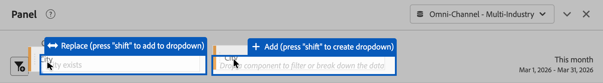

# Panels overview

A [!UICONTROL panel] is a collection of tables and visualizations. You can access panels from the top-left icon in Workspace or a [blank panel](/help/analyze/analysis-workspace/c-panels/blank-panel.md). Panels are helpful when you want to organize your projects according to time periods, report suites, or analysis use case.

## Panel types

The following panel types are available in Analysis Workspace for [!UICONTROL Adobe Analytics]:

| Panel name | Description |
| --- | --- |
| [Blank panel](/help/analyze/analysis-workspace/c-panels/blank-panel.md) | Choose from available panels and visualizations to start your analysis. |
| [Attribution](attribution.md) | Quickly compare and visualize any number of attribution models using any dimension and conversion metric. |
| [Analytics for Target](a4t-panel.md) | Analyze Target activities and experiences in Analysis Workspace. |
| [Freeform](freeform-panel.md) | Perform unlimited comparisons and breakdowns, then add visualizations to tell a rich data story. |
| [Media average minute audience](average-minute-audience-panel.md) | Analyze the average minute audience for a specific piece of content, or over a customized time period. |
| [Media concurrent viewers](media-concurrent-viewers.md) | Analyze concurrent viewers over time, with details on peak concurrency and the ability to break down and compare. |
| [Media playback time spent](/help/analyze/analysis-workspace/c-panels/media-playback-time-spent.md) | Analyze playback time spent to understand where peak concurrencies occur or where drop-offs happen. |
| [Next or previous item](next-previous.md) | Show the next or previous pages people go to. |
| [Quick insights](quickinsight.md) | Quickly build a freeform table and an accompanying visualization to analyze and uncover insights faster. |
| [Page summary](page-summary.md) | Explore key statistics about specific pages. |
| [Segment comparison](/help/analyze/analysis-workspace/c-panels/c-segment-comparison/segment-comparison.md) | Quickly compare two segments across all data points to find relevant differences automatically. |

[!UICONTROL Quick insights], [!UICONTROL Blank] and [!UICONTROL Freeform] panels are great places to start your analysis, while [!UICONTROL Attribution] lends itself to more advanced analyses. A  is available at the bottom of your canvas, so you can add blank panels at any time.

The default starting panel is the [!UICONTROL Freeform] panel, but you can make the [Blank panel](/help/analyze/analysis-workspace/c-panels/blank-panel.md) or [Quick insights](/help/analyze/analysis-workspace/c-panels/quickinsight.md) your default as well. See [Projects & Analysis preferences](/help/analyze/analysis-workspace/user-preferences.md#projects--analyses-preferences).

## Create a panel

To create a panel :

* Drag and drop a panel from the **[!UICONTROL Panels]** left panel onto your canvas.
* Select a panel from the [Blank panel](blank-panel.md).
* Use **[!UICONTROL Insert]** menu in Workspace and select your panel. Alternatively, you can use any of the [shortcuts](../build-workspace-project/fa-shortcut-keys.md) to insert a panel.

  

You can:

* Select  **within** any panel to add another visualization. A popup appears that allows you to select a visualization.

  

  | Select... | To create a...  |
  |---|---|
  |  | [Freeform table](/help/analyze/analysis-workspace/visualizations/freeform-table/freeform-table.md) |
  |  | [Line](/help/analyze/analysis-workspace/visualizations/line.md) |
  |  | [Bar](/help/analyze/analysis-workspace/visualizations/bar.md) |
  |  | [Summary number](/help/analyze/analysis-workspace/visualizations/summary-number-change.md) |
  |  | [Text](/help/analyze/analysis-workspace/visualizations/text.md) |
  |  | [Fallout](/help/analyze/analysis-workspace/visualizations/fallout/fallout-flow.md) |
  |  | [Flow](/help/analyze/analysis-workspace/visualizations/c-flow/flow.md) |
  |  | [Area stacked](/help/analyze/analysis-workspace/visualizations/area.md) |
  |  | [Cohort table](/help/analyze/analysis-workspace/visualizations/cohort-table/t-cohort.md) |
  |  | [Bullet](/help/analyze/analysis-workspace/visualizations/bullet-graph.md)|
  |  | [Donut](/help/analyze/analysis-workspace/visualizations/donut.md) |
  |  | [Summary change](/help/analyze/analysis-workspace/visualizations/summary-number-change.md) |
  |  | [Histogram](/help/analyze/analysis-workspace/visualizations/histogram.md) |
  |  | [Scatter](/help/analyze/analysis-workspace/visualizations/scatterplot.md) |
  |  | [Venn](/help/analyze/analysis-workspace/visualizations/venn.md) |
  |  | [Treemap](/help/analyze/analysis-workspace/visualizations/treemap.md) |

* Select  **outside** the last panel in your workspace to add another [Blank panel](blank-panel.md).

## Manage a panel

You can manage a panel in the following ways:

* To collapse a panel, select .
* To reveal a collapsed panel, select .
* To delete a panel, select . To undo, select **[!UICONTROL Edit]** > **[!UICONTROL Undo]** (**[!UICONTROL *cmd+z*]** | **[!UICONTROL *ctrl+z*]**).
* To move a panel, drag and drop the panel whenever a  is visible (usually when you hover over the header).

## Report suite

Each panel is associated with a [report suite](/help/admin/tools/manage-rs/report-suites-admin.md), identified by  **[!UICONTROL *name of report suite*]** in the drop-down menu at the top right of the panel.

When you create a new panel, the default report suite is based on the report suite of the panel you last worked on in the Analysis Workspace project.

Within a project, you can use one or [many report suites](/help/analyze/analysis-workspace/build-workspace-project/multiple-report-suites.md) depending on your analysis use cases.

The list of report suites is sorted on relevancy, which Adobe defines based on how recently and frequently the suite has been used by the current user. And how frequently the suite is used within the organization.

>[!IMPORTANT]
>
>The selected report suite determines what dimensions, metrics, and segments are available for building visualizations in a panel.
>
>
>When you switch a report suite for a panel, some of the components might not be available in that new report suite. This change can cause your visualization not to render properly. You might see warnings like:
>
>* This panel contains components that are not enabled in the selected report suite. Please change the report suite or enable the required components in the report suite.
>* Unable to render visualization: Please check your columns and rows to ensure they contain valid components.
>

## Calendar

The panel calendar controls the reporting date range for tables and visualizations within a panel.

>[!NOTE]
>
>If a  Date range component is used within a visualization or panel (for example, as a segment), the date range component overrides the panel calendar.
>

1. Select a date range by selecting first the start date and then the end date.
   Alternatively, you can select a **[!UICONTROL Preset]** from the [!UICONTROL *Select a preset*] drop-down menu.

1. Optionally, select **[!UICONTROL Show advanced settings]** to:

   * Specify **[!UICONTROL Start time]** and **[!UICONTROL End time]** other than the default `12:00 AM` (`0:00`) and `11:59 PM` (`23:59`). End times always include 59 seconds. For a date range that spans many days, the start time applies to the first day of the date range and the end time applies to the last day in your date range. Use **[!UICONTROL (Reset time values)]** to reset start and end time to their defaults.
   * **[!UICONTROL Make date range components relative to panel calendar]**. If disabled, the date range components that are used in the panel are relative to the current time. If enabled, the date range components used in the panel are relative to the panel calendar.
   * **[!UICONTROL Use rolling dates]**. If enabled, preset date ranges like **[!UICONTROL Last 7 full days]** dynamically updates as the current date and time progress. If disabled, such presets are not updated once applied.
  
     

     You can select the text in brackets (for example **[!UICONTROL fixed start - rolling daily]**) to extend the panel and specify details for **[!UICONTROL Start]** and **[!UICONTROL End]**.

       1. Select **[!UICONTROL Start of]**, **[!UICONTROL End of]**, or **[!UICONTROL Fixed day]**.
       1. When you have selected **[!UICONTROL Start of]** or **[!UICONTROL End of]**, you can build a full expression. For example: **[!UICONTROL End of]** **[!UICONTROL current year]** **[!UICONTROL plus]** `1` **[!UICONTROL day]**. Pick the appropriate value for each individual part of the expression.
          * Select a value for current. For example, **[!UICONTROL current year]**.
          * Select a value for additional calculation. For example, **[!UICONTROL plus]**.
          * When you have specified an additional calculation, specify a value. For example, `1`.
          * When you have specified an additional calculation, select the time period to use for the calculation. For example **[!UICONTROL day]**.

     Select **[!UICONTROL Hide details]** to hide the details for rolling dates calculation.

1. Select **[!UICONTROL Apply]** to apply the date range to the panel from which you invoked the calendar.
   Select **[!UICONTROL Apply to all panels]** to apply the date range to all panels in the Workspace project.

## Drop zone {#dropzone}

The panel drop zone, labeled **[!UICONTROL _Drop a component to filter or break down the data_]**,  enables you to filter or break down the data for the panel. The segments or breakdowns you use to filter or break down the data applies to all freeform tables and visualizations within the panel.

Segments and breakdowns allow you to interact with the data in a controlled way. For example, you can add a segment drop-down menu for Mobile Device Types so that you can filter the panel by selecting Tablet, Mobile Phone, or Desktop.

Segments can also be used to consolidate many projects into one. For example, if you have different versions of the same project with each a different country segment applied, you can consolidate all versions into a single project and add a Country segment drop-down menu.

The illustration below shows the different variations of (quick) segments or breakdowns that result when you add components to the drop zone.

### Add or replace

To add or replace (quick) segments or breakdowns:

1. Select one or more components from the Components rail. Use ⇧+ or ^+ to select more than one component.
1. Drag the selection to the drop zone, labeled **[!UICONTROL _Drop a component to filter or break down the data_]** ❶, or over an existing component already placed nearby the drop zone.
1. You have two options when you see  **[!UICONTROL Add (press "shift" to create dropdown)]** or  **[!UICONTROL Replace (press "shift" to add to dropdown)]**:

   

   * Drop the selection to create the following components:
      * [Segment](#segment) for any segment components that you drop ❷.
      * [Quick segment](#quick-segment) for any non-segment components (date ranges, metrics, dimensions, dimension items) that you drop ❸.
   * Drop the selection **while you hold** ⇧ (shift) to create the following components:
     * Static segment [drop-down menu](#drop-down-menu) with items to filter on for the selected segments that you drop ❹.
     * Static segment [drop-down menu](#drop-down-menu) with items to filter on for the selected date ranges that you drop ❺.
     * Static segment [drop-down menu](#drop-down-menu) with items to filter on for the selected metrics that you drop ❻.
     * Static segment [drop-down menu](#drop-down-menu) or breakdown [drop-down menu](#drop-down-menu) with items to filter on or break down on for the selected dimension *items* that you drop ❼.
     * Dynamic segment [drop-down menu](#drop-down-menu) or breakdown [drop-down menu](#drop-down-menu) with items to filter on or break down on for the selected dimensions that you drop ❽.

### Segment

Any segment component that you drop is used to segment the panel. Use segments to gain segmented insights into the data and visualizations of your panel.

### Quick segment

Any non-segment component (dimension, dimension item, metric, date range) that is dropped defines a [quick segment](#quick-segment) to segment the panel. Use any non-segment component to create a quick segment without using the [Segment builder](/help/components/segmentation/segmentation-workflow/seg-quick.md). A segment that is created in this way is automatically defined as an event-level segment and labeled **[!UICONTROL Quick segment]** by default.

Alternatively, you can use  to create a quick segment.

See [Quick segments](/help/components/segmentation/segmentation-workflow/seg-quick.md) for how to create and manage quick segments.

### Drop-down menu

A drop-down menu that is created while you hold ⇧ can:

* contain a [static](#static) or [dynamic](#dynamic) list of items.
* behave to [filter a panel](#filter) or to [break down a panel](#breakdown).

#### Static

Static drop-down menus are created for selected dimension *items*, metrics, segments, and date ranges. The items in a static drop-down menu are based on the selected components you drop and the items do not change when you add or replace components.

#### Dynamic

Dynamic drop-down menus are created only when you drop dimensions components. Dynamic drop-down menus are indicated with  as part of the label.

The available items in a dynamic drop-down menu are based on:

* the data resulting from selected items in other drop-down menus, segments and quick segments within the panel's drop zone, and
* the data available within the panel's reporting range.

For example, you can add two dynamic drop-down menus using a countries dimension and a cities dimension. When you select a country from the **[!UICONTROL Countries]** drop-down menu, the **[!UICONTROL Cities]** drop-down menu dynamically adjusts to show only cities within the selected country. When you have additional static drop-down menus, items selected in those drop-down menus also affect the available items in the dynamic drop-down menus. Items that are selected in dynamic drop-down menus do not affect available items in static drop-down menus.

#### Filter a panel

For any metric, segment, or date range component that you drop **while you hold** ⇧, a segment drop-down menu is created. That drop-down menu allows you to filter the panel based on items available for the dropped component. 

For any *dimension* component that you drop **while you hold** ⇧, a segment drop-down menu is created. That drop-down menu allows you to filter the panel based on the items available for the dropped dimension items ([static](#static) segment drop-down menu) or dimension component ([dynamic](#dynamic) segment drop-down menu). To configure the drop-down menu explicitly to filter using segments:

* Select  and select  from the context menu for the component ❾. 

#### Break down a panel

For any *dimension* component that you drop **while you hold** ⇧, a segment drop-down menu is created. You can configure the drop-down menu to break down instead. To configure the drop-down menu explicitly to break down using breakdowns:

* Select  and select the  from the context menu for the component ❾. 

>[!IMPORTANT]
>
>Breakdowns are only available for dimensions and dimension items, not for segments, date ranges, or metrics.
>

#### Segments versus breakdowns

Consider to break down a panel instead of to filter a panel (using segments) in the following scenarios:

* If you are using attribution-enabled metrics within your panel, segments often clear out your attribution-enabled metrics. Breakdowns are applied at a different point within the query that is executed to retrieve the data for your panel. As a result, breakdowns do not clear out these attribute-enabled metrics.

  As an example, see the difference between the attribute based **[!UICONTROL Online Revenue]** metric when using a **[!UICONTROL Luma: Product Category]**  **[!UICONTROL Women]** segment versus a **[!UICONTROL Luma: Product Category]**  **[!UICONTROL Women]** breakdown.

  

* If you are using a sub-event level dimension within a breakdown drop-down menu, the breakdowns execute at that sub-event level. Instead, segments within a segments drop-down menu execute at the event level. 

  As an example, see the difference between the **[!UICONTROL Online Revenue]** metric when using a **[!UICONTROL Luma: Product Subcategory]**  **[!UICONTROL Tops]** segment versus a **[!UICONTROL Luma: Product Subcategory]**  **[!UICONTROL Tops]** breakdown. The breakdown executes the query explicitly at the sub-event level, while the segment executes the query at the event level.

  

### Manage

You can manage the components in the drop zone as follows:

| What to do in the panel drop zone... | How to do... |
|---|---|
| To remove a segment or quick segment. | Select  within the component. |
| To remove a selected item from a drop-down menu. | Select  within the item. |
| To remove all selected items from a drop-down menu. | Select  within the drop-down menu. |
| To edit the label of any component. | Hover over the label for the component and select . |
| To delete the label of any component. | Hover over the label for the component and select **[!UICONTROL Delete label]** from the context menu for the component. |
| To delete the component from the drop zone. | Select **[!UICONTROL Delete drop-down]** from the context menu for the component. |
| To get info on a segment or quick segment. | Hover inside the component and select  to open the Data Dictionary with info on the component. |
| To get info on the component that defines a drop-down menu. | Hover inside the drop-down menu and select  to open the Data Dictionary with info on the component. |
| To edit a quick segment. | Hover inside the quick segment and select . See [Quick segments](/help/components/segmentation/segmentation-workflow/seg-quick.md) for more details. |
| To require a selection for a drop-down menu. | Select **[!UICONTROL Require selection]** from the context menu for the component. |
| To allow no filter for a drop-down menu. | Select **[!UICONTROL Allow no filter]** from the context menu for the component. |
| To reset all components and clear all selections for drop-down menus. | Select **[!UICONTROL Reset all]**. |

>[!BEGINSHADEBOX]

See  [Using filters in Analysis Workspace](https://experienceleague.adobe.com/en/docs/analytics-learn/tutorials/analysis-workspace/using-panels/using-drop-down-filters){target="_blank"} for a demo video.

>[!ENDSHADEBOX]

>[!BEGINSHADEBOX]

See  [Dynamic drop down menus](https://experienceleague.adobe.com/en/docs/customer-journey-analytics-learn/tutorials/analysis-workspace/tips-and-tricks/dynamic-drop-downs){target="_blank"} for a demo video.

{{videocja}}

>[!ENDSHADEBOX]

## Context menu

Additional functionality for a panel is available through a context menu (right-click) on the panel header.

The following options are available:

| Option | Description |
| --- | --- |
| **[!UICONTROL Insert copied panel]** | Let you paste a copied panel to another place within the project, or into a different project.|
| **[!UICONTROL Insert copied visualization]** | Paste a copied visualization to another place within the panel, project, or into a different project. |
| **[!UICONTROL Apply Report Suite to all panels]** | Apply the report suite for this panel to all other panels in the project. |
| **[!UICONTROL Copy panel]** | Copy a panel, so that you can insert it to another place within the project, or into a different project.|
| **[!UICONTROL Duplicate panel]** | Makes an exact duplicate of the current panel, which you can then modify. |
| **[!UICONTROL Collapse all panels]** | Collapse all project panels. |
| **[!UICONTROL Expand all panels]** | Expand all project panels. |
| **[!UICONTROL Collapse all visualizations in panel]** | Collapse all visualizations in the current panel. |
| **[!UICONTROL Expand all visualizations in panel]** | Expand all visualizations in the current panel. |
| **[!UICONTROL Edit Description]** | Add (or edit) a text description for the panel. |
| **[!UICONTROL Get Panel Link]** | Direct someone to a specific panel within a project. When the link is selected, the recipient is required to log in before being directed to the exact panel linked to. |

## Configuration

Some panels (like [!UICONTROL Attribution], [!UICONTROL Experimentation], [!UICONTROL Media average minute audience], and others) have a configuration dialog to assist you in building the visualization. Use  at the top of the panel to access and change the configuration.

