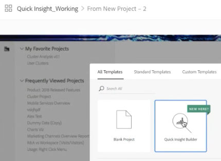
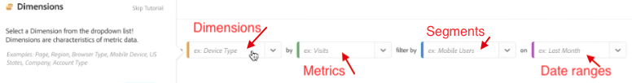
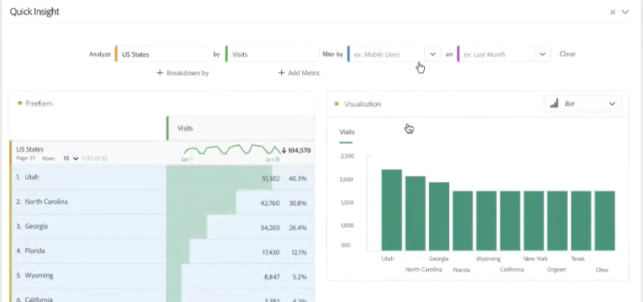
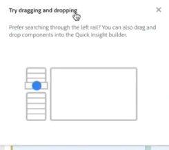
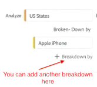
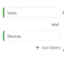
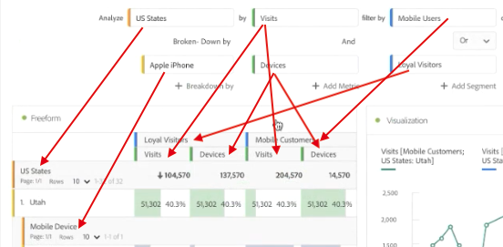
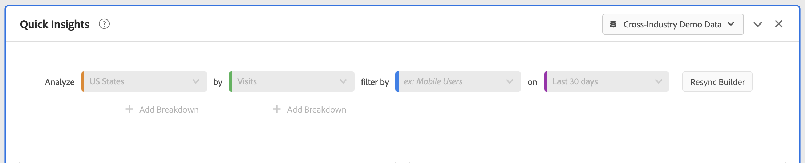
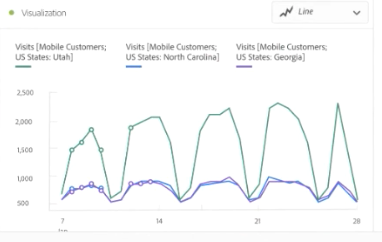

# Quick Insights builder

>[!IMPORTANT]
>
>**[!UICONTROL Quick Insights]** is currently in limited testing and not generally available to all Adobe Analytics customers yet.

[!UICONTROL Quick Insights] provides guidance for non-analysts and new users of [!UICONTROL Analysis Workspace] to learn how to answer business questions quickly and easily. It is also a great tool for advanced users who want to answer a simple question quickly without having to build a table themselves.

When you first start using this [!UICONTROL Analysis Workspace], you might wonder what visualizations would be most useful, which dimensions and metrics might facilitate insights, where to drag and drop items, where to create a segment, etc. 

To help with this, and based on your own company's usage of data components in [!UICONTROL Analysis Workspace], [!UICONTROL Quick Insights] leverages an algorithm that will present you with the most popular dimensions, metrics, segments, and date ranges your company uses. 

[!UICONTROL Quick Insights] helps you

* Properly build a data table and an accompanying visualization in [!UICONTROL Analysis Workspace].
* Learn the terminology and vocabulary for basic components and pieces of [!UICONTROL Analysis Workspace].
* Do simple breakdowns of dimensions, add multiple metrics, or compare segments easily within a [!UICONTROL Freeform table].
* Change or try out various visualization types to find the find tool for your analysis quickly and intuitively.

## Basic key terminology

Following are some of the basic terms you need to be familiar with. Each data table consists of 2 or more building blocks (components) that you utilize to tell your data story.

|Building block (Component)|Definition|
|---|---|
|[!UICONTROL Dimension]|Dimensions are descriptions or characteristics of metric data that can be viewed, broken down, and compared in a project. They are non-numeric values and dates that break down into dimension items. For example, "browser", or "page" are dimensions.|
|[!UICONTROL Dimension item]|Dimension items are individual values for a dimension. For example, dimension items for the browser dimension would be "Chrome", "Firefox", "Edge", etc.|
|[!UICONTROL Metric]|Metrics are quantitative information about visitor activity, such as views, click-throughs, reloads, average time spent, units, orders, revenue, and so on.|
|[!UICONTROL Visualization]|Workspace offers [a number of visualizations](/help/analyze/analysis-workspace/visualizations/freeform-analysis-visualizations.md) to build visual representations of your data, such as bar charts, donut charts, histograms, line charts, maps, scatterplots, and others.|
|[!UICONTROL Breakdown]|A breakdown is a way to literally break down a dimension by other dimensions. In our example, you could break down US States by Mobile Devices to get the mobile device visits per state, or you could break Mobile Devices down by Mobile Device types, by Regions, by Internal Campaigns, etc..|
|[!UICONTROL Segment]|Segments let you identify subsets of visitors based on characteristics or website interactions. For example, you can build [!UICONTROL Visitor] segments based on attributes: browser type, device, number of visits, country, gender, or based on interactions: campaigns, keyword search, search engine, or based on exits and entries: visitors from Facebook, a defined landing page, referring domain, or based on custom variables: form field, defined categories, customer ID.  |

## Get started with Quick Insights

1. Log in to Adobe Analytics using the credentials you have been provided with.
1. Go to [!UICONTROL Workspace] and click **[!UICONTROL Create New Project]** and then click **[!UICONTROL Quick Insights]**.

    

1. When you first start out, go through the short tutorial that teaches you some of the [!UICONTROL Quick Insights panel] basics. Or, click to **[!UICONTROL Skip Tutorial]**.
1. Select your building blocks (also known as components): dimensions (orange), metrics (green), segments (blue), or date ranges (purple) You have to select at least one dimension and one metric for a table to be built automatically. 

    

    You have three ways of selecting the building blocks:
    * Drag and drop them from the left rail.
    * If you know what you are looking for: Start typing and [!UICONTROL Quick Insights] will fill in the blanks for you.
    * Click on the drop-down and search the list.

1. When you have added at least one dimension and one metric, the following will be created for you:

    * A Freeform table with the dimension (here, US States) vertically and the metric (here, Visits) horizontally at the top. Check out this table: 

    

    * An accompanying visualization, in this case a [bar chart](/help/analyze/analysis-workspace/visualizations/bar.md). The visualization that is generated is based on the type of data you added to the table. You can change the type of visualization by clicking on the drop-down arrow next to **[!UICONTROL Bar]**.

1. (Optional) Drill down on dimensions and see dimension items by clicking the > right-arrow next to the dimension.

1. Try adding some more refinements as described below under "Other helpful options."

## Other helpful options

Other useful hints will pop up in the [!UICONTROL Quick Insights Builder], some of them depending on your last action.

* First, complete the **[!UICONTROL More tips]** tutorial: Access it via the Help (?) icon next to the [!UICONTROL Quick Insights Panel] title.

    

* **Breakdown by**: You can use up to 3 levels of breakdowns on dimensions to drill down to the data you really need.

    

* **Add more metrics**: You can add up to 2 more metrics by using the AND operator to add them the table.

    

* **Add more segments**: You can add up to 2 more segments by using the AND or OR operators to add them the table. Look at what happens to the table when you add Mobile Users OR Loyal Visitors. They are next to each other, above the metrics. If you added Mobile Users AND Loyal Visitors, you would see results from both segments together, and they would be stacked on top of each other in the table.

    

## Known limitations

If you try to edit directly within the table, it will cause the [!UICONTROL Quick Insights] panel (the fill-in-the-blank tool) to become out of sync. You can restore it to the previous [!UICONTROL Quick Insights] settings by clicking **[!UICONTROL Resync Builder]** at the top right of the panel.

 

You will get a warning before adding anything directly to the table:

 

Otherwise, building directly will cause the table to now behave as a traditional Freeform table, without the helpful features for new users.

