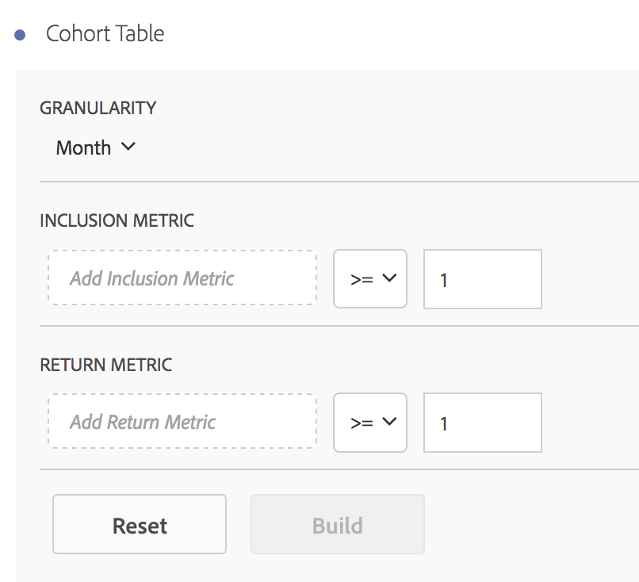

# Run a cohort analysis report

Create a cohort and run a cohort analysis report in Analysis Workspace.

1. In Analysis Workspace, click the **[!UICONTROL Panels]** icon in the left rail and drag a **[!UICONTROL Blank Panel]** to the canvas.

   

1. Click **[!UICONTROL Visualizations]** in the left rail, then drag a **[!UICONTROL Cohort Table]** to the canvas.

   

1. Specify a date range.
1. Add metrics to the **[!UICONTROL Inclusion]** and **[!UICONTROL Return]** fields.

   These metrics group your users into a granularity buckets, based on an activity (such as placing an order).

   

<table id="table_AFC2D9DD11584D5FAF6723FB052C838A"> 
 <thead> 
  <tr> 
   <th colname="col1" class="entry"> Element </th> 
   <th colname="col2" class="entry"> Description </th> 
  </tr> 
 </thead>
 <tbody> 
  <tr> 
   <td colname="col1"> Granularity </td> 
   <td colname="col2"> 
The time granularity of Day, Week, Month, Quarter, or Year. 
 </td> 
  </tr> 
  <tr> 
   <td colname="col1"> Inclusion Metric </td> 
   <td colname="col2"> 
 The metric that places a user in a cohort. For example, if the inclusion metric is Orders, only users who placed an order during the time range of the cohort analysis will be included in the initial cohorts. 
 </td> 
  </tr> 
  <tr> 
   <td colname="col1"> Return Metric </td> 
   <td colname="col2"> 
 The metric that indicates the user has been retained. For example, if the return metric is Video Views, only users who viewed videos during subsequent time periods (after the period in which they were added to a cohort) will be represented as retained. Another metric that quantifies retention is Visits. 
 </td> 
  </tr> 
 </tbody> 
</table>

1. Click **[!UICONTROL Run Report]**.

   

   The report shows visitors who placed an order ( *`Included`* column), and who returned to your site in subsequent visits. The reduction in visits over time enables you to spot problems and take action. 
1. (Optional) Create a segment from a selection.

   Select cells (contiguous or noncontiguous), then right-click > **[!UICONTROL Create Segment From Selection]**.

   

   This example segment would show all the visitors in January 2015, month 1 and 2. 
1. On the [Segment Builder](https://marketing.adobe.com/resources/help/en_US/analytics/segment/?f=seg_build), further edit the segment, then click **[!UICONTROL Save]**.

   The saved segment is available for use in the [!UICONTROL Segment] panel in Analysis Workspace. 
1. Name and save your cohort project.
1. (Optional) [Curate and share](../../../analyze/analysis-workspace/curate-share/curate.md#concept_4A9726927E7C44AFA260E2BB2721AFC6) the project components.

   >[!NOTE]
   >
   >You must save your project before curation is available.

