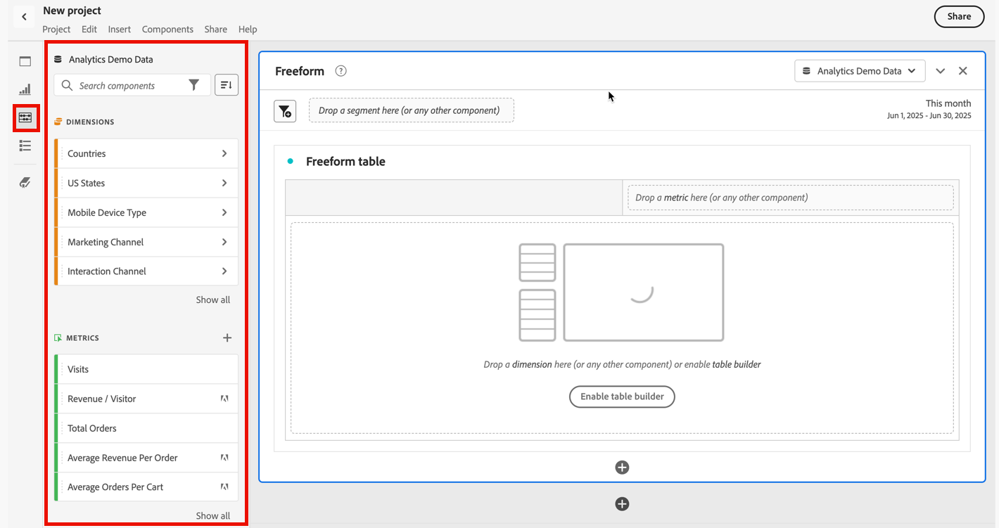

# Components overview

Components in Analysis Workspace consist of metrics, dimensions, segments, and time granularities that you can drag-and-drop onto a project. Custom components that you create are added to these panels, such as custom date ranges.

To access the Components panel, click the **[!UICONTROL Components]** icon in the left rail. You can switch among Panels (Blank panel, [Freeform panel](/help/analyze/analysis-workspace/visualizations/freeform-table.md), or [Segment Comparison](/help/analyze/analysis-workspace/c-panels/c-segment-comparison/segment-comparison.md) panel), [Visualizations](/help/analyze/analysis-workspace/visualizations/freeform-analysis-visualizations.md), and Components using the left-rail icons or by using [hotkeys](/help/analyze/analysis-workspace/build-workspace-project/fa-shortcut-keys.md).

See [Create a freeform analysis project](/help/analyze/analysis-workspace/build-workspace-project/t-freeform-project.md) for information about using Components in a project.

## Component Actions {#section_B7BB29B89AE04297874CDE2C52EAD516}

You can manage components (individually or by selecting more than one) in a number of ways. Right-click a component or click **[!UICONTROL Actions]** at the top of the component list.

> [!NOTE] These actions do not apply to Time components.

| Component Action | Description |
|--- |--- |
|Tag|Organize or manage components by applying tags to them. It then shows up in the respective component manager, such as  Analytics >  Components >  Segments, or  Analytics >  Components >  Projects|
|Favorite|Add the component to your list of favorites. It then shows up in the respective component manager, such as  Analytics >  Components >  Segments, or  Analytics >  Components >  Projects.|
|Approve|Approve the component to make it canonical. It then shows up in the respective component manager, such as  Analytics >  Components >  Segments, or  Analytics >  Components >  Projects|
|Share|Applies only to segments.|
|Delete|Applies only to segments.|

[Creating Metrics, Segments, and Dates on YouTube](https://www.youtube.com/watch?v=XXJuNAte8E8&index=25&list=PL2tCx83mn7GuNnQdYGOtlyCu0V5mEZ8sS) (2:51)
