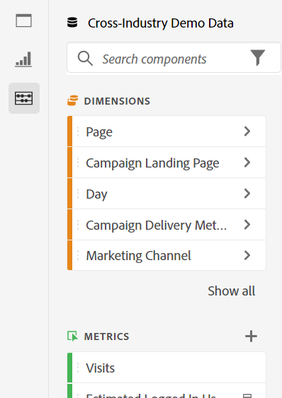
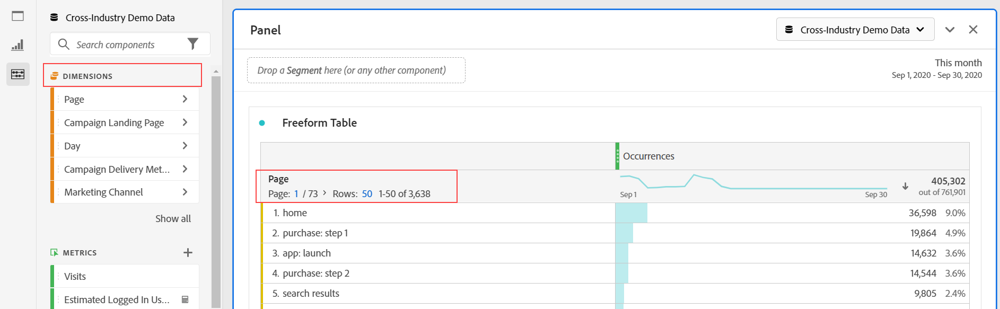
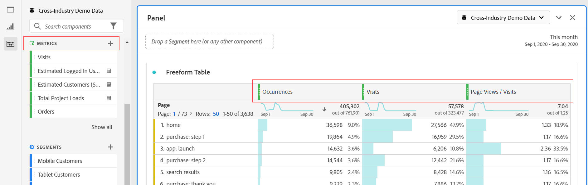
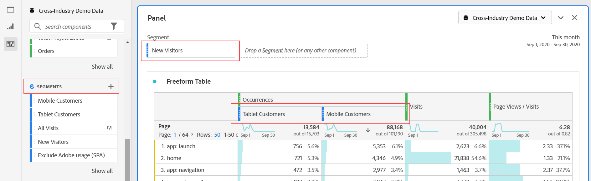
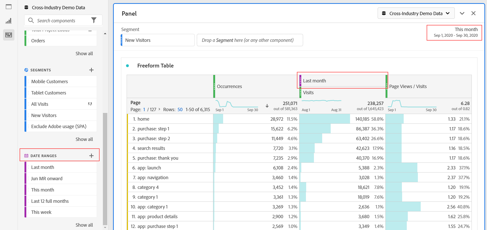
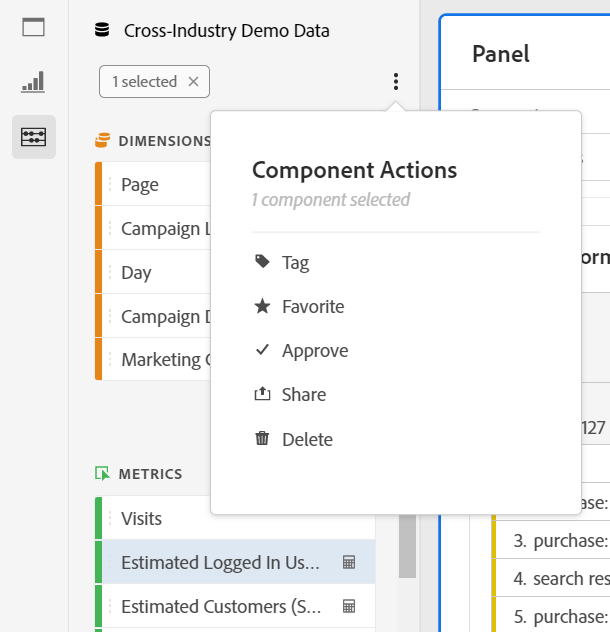

# Components overview

Components in Analysis Workspace consist of dimensions, metrics, segments, and date ranges that you can drag-and-drop onto a project. 

To access the Components menu, click the **[!UICONTROL Components]** icon in the left rail. You can switch among [Panels](https://experienceleague.adobe.com/docs/analytics/analyze/analysis-workspace/panels/panels.html), [Visualizations](https://experienceleague.adobe.com/docs/analytics/analyze/analysis-workspace/visualizations/freeform-analysis-visualizations.html), and Components from the left rail icons or by using [hotkeys](/help/analyze/analysis-workspace/build-workspace-project/fa-shortcut-keys.md).

You can also adjust the [View density settings](https://experienceleague.adobe.com/docs/analytics/analyze/analysis-workspace/build-workspace-project/view-density.html) for the project to see more values in the left rail at once by going to **[!UICONTROL Project > Project Info & Settings > View Density]**.

## Dimensions {#dimensions}

[**Dimensions**](https://experienceleague.adobe.com/docs/analytics/components/dimensions/overview.html) are text attributes that describe your visitor behavior and can be viewed, broken down, and compared in your analysis. They can be found in the left Component rail (orange section) and are typically applied as rows of a table. 

Examples of dimensions include [!UICONTROL Page Name], [!UICONTROL Marketing Channels], [!UICONTROL Device Type], and [!UICONTROL Products]. Dimensions are provided by Adobe and are captured through your custom implementation (eVar, Props, classifications, etc).

Each dimension also contains **dimension items** within it. Dimension items can be found in the left Component rail by clicking the right-arrow next to any dimension name (items are yellow).

Examples of dimension items include [!UICONTROL Homepage] (within the [!UICONTROL Page] dimension), [!UICONTROL Paid Search] (within the [!UICONTROL Marketing Channel] dimension), [!UICONTROL Tablet] (within the [!UICONTROL Mobile Device Type] dimension), and so on.

## Metrics {#metrics}

[**Metrics**](https://experienceleague.adobe.com/docs/analytics/components/metrics/overview.html) are quantitative measures about visitor behavior. They can be found in the left Component rail (green section) and are typically applied as columns of a table.

Examples of metrics include [!UICONTROL Page views], [!UICONTROL Visits], [!UICONTROL Orders], [!UICONTROL Average Time spent], and [!UICONTROL Revenue/Order]. Metrics are provided by Adobe, or captured through your custom implementation ([!UICONTROL Success events]), or created using the [Calculated metric builder](https://experienceleague.adobe.com/docs/analytics/components/calculated-metrics/calcmetric-workflow/cm-build-metrics.html).

## Segments {#segments}

[**Segments**](https://experienceleague.adobe.com/docs/analytics/analyze/analysis-workspace/components/t-freeform-project-segment.html) are audience filters that are applied to your analysis. They can be found in the left Component rail (blue section) and are typically applied at the top of a panel or above metric columns in a table. 

Examples of segments include [!UICONTROL Mobile Device Visitors], [!UICONTROL Visits from Email], and [!UICONTROL Authenticated Hits]. Segments are provided by Adobe, or created in the [panel dropzone](https://experienceleague.adobe.com/docs/analytics/analyze/analysis-workspace/panels/panels.html), or created using the [Segment builder](https://experienceleague.adobe.com/docs/analytics/components/segmentation/segmentation-workflow/seg-build.html).

## Date Ranges {#date-ranges}

[**Date Ranges**](https://experienceleague.adobe.com/docs/analytics/analyze/analysis-workspace/components/calendar-date-ranges/calendar.html) are the range of dates you conduct your analysis across. They can be found in the left Component rail (purple section) and are typically applied in the calendar of each panel.

Examples of date ranges include July 2019, [!UICONTROL Last 4 weeks], and [!UICONTROL This month]. Date ranges are provided by Adobe, applied in the [panel calendar](https://experienceleague.adobe.com/docs/analytics/analyze/analysis-workspace/panels/panels.html), or created using the [Date range builder](https://experienceleague.adobe.com/docs/analytics/analyze/analysis-workspace/components/calendar-date-ranges/custom-date-ranges.html).

## Component Actions {#actions}

You can manage components (individually or by selecting more than one) directly in the left rail. Right-click a component or click the Action dot icon at the top of the component list.

| Component Action | Description |
|--- |--- |
| Tag | Organize or manage components by applying tags to them. You can then search by tag in the left rail by clicking the filter or typing #. Tags also act as filters in the component managers. |
| Favorite | Add the component to your list of favorites. Like tags, you can search by Favorites in the left rail and filter by them in the component managers. |
| Approve | Mark components as Approved to signal to your users that the component is organization-approved. Like tags, you can search by Approved in the left rail and filter by them in the component managers. |
| Share | Share components to users in your organization. This option is available for custom components only, such as segments or calculated metrics. |
| Delete | Delete components that you no longer need. This option is available for custom components only, such as segments or calculated metrics. |

Custom components can also be managed through their respective Component managers. For example, the [Segment Manager](/help/components/segmentation/segmentation-workflow/seg-manage.md).
