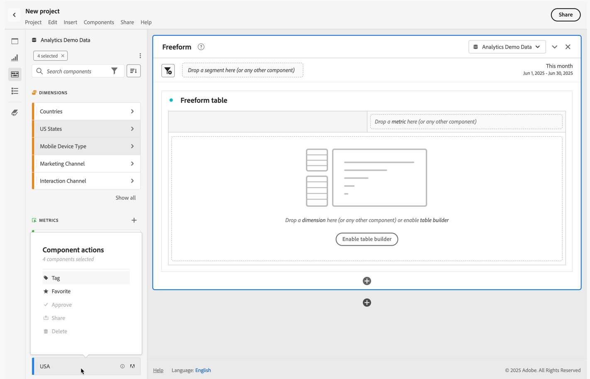

# Components overview

Components are features in Adobe Analytics that can be used in visualizations (like Freeform table), or to complement reporting features.

To manage components from the main Adobe Analytics interface: 
  
   1. Select **[!UICONTROL Components]** from the top bar.
   1. Select **[!UICONTROL Components]** to see an overview of the components you can manage, or directly select the component you want to manage from the menu.

You can manage the following components:  

* [Segments](/help/components/segmentation/seg-home.md): Build, manage, share, and apply powerful, focused audience segments to your reports. Segments let you identify subsets of persons based on characteristics or interactions.
* [Calculated metrics](/help/components/c-calcmetrics/cm-overview.md): Use metrics and formulas as new components for use in reporting
* [Date ranges](calendar-date-ranges/custom-date-ranges.md): Customize and refine the date ranges Analysis Workspace offers.
* [Scheduled projects](../curate-share/t-schedule-report.md): Manage your scheduled projects.
* [Locations](../../../components/locations/locations-manager.md): Manage the locations to export your projects to.
* [Alerts](/help/components/c-alerts/intellligent-alerts.md): Allow you to be notified based on changed percentages or specific data points. 
* [Annotations](annotations/overview.md): Communicate contextual data nuances and insights to your organization.
* [Preferences](/help/analyze/analysis-workspace/user-preferences.md): Manage the preferences for Analysis Workspace.

## Analysis Workspace components

Components in Analysis Workspace consist of metrics, dimensions, segments, and date ranges that you can drag-and-drop onto panels and visualizations in your Workspace project. Custom components that you create are added to these panels, such as a calculated metric, or a custom date range.

To access the Components panel, select  **[!UICONTROL Components]** in the button panel. 

See [Create a project](/help/analyze/analysis-workspace/home.md) for information on how to use components in a project.

## Manage components {#actions}

You can quickly create a new component using the **[!UICONTROL Components]** menu in Analysis Workspace. See the [Analysis Workspace menu](/help/analyze/analysis-workspace/home.md#menu) for more details.

You can manage components (individually or by selecting more than one). 

1. Select one or more components.

1. From the context menu, or from the  Component actions button (at the top of Components), select one of the following actions.
   

   >[!TIP]
   >
   >You can select multiple components by holding **[!UICONTROL Shift]**, or by holding **[!UICONTROL Command]** (on macOS) or **[!UICONTROL Ctrl]** (on Windows).

   

   | Component action | Description |
   |--- |--- |
   |  [!UICONTROL **Tag**] | Organize or manage components by applying tags to them. You can then search by tag in the left panel by selecting the  filter or typing `#`. Tags also act as filters in the component managers. |
   |  [!UICONTROL **Favorite**] | Add the component to your list of favorites. Like tags, you can search by Favorites in the left panel and filter by them in the component managers. |
   |  **[!UICONTROL Un-favorite]** | Remove the component from your list of favorites. |
   |  [!UICONTROL **Approve**] | Mark components as Approved to signal to your users that the component is organization-approved. Like tags, you can search and filter by Approved in the left panel. A  identifies approved components. |
   |  [!UICONTROL **Share**] | Share components to users in your organization. This option is available for custom components only, such as segments or calculated metrics. |
   |  [!UICONTROL **Delete**] | Delete components that you no longer need. This option is available for custom components only, such as segments or calculated metrics. |

Custom components can also be managed through their respective Component managers. For example, see [Manage segments](/help/components/segmentation/segmentation-workflow/seg-manage.md).

## Manage the component list

You can search, filter, and sort the component list in the left panel of Analysis Workspace to locate a particular component. 

### Search

1. Select **Components**  in the left panel.

2. In the search field, begin typing the name of the component you want to use in your project.

   A color and icon identify the type of component. **Dimensions**  are orange, **Segments**  are blue, **Date ranges**  are purple, and **Metrics**  are green. The Adobe icon  indicates either a calculated metric template or a segment template. The calculator icon  indicates a calculated metric that an administrator in your organization has created. 

3. Select the component from the drop-down menu.

### Filter

1. Select the **Components** icon  in the left panel.

2. Select **Filter** , or enter `#` in the search field.

3. Select any of the following filter options to filter the list of components:

   | Icon | Filter option | Description |
   |---------|---|----------|
   |  | **[!UICONTROL Approved]** | Show only components that are marked as Approved by an administrator. |
   |  | **[!UICONTROL Favorites]**| Show only components that are in your list of Favorites.  For information about adding components to your list of favorites, see [Manage components](#manage-components). |
   |  | **[!UICONTROL Dimensions]** | Show only components that are Dimensions. |
   |  | **[!UICONTROL Metrics]** | Show only components that are Metrics. |
   | | **[!UICONTROL Segments]** | Show only components that are segments. |
   |  | **[!UICONTROL Date ranges]** | Show only components that are Date ranges. |
   |  | **[!UICONTROL *Tag name*]** | Show only components with the specific selected tags. A dedicated tag is available for Adobe Template which are the [default calculated metrics](/help/components/c-calcmetrics/cm-reference/default-calcmetrics.md) from Adobe. |

   Select  in a filter to remove the filter.

4. You can optionally sort the component list, as described in [Sort the component list](#sort-the-component-list).

### Sort

<!-- {{release-limited-testing-section}}-->

1. (Optional) Apply any filters to the component list, as described in [Filter the component list](#filter-the-component-list).

2. Select **Components**  in the left panel.

3. Select **Sort** , then select any of the following filter options to sort the list of components.

The following sort options are available:

{{components-sort-options}}

## Access permissions

In Analysis Workspace, administrators can [curate](/help/analyze/analysis-workspace/curate-share/curate.md) which components are exposed to users in reporting.

<!--
# Components overview

Components in Analysis Workspace consist of dimensions, metrics, segments, and date ranges that you can drag-and-drop onto a project. 

To access the Components menu, click the **[!UICONTROL Components]** icon in the left rail. You can switch among [panels](https://experienceleague.adobe.com/docs/analytics/analyze/analysis-workspace/panels/panels.html), [visualizations](https://experienceleague.adobe.com/docs/analytics/analyze/analysis-workspace/visualizations/freeform-analysis-visualizations.html), and components from the left rail icons or by using [hotkeys](/help/analyze/analysis-workspace/build-workspace-project/fa-shortcut-keys.md).

You can also adjust the [View density settings](https://experienceleague.adobe.com/docs/analytics/analyze/analysis-workspace/build-workspace-project/view-density.html) for the project to see more values in the left rail at once by going to **[!UICONTROL Project > Project Info & Settings > View Density]**.

## Dimensions {#dimensions}

[**Dimensions**](https://experienceleague.adobe.com/docs/analytics/components/dimensions/overview.html) are text attributes that describe your visitor behavior and can be viewed, broken down, and compared in your analysis. They can be found in the left Component rail (orange section) and are typically applied as rows of a table. 

Examples of dimensions include [!UICONTROL Page Name], [!UICONTROL Marketing Channels], [!UICONTROL Device Type], and [!UICONTROL Products]. Dimensions are provided by Adobe and are captured through your custom implementation (eVar, Props, classifications, etc).

Each dimension also contains **dimension items** within it. Dimension items can be found in the left Component rail by clicking the right-arrow next to any dimension name (items are yellow).

Examples of dimension items include [!UICONTROL Homepage] (within the [!UICONTROL Page] dimension), [!UICONTROL Paid Search] (within the [!UICONTROL Marketing Channel] dimension), [!UICONTROL Tablet] (within the [!UICONTROL Mobile Device Type] dimension), and so on.

## Metrics {#metrics}

[**Metrics**](https://experienceleague.adobe.com/docs/analytics/components/metrics/overview.html) are quantitative measures about visitor behavior. They can be found in the left Component rail (green section) and are typically applied as columns of a table.

Examples of metrics include [!UICONTROL Page views], [!UICONTROL Visits], [!UICONTROL Orders], [!UICONTROL Average Time spent], and [!UICONTROL Revenue/Order]. Metrics are provided by Adobe, or captured through your custom implementation ([!UICONTROL Success events]), or created using the [Calculated metric builder](https://experienceleague.adobe.com/docs/analytics/components/calculated-metrics/calcmetric-workflow/cm-build-metrics.html).

## Segments {#segments}

[**Segments**](https://experienceleague.adobe.com/docs/analytics/analyze/analysis-workspace/components/segments/t-freeform-project-segment.html) are audience filters that are applied to your analysis. They can be found in the left Component rail (blue section) and are typically applied at the top of a panel or above metric columns in a table. 

Examples of segments include [!UICONTROL Mobile Device Visitors], [!UICONTROL Visits from Email], and [!UICONTROL Authenticated Hits]. Segments are provided by Adobe, or created in the [panel dropzone](https://experienceleague.adobe.com/docs/analytics/analyze/analysis-workspace/panels/panels.html), or created using the [Segment builder](https://experienceleague.adobe.com/docs/analytics/components/segmentation/segmentation-workflow/seg-build.html).

## Date Ranges {#date-ranges}

[**Date Ranges**](https://experienceleague.adobe.com/docs/analytics/analyze/analysis-workspace/components/calendar-date-ranges/calendar.html) are the range of dates you conduct your analysis across. They can be found in the left Component rail (purple section) and are typically applied in the calendar of each panel.

You can make the date range components relative to the panel calendar. For additional information, see [About relative panel date ranges](/help/analyze/analysis-workspace/components/calendar-date-ranges/calendar.md#relative-panel-dates).

Examples of date ranges include July 2019, [!UICONTROL Last 4 weeks], and [!UICONTROL This month]. Date ranges are provided by Adobe, applied in the [panel calendar](https://experienceleague.adobe.com/docs/analytics/analyze/analysis-workspace/panels/panels.html), or created using the [Date range builder](https://experienceleague.adobe.com/docs/analytics/analyze/analysis-workspace/components/calendar-date-ranges/custom-date-ranges.html).

## Manage components {#actions}

You can manage components directly in the left rail. 

1. Right-click a component.

   Or
   
   Select a component, then select the **Action** (3-dot) icon at the top of the component list.

   >[!TIP]
   >
   >   You can select multiple components by holding Shift, or by holding Command (on Mac) or Ctrl (on Windows).

   

   | Component action | Description |
   |--- |--- |
   | [!UICONTROL **Tag**] | Organize or manage components by applying tags to them. You can then search by tag in the left rail by clicking the filter or typing #. Tags also act as filters in the component managers. |
   | [!UICONTROL **Favorite**] | Add the component to your list of favorites. Like tags, you can search by Favorites in the left rail and filter by them in the component managers. |
   | [!UICONTROL **Approve**] | Mark components as Approved to signal to your users that the component is organization-approved. Like tags, you can search by Approved in the left rail and filter by them in the component managers. |
   | [!UICONTROL **Share**] | Share components to users in your organization. This option is available for custom components only, such as segments or calculated metrics. |
   | [!UICONTROL **Delete**] | Delete components that you no longer need. This option is available for custom components only, such as segments or calculated metrics. |

Custom components can also be managed through their respective Component managers. For example, the [Segment Manager](/help/components/segmentation/segmentation-workflow/seg-manage.md).

## Search, filter, and sort the component list

You can search, filter, and sort the component list in the left rail of Analysis Workspace to quickly locate a particular component. 

### Search the component list

1. Select the **Components** icon  in the left rail.

2. In the search field, begin typing the name of the component you want to use in your project.

   The type of component can be identified by both color and icon. **Dimensions**  are orange, **Segments**  are blue, **Date ranges**  are purple, and **Metrics**  are green. The Adobe icon indicates either a calculated metric template or a segment template, and the calculator icon  indicated a calculated metric that was created by an Analytics administrator in your organization. 

3. Select the component when it appears in the drop-down list.

### Filter the component list

1. Select the **Components** icon  in the left rail.

2. Select the **Filter** icon .

   Or

   Type the pound sign (#) in the search field.

3. Select any of the following filter options to filter the list of components:

   |Option | Function |
   |---------|----------|
   | [!UICONTROL **Approved**] | Show only components that are marked as Approved by an administrator. |
   | [!UICONTROL **Favorites**] | Show only components that are in your list of Favorites. For information about adding components to your list of favorites, see [Components overview](/help/analyze/analysis-workspace/components/analysis-workspace-components.md). |
   | [!UICONTROL **Dimensions**] | Show only components that are Dimensions. |
   | [!UICONTROL **Metrics**] | Show only components that are Metrics. |
   | [!UICONTROL **Segments**] | Show only components that are Segments.  |
   | [!UICONTROL **Date ranges**] | Show only components that are Date Ranges. |
   | [!UICONTROL **Show all**] | Show all components. This option is available only for administrators. |
   | [!UICONTROL **Unapproved**] | Show only components that are not yet marked as Approved by an administrator. As an administrator, this is helpful when identifying components that require your review and approval. This option is available only for administrators. |

4. (Optional) To further hone the list, you can sort the component list, as described in [Sort the component list](#sort-the-component-list).

### Sort the component list

1. (Optional) Apply any filters to the component list, as described in [Filter the component list](#filter-the-component-list).

2. Select the **Components** icon  in the left rail.

3. Select the **Sort** icon , then select any of the following filter options to sort the list of components:

   {{components-sort-options}}

-->