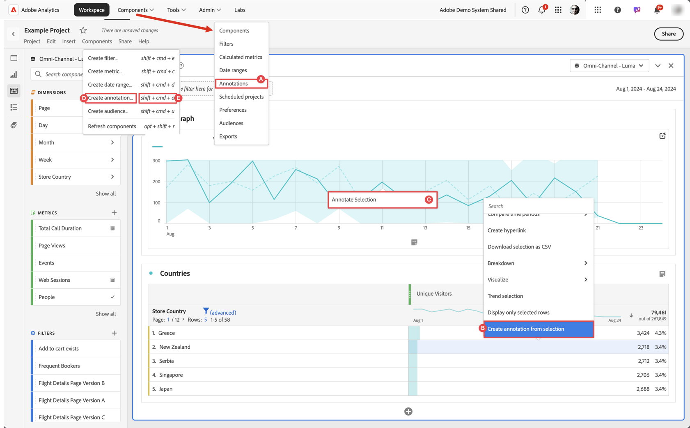
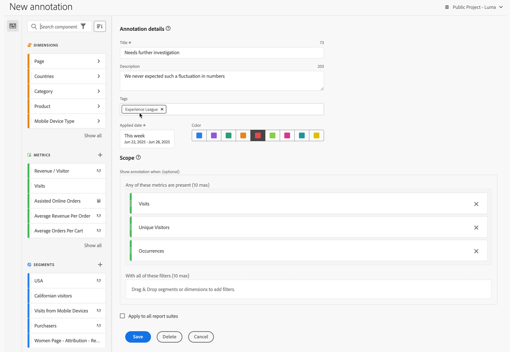
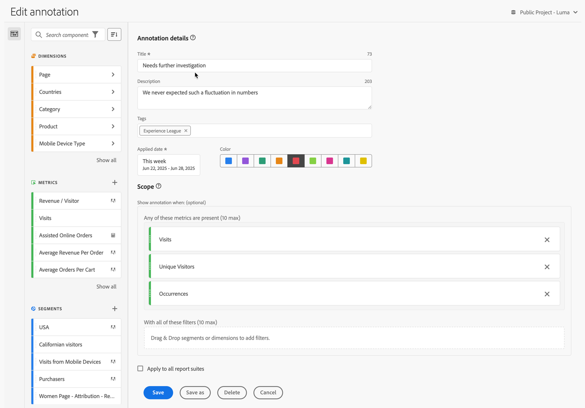

# Create annotations

By default, only administrators can create annotations. Users have rights to view annotations, similar to how users view other components (such as segments, calculated metrics, etc.).

However, Admins can give the [!UICONTROL Annotation Creation] permission (Analytics Tools) to users via the [Adobe Admin Console](https://experienceleague.adobe.com/docs/analytics/admin/admin-console/permissions/analytics-tools.html).

You can create an annotation in the following ways:

* **A**. In the main interface, select **[!UICONTROL Components]** and select **[!UICONTROL Annotations]**. Select  [!UICONTROL **[!UICONTROL Add]**] from the [[!UICONTROL Annotations] manager](/help/analyze/analysis-workspace/components/annotations/manage-annotations.md). 
* **B**. In a Workspace project, from the context menu in a visualization, select **[!UICONTROL Create annotation from selection]**.
* **C**. In a Workspace project, from the context menu in a line graph, select **[!UICONTROL Annotate Selection]**.
* **D**. In a Workspace project, select **[!UICONTROL Components]** from the menu, and select **[!UICONTROL Create annotation]**. 
* **E**.  In a Workspace project, use the shortcut **[!UICONTROL ctrl+shift+o]** (Windows) or **[!UICONTROL shift+command+o]** (macOS)

To define the annotation, you use the [[!UICONTROL Annotation builder]](#annotation-builder).

## Annotation builder {#annotation-builder}

>[!CONTEXTUALHELP]
>id="components_annotations_details"
>title="Annotation details"
>abstract="Annotations enable you to effectively communicate contextual data nuances and insights to your organization. They let you tie calendar events to specific dimensions/metrics."

>[!CONTEXTUALHELP]
>id="components_annotations_scope"
>title="Scope"
>abstract="Scope allows you to customize what data will be annotated. Calculated metrics and segments will not automatically inherit annotations applied to components used in their definitions. You may add new calculated metrics to the scope section of an existing annotation. New segments require a new annotation."

The **[!UICONTROL Annotations builder]** dialog is used to create new or edit existing annotations. The dialog is titled **[!UICONTROL New annotation]** or **[!UICONTROL Edit annotation]** for annotations that you create or manage from the [[!UICONTROL Annotations] manager](/help/analyze/analysis-workspace/components/annotations/manage-annotations.md).

>[!BEGINTABS]

>[!TAB Annotation builder] 

>[!TAB Create / Edit annotation] 

>[!ENDTABS]

1. Specify the following details ( is required):

   | Element | Description |
   | --- | --- |
   | **[!UICONTROL Report suite]** | You can select the report suite for the annotation. The annotation you define is available as an annotation in the Workspace projects based on the selected report suite. This selection is overruled when you have enabled [!UICONTROL Apply to all report suites]. | 
   | **[!UICONTROL Project-only Annotation]** | An info box to explain that the annotation you create is only visible in the Workspace project you are working on. Enable **[!UICONTROL Make this Annotation available to all your projects]**, to make the annotation visible to all your projects. This info box is only visible when you create an annotation from within a Workspace project. |
   | **[!UICONTROL Title]**  | Name the annotation, for example, `Needs further investigation`. |
   | **[!UICONTROL Description]** | Provide a description for the annotation, for example, `We never expected such a fluctuation in numbers.`. |
   | **[!UICONTROL Tags]**|  Organize the annotation by creating or applying one or more tags. Start typing to find existing tags you can select. Or press **[!UICONTROL Enter]** to add a new tag. Select  to remove a tag. |
   | **[!UICONTROL Applied date]**  | Select the date or date range that needs to be present for the annotation to be visible. When you create an annotation using the shortcut, the annotation defaults to a date range for just the day. When you create an annotation using a selection in a visualization, the annotation defaults to the date range based on date range from the panel the visualization belongs to. |
   | **[!UICONTROL Color]** | Apply a color to the annotation. The annotation appears in the project with the selected color. Color can be used to categorize annotations, such as public holidays, external events, tracking issues, etc. |
   | **[!UICONTROL Scope]** | Drag and drop metrics from the component panel that trigger the annotation. For example People, Sessions and Events. Then drag and drop any dimensions or segments from the component panel that act as segments to determine whether to display or not to display the annotation. If you don't specify a scope, the annotation applies to all your data.  You have two options:<ul><li>**[!UICONTROL Any of these metrics are present]**: Drag and drop up to 10 metrics that trigger the annotation to show. For example, the Revenue metric have stopped collecting data for a specific date range. Drag the Revenue metric into this box.</li><li>**[!UICONTROL With all of these segments]**: Drag and drop up to 10 dimensions or segments that segment whether the annotation shows.</li></ul>

**Note:** Any annotation applied to a component that is then subsequently used as part of a calculated metric or segment definition does NOT automatically inherit the annotation. The desired calculated metric must also be added to the scope section to display the annotation. However, a new annotation should be created for any segment that you wish to annotate with the same information. For example, you apply an annotation to [!UICONTROL Orders] on a specific day. You then use [!UICONTROL Orders] in a calculated metric for the same date range. The new calculated metric does not automatically display the annotation for orders. Also add the calculated metric to the scope section for the annotation to display.|
   | **[!UICONTROL Apply to all data views]** | By default, the annotation applies to the originating report suite. By checking this box, you can make the annotation apply to all report suites in the company. |

   {style="table-layout:auto"}
   
1. Select 
   * **[!UICONTROL Save]** to save the annotation.
   * **[!UICONTROL Save As]** to save a copy of the annotation. 
   * **[!UICONTROL Delete]** to delete an annotation.
   * **[!UICONTROL Cancel]** to cancel any changes you made to an annotation or cancel the creation of a new annotation.
