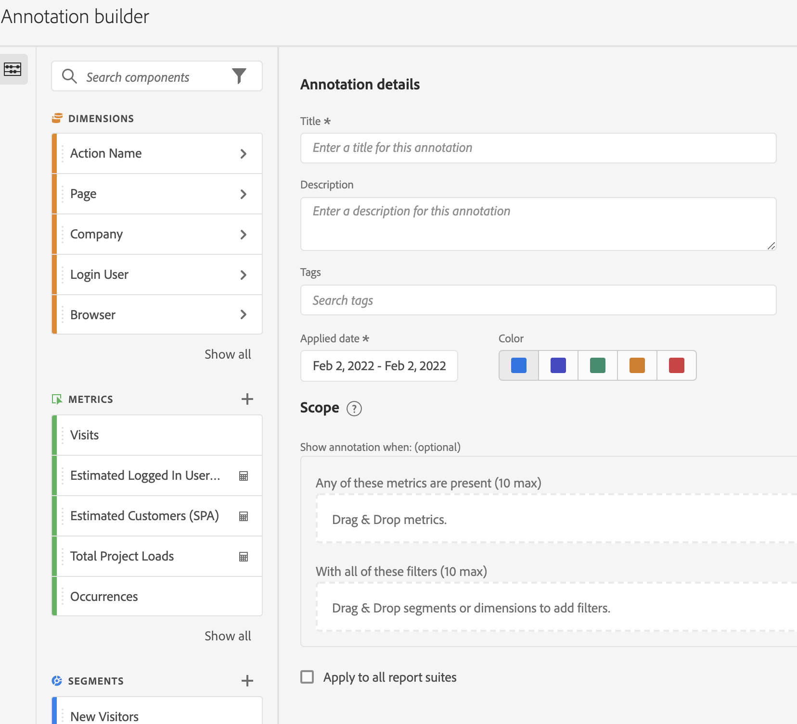

# Create annotations

>[!NOTE]
>
>This feature is currently in limited testing.

1. To create annotations, you have 4 ways to get started:

   * Go to [!UICONTROL Analytics] > [!UICONTROL Components] > [!UICONTROL Annotation]. The Annotations Manager page opens. Click [!UICONTROL Create New Annotation] and the Annotation builder opens, or

   * Right-click a point on a table or Line graph. The Annotation builder opens, or

   * In Workspace, go to [!UICONTROL Components] > [!UICONTROL Create annotation].

   * Use this hotkey to open the Annotation builder: 
      * (PC) `ctrl` `shift` + o 
      * (Mac) `shift` + `command` + o

1. Fill in the Builder elements.

   

   | Element | Description |
   | --- | --- |
   | [!UICONTROL Title] | Name the annotation, e.g. "Memorial Day" |
   | [!UICONTROL Description] |(Optional) Provide a description for the annotation, e.g. "Public holiday observed in the US". |
   | [!UICONTROL Tags] | (Optional) Organize annotations by creating or applying a tag. |
   | [!UICONTROL Applied date] | Select the date or date range that needs to be present for the annotation to be visible. |
   | [!UICONTROL Color] | Apply a color to the annotation. The annotation appears in the project with the selected color. Color can be used to categorize annotations, such as public holidays, external events, tracking issues, etc. |
   | [!UICONTROL Scope] | (Optional) Drag and drop the metrics that trigger the annotation. Then drag and drop any dimensions or segments that act as as filters (i.e., that the annotation will be visible with). If you don't specify a scope, the annotation will apply to all your data.<ul><li>**[!UICONTROL Any of these metrics are present]**: Drag and drop up to 10 metrics that will trigger the annotation to show.</li><li>**[!UICONTROL With all of these filters]**: Drag and drop up to 10 dimensions or segments that will filter when the annotation shows.</li></ul>
Use cases: An eVar has stopped collecting data for a specific date range. Drag the eVar into the **[!UICONTROL Any of these metrics are present]** dialog. Or your [!UICONTROL Visits] metric isn't reporting any data - follow the same process. |
   | [!UICONTROL Apply to all report suites] | By default, the annotation applies to the originating report suite. By checking this box, you can make the annotation apply to all report suites in the company. |
   | [!UICONTROL Apply to all projects] | By default, the annotation applies to the current project. By checking this box, you can make the annotation apply to all projects that you own. |
   
1. Click [!UICONTROL Save].