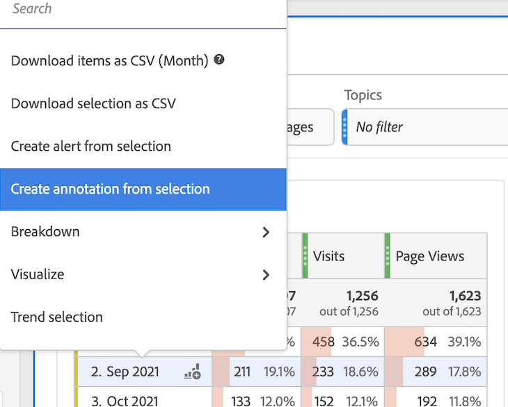
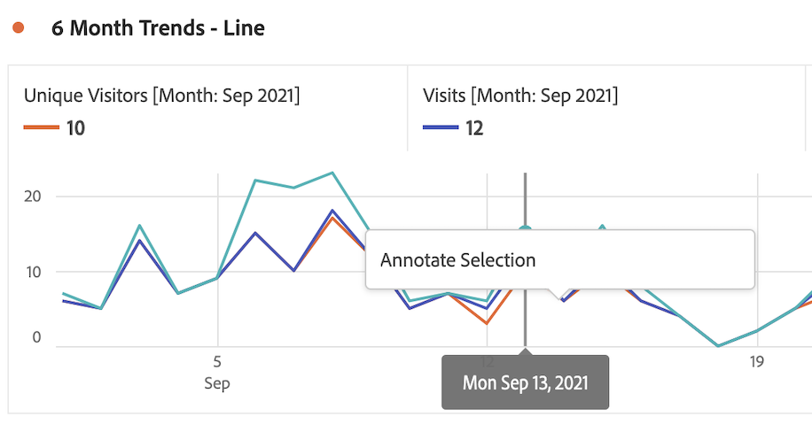
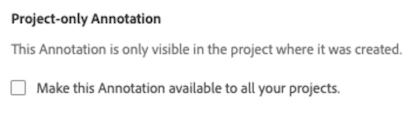

# Create annotations

By default, only Admins can create annotations. Users have rights to view annotations like they do with other other Analytics components (such as segments, calculated metrics, etc.).

However, Admins can give the [!UICONTROL Annotation Creation] permission (Analytics Tools) to users via the [Adobe Admin Console](https://experienceleague.adobe.com/docs/analytics/admin/admin-console/permissions/analytics-tools.html).

1. To create annotations, you have several ways to get started:

| Creation method | Details |
| --- | --- |
| **Go to [!UICONTROL Analytics] > [!UICONTROL Components] > [!UICONTROL Annotation].** | The Annotations Manager page opens. Click [!UICONTROL Create New Annotation] and the [!UICONTROL Annotation builder] opens. |
| **Right-click a point on a table.** | [!UICONTROL The Annotation builder] opens. Note that, by default, annotations created this way are visible only in the project where they were created. But you can make them available to all projects. Also notice that the date/s and any metric, etc., have already been populated.
 |
| **Right-click a point in a [!UICONTROL Line] graph.** | The [!UICONTROL Annotation builder] opens. Note that, by default, annotations created this way are visible only in the project where they were created. But you can make them available to all projects. Also notice that the date/s and any metric, etc., have already been populated.
 |
| **In Workspace, go to [!UICONTROL Components] > [!UICONTROL Create annotation].** | The [!UICONTROL Annotation builder] opens. |
| **Use this hotkey** to open the Annotation builder: (PC) `ctrl` `shift` + o, (Mac) `shift` + `command` + o | Note that by using the hotkey to create an annotation, you create a single-day annotation for the current date, without any pre-selected scope (metrics or dimensions). |

{style="table-layout:auto"}

1. Fill in the [!UICONTROL Annotation builder] elements.

   

   | Element | Description |
   | --- | --- |
   | [!UICONTROL Project-only Annotation] | By default, the annotation applies to the current project. By checking this box, you can make the annotation available to all projects that you own.
 |
   | [!UICONTROL Title] | Name the annotation, e.g. "Memorial Day" |
   | [!UICONTROL Description] |(Optional) Provide a description for the annotation, e.g. "Public holiday observed in the US". |
   | [!UICONTROL Tags] | (Optional) Organize annotations by creating or applying a tag. |
   | [!UICONTROL Applied date] | Select the date or date range that needs to be present for the annotation to be visible. |
   | [!UICONTROL Color] | Apply a color to the annotation. The annotation appears in the project with the selected color. Color can be used to categorize annotations, such as public holidays, external events, tracking issues, etc. |
   | [!UICONTROL Scope] | (Optional) Drag and drop the metrics that trigger the annotation. Then drag and drop any dimensions or segments that act as as filters (i.e., that the annotation will be visible with). If you don't specify a scope, the annotation will apply to all your data.<ul><li>**[!UICONTROL Any of these metrics are present]**: Drag and drop up to 10 metrics that will trigger the annotation to show.</li><li>**[!UICONTROL With all of these filters]**: Drag and drop up to 10 dimensions or segments that will filter when the annotation shows.</li></ul>
Use cases: An eVar has stopped collecting data for a specific date range. Drag the eVar into the **[!UICONTROL Any of these metrics are present]** dialog. Or your [!UICONTROL Visits] metric isn't reporting any data - follow the same process.
**Note:** Any annotation applied to a component that is then used as part of a calculated metric or segment definition does NOT automatically inherit the annotation. The desired calculated metric must also be added to the scope section to display the annotation. However, a new annotation should be created for any segment that you wish to annotate with the same information.
Example: You apply an annotation to [!UICONTROL Orders] on a specific day. You then use [!UICONTROL Orders] in a calculated metric for the same date range. The new calculated metric will not automatically display the annotation for orders; the calculated metric must be also be added to the scope section for the annotation to be displayed.|
   | [!UICONTROL Apply to all report suites] | By default, the annotation applies to the originating report suite. By checking this box, you can make the annotation apply to all report suites in the company. |

   {style="table-layout:auto"}
   
1. Click **[!UICONTROL Save]**.
