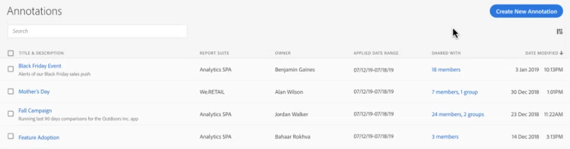

# Manage annotations

The [!UICONTROL Components] > [!UICONTROL Annotations] manager offers many ways of managing annotations, such as sharing, filtering, tagging, approving, copying, deleting, and marking as favorites.

The [!UICONTROL Annotations] manager shows you all the annotations you own that have been scoped to all your projects, and that have been shared with you. 

>[!NOTE]
>
>[!UICONTROL Annotations] that you created only for a specific project do not appear in the manager.

## Annotations Manager user interface

| UI Element | Description |
| --- | --- | 
| [!UICONTROL Title and Description] | Provided in the Annotations Builder. To edit the title and description, click the title link - this takes you back to the Annotations Builder.  |
| [!UICONTROL Report Suite] | The report suite(s) that this annotation applies to.  | 
| [!UICONTROL Owner] | Indicates who owns the annotation. As a non-Admin, you can see only annotations that you own or those that were shared with you. |
| [!UICONTROL Applied Date Range] | The date or date range that this annotation applies to. |
| [!UICONTROL Shared with] | Lists how many individuals or groups that you shared the annotation with. Click for more detail. |
| [!UICONTROL Date Modified] | Shows the date and time that the annotation was last modified. |

{style="table-layout:auto"}

## Edit annotations

Editing an annotation means that you can adjust date ranges, colors, scope, or whether or not it applies to all report suites or projects. You can edit annotations in two ways:

* In a line chart, hover over the annotation and click the pencil icon within the popover.

* In the [!UICONTROL Annotations Manager], click the title of the annotation.

Both of these options land you back in the [!UICONTROL Annotations Builder]. There, you can make the necessary adjustments and save the new version.

## Share annotations

When sharing annotations or working with annotations that were shared with you, keep this in mind:

* Let's say you create a project with project-only annotations and then you share the project with another user. These annotations will be displayed, but they cannot be edited or deleted by anyone you share the project with. 

* If you save an annotation and share it directly with a user, they can edit/delete the annotation only if they have admin rights.

* To recap, if the project is shared with you, it will show up only in that project. If the annotation is shared directly with you, it will show up in all projects where that annotation can be displayed. 

## Annotations and time zones

All annotations are created with a timestamp, but no hours or timezone information. At report time, the timezone of the panel’s report suite is always applied. So an annotation created for Christmas Day happens on December 25th - no matter what report suite timezone you are in. 

Another example is New Year's Day. Every hour, a different timezone sets off fireworks as the new year starts. At 10pm US Mountain Time, the US east coast is setting off fire works because it is already 12am Eastern Time.

## Other annotations tasks

The Annotations manager lets Administrators edit, add, tag, delete, rename, approve, copy, export, and filter annotations. It is not visible to non-Admin users. 

Just select one or more of the annotations and the Task bar appears.

| Task | Description |
| --- | --- |
| [!UICONTROL Add] | Takes you to the Annotations builder where you can create new annotations. |
| [!UICONTROL Tag] | All users can create tags for annotations and apply one or more tags to an annotation. However, you can see tags only for those annotations that you own. What kinds of tags should you create? Here are some suggestions for useful tags:<ul><li>Tags based on team names, such as Social Marketing, Mobile Marketing</li><li>Project tags (analysis tags), such as Entry-page analysis</li><li>Category tags: Men's; geography</li><li>Workflow tags: Curated for (a specific business unit); Approved</li></ul>|
| [!UICONTROL Delete] | Deleting an annotation removes it from any project in your organization. |
| [!UICONTROL Rename] | Renaming an annotation renames it in all projects that it was applied to. |
| [!UICONTROL Copy] | Creates a distinct copy with its own annotation ID, but with the same name and definition.|
| [!UICONTROL Export to CSV] | Export the annotation definition to a .csv file.|
| [!UICONTROL Filter] (left rail) | Filter by tags, report suite, owners, and other filters (Mine, Approved, Favorites, Shared with me, and Show All).|

{style="table-layout:auto"}
