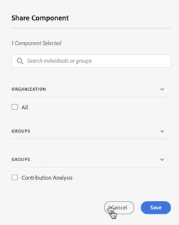

# Manage annotations

>[!NOTE]
>
>This feature is currently in limited testing.

The [!UICONTROL Components] > [!UICONTROL Annotations] manager offers many ways of managing annotations, such as sharing, filtering, tagging, approving, copying, deleting, and marking as favorites.

The [!UICONTROL Annotations] manager shows you all the annotations you own that have been scoped to all your projects, and that have been shared with you. 

>[!NOTE]
>
>[!UICONTROL Annotations] that you created only for a specific project do not appear in the manager.

## Annotations Manager user interface

| UI Element | Description |
| --- | --- | 
| [!UICONTROL Title and Description] | Provided in the Annotations Builder. To edit the title and description, click the title link - this takes you back to the Annotations Builder.  |
| [!UICONTROL Report Suite] | The report suite(s) that this annotation applies to.  | 
| [!UICONTROL Owner] | Indicates who owns the annotation. As a non-Admin, you can see only annotations that you own or those that were shared with you. |
| [!UICONTROL Applied Date Range] | The date or date range that this annotation applies to. |
| [!UICONTROL Shared with] | Lists how many individuals or groups that you shared the annotation with. Click for more detail. |
| [!UICONTROL Date Modified] | Shows the date and time that the annotation was last modified. |

## Edit annotations

Editing an annotation means that you can adjust date ranges, colors, scope, or whether or not it applies to all report suites or projects. You can edit annotations in two ways:

* In a line chart, hover over the annotation and click the pencil icon within the popover.

* In the [!UICONTROL Annotations Manager], click the title of the annotation.

Both of these options land you back in the Annotations Builder. There, you can make the necessary adjustments and save the new version.

## Share annotations

1. Select the annotation/s you want to share and click [!UICONTROL Share].

1. In the [!UICONTROL Share Component] dialog, search the individuals or groups with whom you want to share the annotation/s.

1. Under [!UICONTROL Organization], ....

1. Click [!UICONTROL Save].

## Tag annotations

## 

