# Mobile scorecard annotations

You can display annotations that are created in Analysis Workspace in Mobile scorecards. Annotations in mobile scorecards allow you to share contextual data nuances and insights about your organization and campaigns.

## Display annotations in Mobile scorecards

To surface annotations in mobile scorecards, create the annotation first from Workspace projects or from the components menu.

For information on creating annotations, see [Create annotations](create-annotations.md). Annotations are turned off in mobile scorecards by default and must be enabled for each scorecard that you want to surface in mobile scorecards.

1. Turn on annotations. To turn annotations on, see [Turn annotations on or off](overview.md#turn-annotations-on-or-off).

1. Create an annotation and make sure it is shared to all your projects. See [Create annotations](create-annotations.md) for more information.

1. Select **[!UICONTROL Show annotations]** to display the annotation in Mobile Scorecards.

   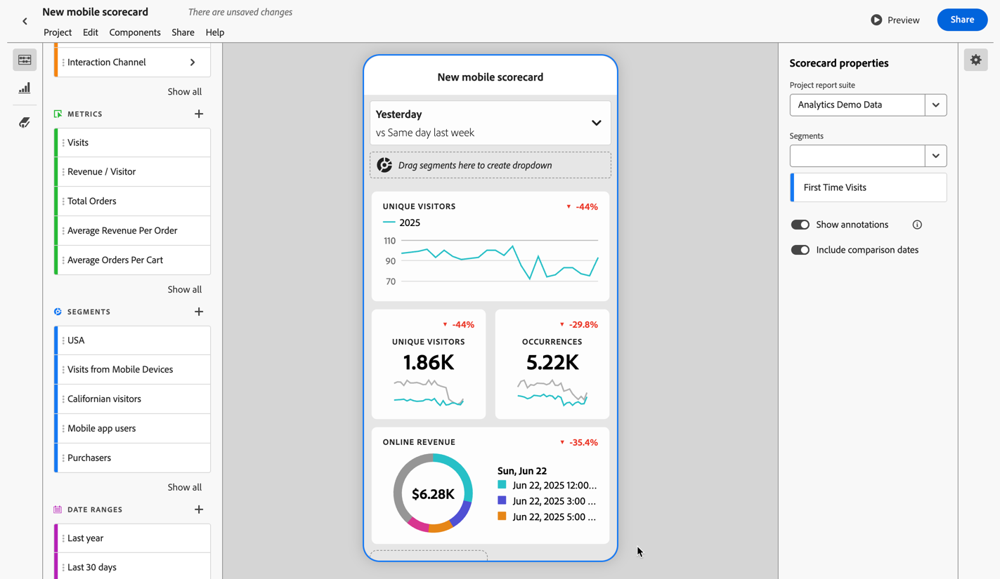

   You can optionally confirm that **[!UICONTROL Show annotations]** is selected in **[!UICONTROL Project]** > **[!UICONTROL Project info and settings]**

## View annotations in Mobile scorecards

When annotations are enabled, annotation icons are visible in the Scorecard builder. Annotations appear only on charts and tables in the detailed view. Annotations are not visible from the main tile view of the scorecard.

 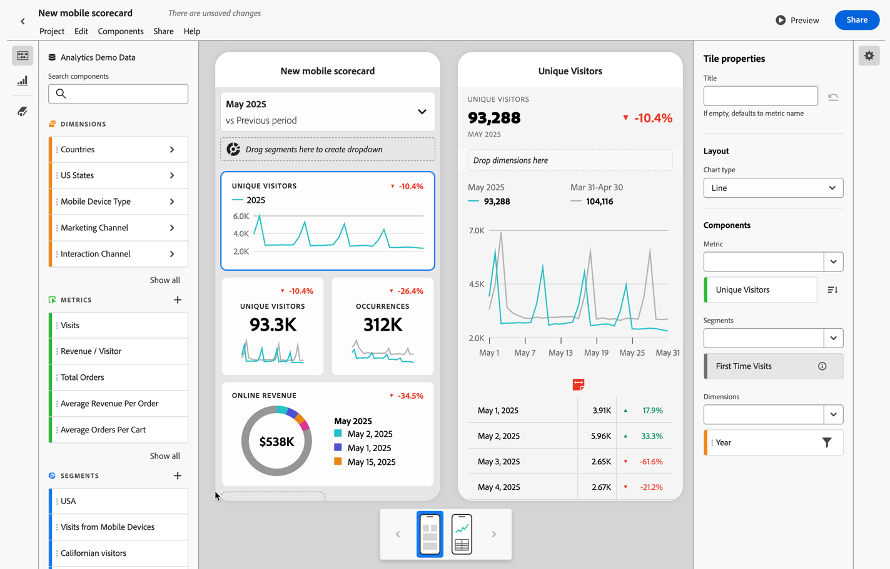

When annotation icons are visible, you cannot fully view or interact with annotations in the builder canvas. Use  **[!UICONTROL Preview]** to view and interact with annotations as they appear in the app.

Annotation colors are selected when the annotation is created in Workspace. Gray annotations indicated the presence of more than one annotation. 

## Preview annotations

You can preview annotation using  Preview. Select an annotation to open details of the annotation. 

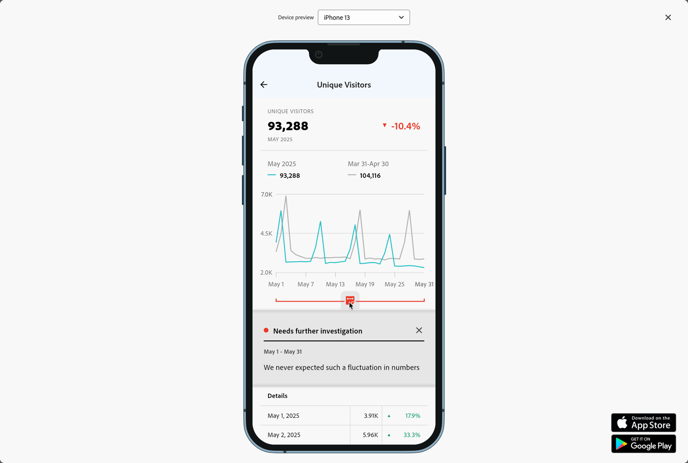

If more annotations are available, you see multiple dots (●) appear at the bottom of the annotation. Swipe left or right to switch between annotations.

<!--
# Share Annotations in Mobile Scorecards

You can display annotations that are created in Workspace in Mobile Scorecards. This allows you to share contextual data nuances and insights about your organization and campaigns directly within Mobile Scorecard projects, viewable in the Analytics dashboards mobile app.

## Surface Annotations in Mobile Scorecards

To surface annotations in mobile scorecards, create the annotation first from Workspace projects or from the components menu.

For information on creating annotations, see [Create Annotations](create-annotations.md). Annotations are turned off in mobile scorecards by default and must be enabled for each scorecard that you want to surface in mobile scorecards.

1. Turn on annotations. To turn annotations on, see [Turn annotations on or off](overview.md#annotations-on-off).

1. Create an annotation and make sure it is shared to all your projects. To create an annotation in Workspace,  see [Create Annotations](create-annotations.md).

1. Select **Show annotations** to display the annotation in Mobile Scorecards.

   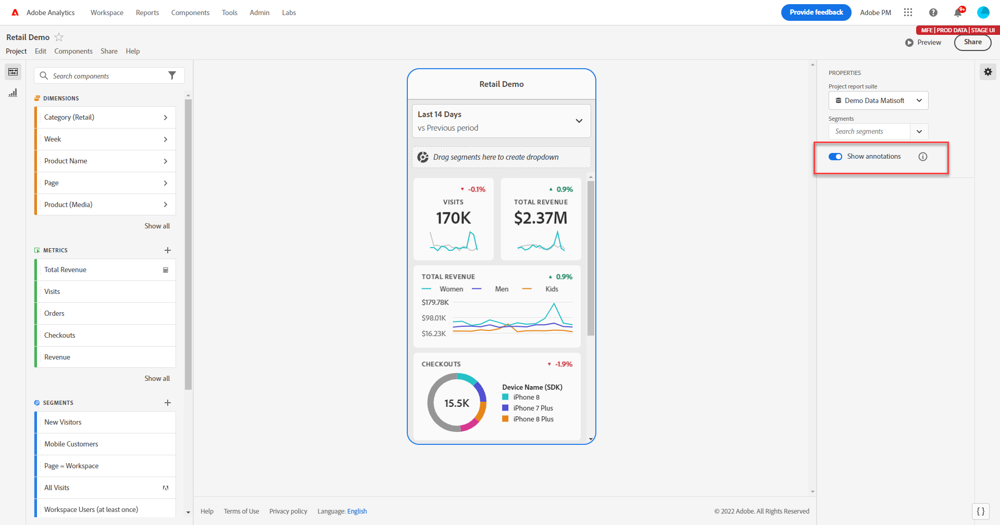

1. Confirm that show annotations is selected, go to **Project** > **Project info and settings**.

   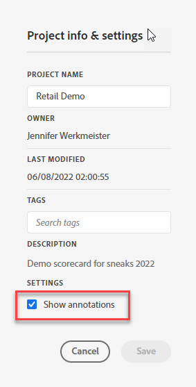

## View annotations in Mobile Scorecards

When annotations are enabled, annotation icons are visible in the Scorecard Builder. Annotations appear only on charts and tables in the detailed view. Annotations are not visible from the main tile view of the scorecard.

 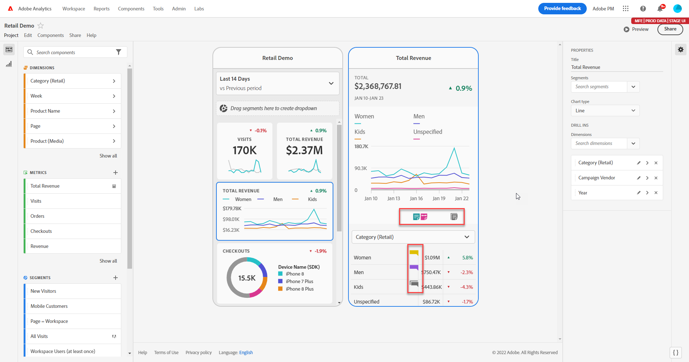

When annotation icons are visible, you can't fully view or interact with annotations in the builder canvas. Use the Preview mode to view and interact with annotations as they appear in the app  **Preview**.

Annotation colors are selected when the annotation is created in workspace. Gray annotations indicated the presence of more than one annotation.

## View chart annotations

| Date | Appearance |
| --- | --- |
| **Single day** |  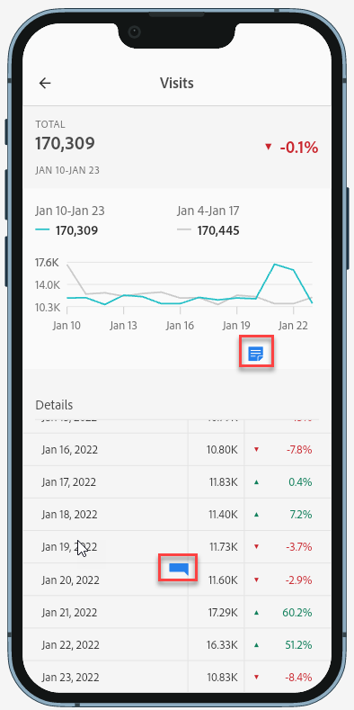   |
| **Date range** |  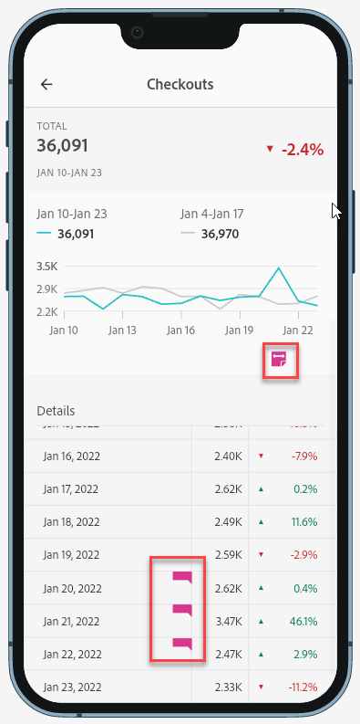|
| **Overlapping annotations** | 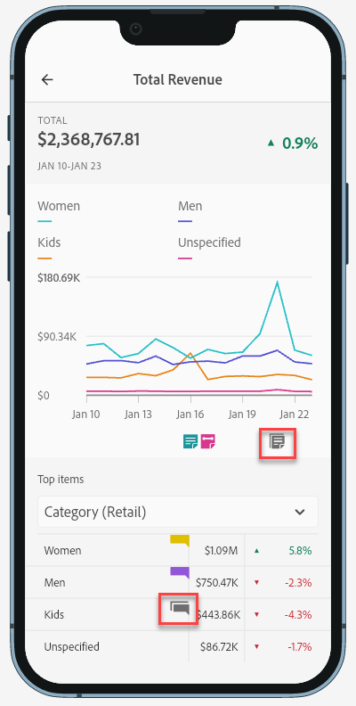  To view annotation details in the Analytics dashboards app, tap an annotation icon.   When viewing an annotation in a chart, you can swipe left and right to navigate all annotations present in the chart. When viewing an annotation in the table, swipe left and right to navigate all annotations associated with that row item in the table.   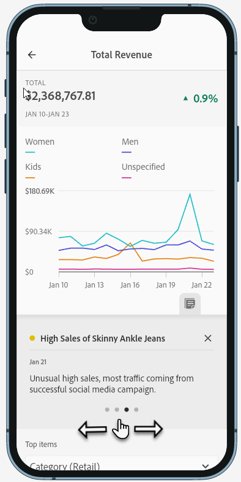   In charts that do not have a time-based *x axis*, such as the donut or horizontal bar charts, annotations that apply to the chart can be viewed by tapping the icon located in the lower right-hand corner.   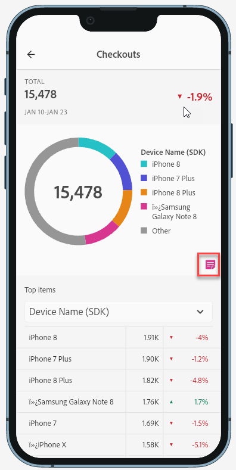|
-->