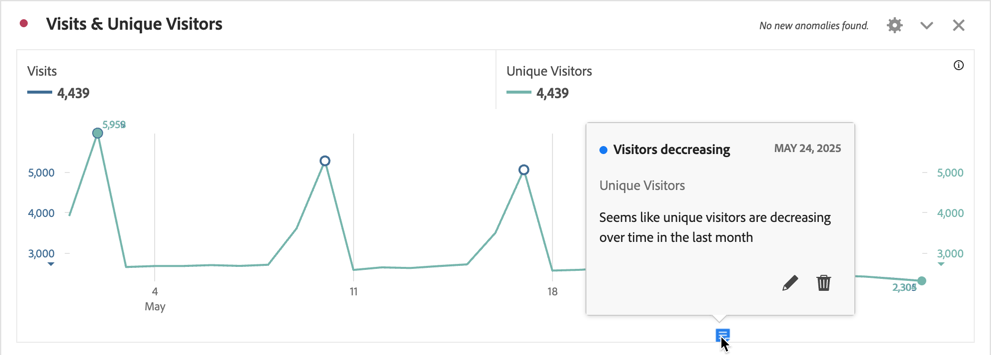
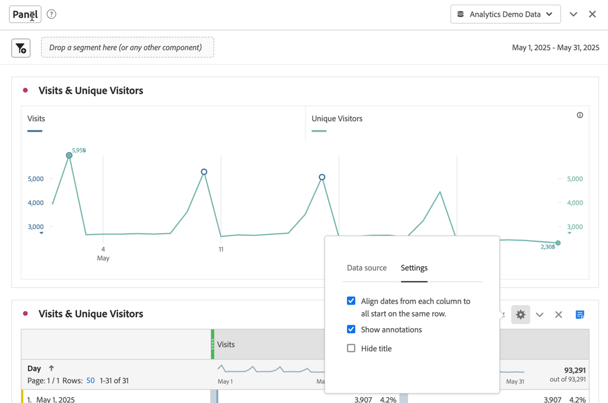
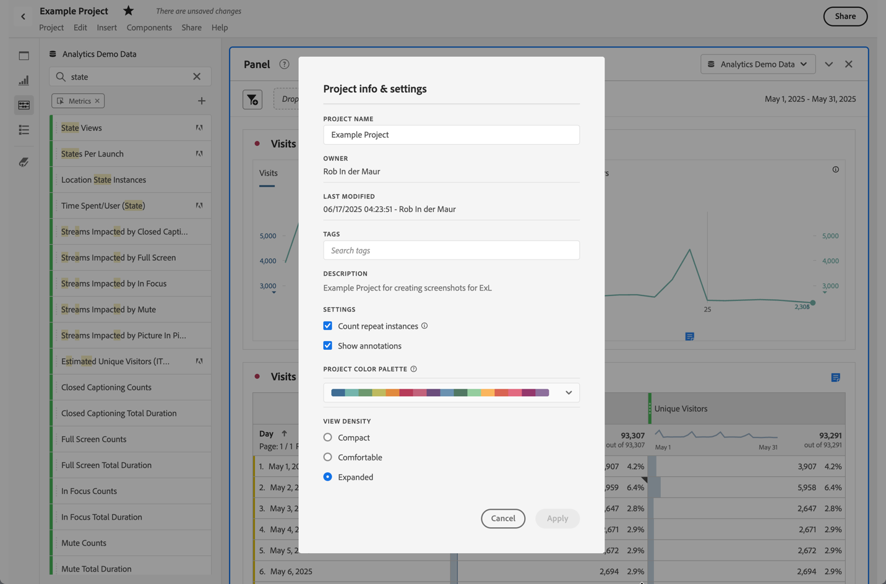
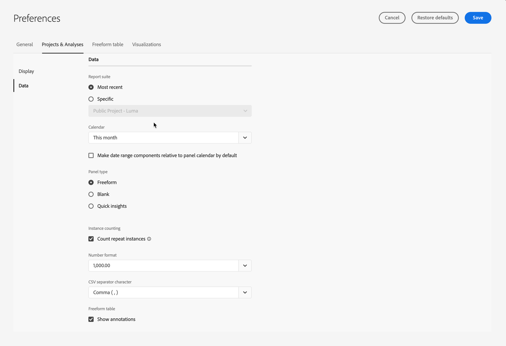

# Annotations overview

Annotations enable you to communicate contextual data nuances and insights effectively to other stakeholders in your organization. Annotations let you tie calendar events to specific dimensions and metrics. You can annotate a date or date range with known data issues, public holidays, campaign launches, etc. You can then graphically display events and see whether campaigns or other events have affected your site traffic, mobile app usage, revenue, or any other metric.

For example, you are sharing projects with your organization. If you had a noticeable decline in your unique visitors, you could create a **Visitors decreasing** annotation and scope it for your whole report suite. When your users view any report suite that included that date, they see the annotation within their projects, alongside their data.

Annotations can apply to:

* A single date or a date range.

* Your entire dataset or specific metrics, dimensions, or segments.

* The project in which annotations are created (default) or all projects.

* The data view in which annotations are created (default), or all data views.

See [Create annotations](create-annotations.md) for the various options available to create annotations. You then build, modify, and save annotations in the [Annotation builder](create-annotations.md#annotation-builder).

You use the [Annotations manager](manage-annotations.md) to manage annotations.

## Turn annotations on or off

Annotations can be turned on or off at several levels:

| Level | How to... |
|---|---|
| **Visualization** | Enable or disable  > **[!UICONTROL Settings]** >  **[!UICONTROL Show annotations]**.  |
| **Project** | From a Workspace project menu, select **[!UICONTROL Project]** > **[!UICONTROL Project info & settings]** and enable or disable **[!UICONTROL Show annotations]**.  |
| **User** | From the **[!UICONTROL Components]** tab select **[!UICONTROL Preferences]**, or from a Workspace project menu, select **[!UICONTROL Project]** > **[!UICONTROL User preferences]**.  In **[!UICONTROL Preferences]**, select **[!UICONTROL Projects & Analysis]**. From the left tab bar, select **[!UICONTROL Data]**. At the bottom, enable or disable **[!UICONTROL Show annotations]** underneath the **[!UICONTROL Freeform table]** heading.  |

<!--
# Annotations overview

Annotations in Workspace enable you to effectively communicate contextual data nuances and insights to your organization. They let you tie calendar events to specific dimensions/metrics. You can annotate a date or date range with known data issues, public holidays, campaign launches, etc. You can then graphically display events and see whether campaigns or other events have affected your site traffic, revenue, or any other metric.

For example, let's say you are sharing projects with your organization. If you had a major spike in traffic due to a marketing campaign, you could create a "Campaign launch date" annotation and scope it for your whole report suite. When your users view any data sets that included that date, they see the annotation within their projects, alongside their data.

Keep this in mind:

* Annotations can be tied to a single date or to a date range.

* They can apply to your entire data set or to specified metrics, dimensions, or segments.

* They can apply to the project in which they were created (default) or to all projects.

* They can apply to the report suite in which they were created (default) or to all report suites.

## Permissions {#permissions}

By default, only Admins can create annotations. Users have rights to view annotations like they do with other other Analytics components (such as segments, calculated metrics, etc.).

However, Admins can give the [!UICONTROL Annotation Creation] permission (Analytics Tools) to users via the [Adobe Admin Console](/help/admin/admin-console/permissions/analytics-tools.md).

## Turn annotations on or off {#annotations-on-off}

Annotations can be turned on or off at several levels:

* At the Visualization level: [!UICONTROL Visualization] settings > [!UICONTROL Show annotations]

* At the Project level: [!UICONTROL Project info & settings] > [!UICONTROL Show annotations]

* At the User level: [!UICONTROL Components] > [!UICONTROL User preferences] > [!UICONTROL Data] > [!UICONTROL Show annotations]

-->