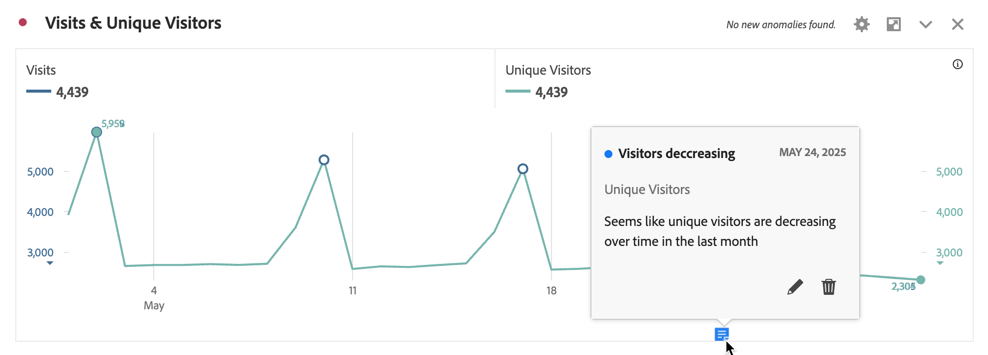
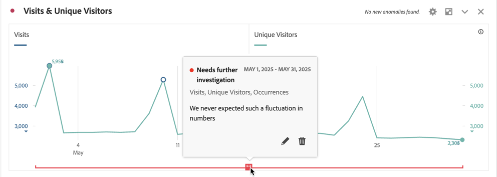
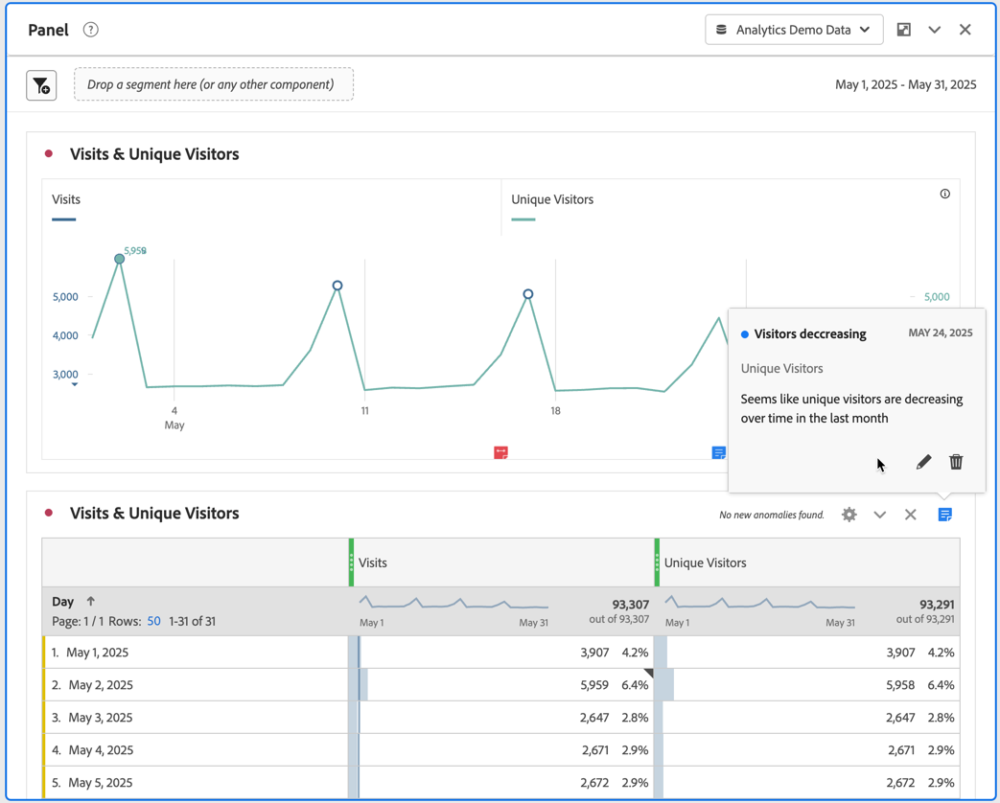
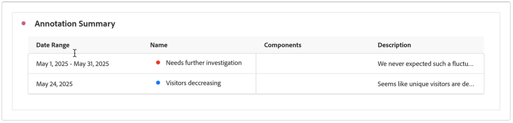

# View annotations

Annotations manifest slightly differently, depending on where they appear and whether they span a single day or a date range. 

## View annotations in Workspace

| Visualization Type | Description |
| --- | --- |
| **Line** **Single day** | When you select  in a line visualization, you see a popup with the annotation details.  To edit edit the annotation in the [Annotation builder](create-annotations.md#annotation-builder) select . To delete the annotation, select . |
| **Line** **Date range** |  When you select  you see a popup with the annotation details and a line at the bottom indicating the date range. To edit edit the annotation in the [Annotation builder](create-annotations.md#annotation-builder) select . To delete the annotation, select . |
| **Freeform table**| In a Freeform table, you can access all annotations from the annotations button at the top right of the visualization. Select  to see a (scrolling list) of all annotations.  For each annotation, you can select  to edit the annotation in the [Annotation builder](create-annotations.md#annotation-builder) and  to delete the annotation. |

{style="table-layout:auto"}

## View annotations in a PDF

When you download your project as a PDF, or send your project as a PDF, annotations are summarized in PDF in the Annotation summary section.

<!--
# View annotations

Annotations manifest slightly differently, depending on whether they span a single day or a date range.

## View annotations in Line charts or Tables

| Date | Appearance |
| --- | --- |
| **Single day** |   
When you hover over the annotation, you can see its details, you can edit it by selecting the pen icon, or you can delete it:
  |
| **Date range** |  The icon changes and when you hover over it, the date range appears.

When you select it in the line chart, the annotation metadata appear, and you can edit or delete it:
In a table, an icon appears on every date in the date range.
|
| **Overlapping annotations** | On days that have more than one annotation tied to them, the icon appears in a grey color.

When you hover over the grey icon, all overlapping annotations appear:
 |

{style="table-layout:auto"}

## View annotations in a .pdf file

Since you cannot hover over icons in a .pdf file, this file (after export) provides notes of explanations at the bottom of a panel. Here is an example:

## View annotations with non-trended data

Sometimes annotation are shown with non-trended data, but tied to a specific dimension. In that case, they appear only in a summary annotation in the bottom right corner. Here is an example:

The summary chart appears in all visualization types in the corner, not just in non-trended freeform tables and summary numbers. It also appears in visualizations like [!UICONTROL Donut], [!UICONTROL Flow],[!UICONTROL Fallout],[!UICONTROL Cohort], and so on.

-->