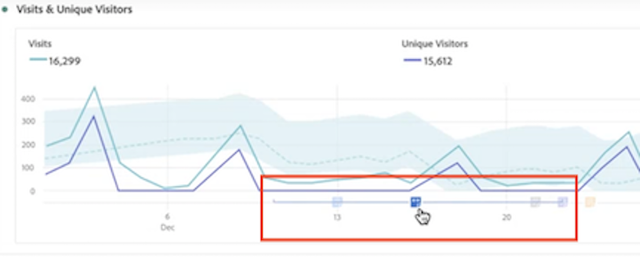

# View annotations

>[!NOTE]
>
>This feature is currently in limited testing.

Annotations manifest slightly differently, depending on whether they span a single day or a date range.

## View annotations in Line charts or Tables

| Date | Appearance |
| --- | --- |
| **Single day** |     |
| **Date range** |  The icon changes and when you hover over it, the date range appears.

In a table, an icon appears on every date in the date range.

Note the following: on days that have more than one annotation tied to them, the icon will be a grey color.|

## View annotations in a Summary chart

## View annotations in a .pdf file

Since you cannot hover over icons in a .pdf file, this file (after export) provides notes of explanations at the bottom of a panel. Here is an example:

