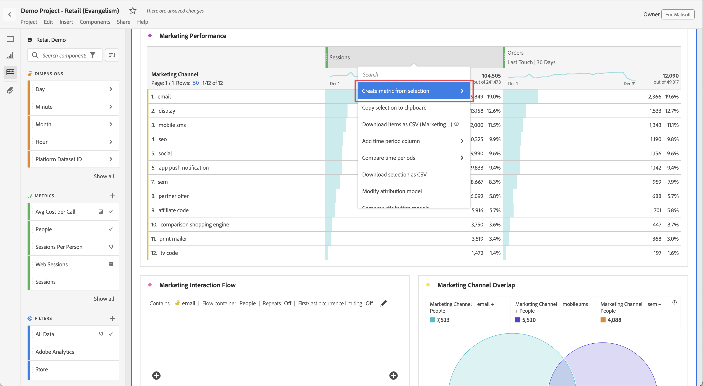

# Metrics

Metrics allow you to quantify data points in Analysis Workspace. They are most commonly used as columns in a visualization and tied to dimensions.

## Use metrics in Analysis Workspace

Metrics are flexible in their use within Analysis Workspace. Drag a metric to an empty Freeform table to see that metric trended over the project's date period. You can also drag a metric when a dimension is present to see how that metric compares to each dimension item. Dragging a metric on top of an existing metric header replaces it, and dragging a metric next to a header lets you see both metrics side-by-side.

For information about how to add metrics and other types of components to Analysis Workspace, see [Use components in Analysis Workspace](use-components-in-workspace.md).

## Types of metrics

Adobe offers several types of metrics for use in Analysis Workspace:

* **Standard metrics**: Most metrics that you use in projects are standard metrics. Examples include [Page views](/help/components/metrics/page-views.md), [Revenue](/help/components/metrics/revenue.md), or [Custom events](/help/components/metrics/custom-events.md). See [Metrics overview](/help/components/metrics/overview.md) in the Components user guide for more information.

* **Calculated metrics** : User-defined metrics that are based on standard metrics, static numbers, or algorithmic functions. User-defined calculated metrics show a calculator icon in the list of available components. See [Calculated Metrics overview](/help/components/calculated-metrics/cm-overview.md) in the Components user guide for more information.

* **Calculated metric templates** : Adobe-defined metrics that behave similarly to calculated metrics. You can use them as-is in Workspace projects, or save a copy to customize its logic. Calculated metric templates show an Adobe icon in the list of available components.

You can see whether a metric is approved   or not. If you want more details on a metric, hover over the metric, and select . See [Component info](use-components-in-workspace.md#component-info) for more information.

## Use metrics in Analysis Workspace

Metrics can be used in various ways within Analysis Workspace. For information about how to add metrics and other types of components to Analysis Workspace, see [Use components in Analysis Workspace](/help/analyze/analysis-workspace/components/use-components-in-workspace.md).

>[!BEGINSHADEBOX]

See  [Use metrics](https://video.tv.adobe.com/v/40817?quality=12&learn=on){target="_blank"} for a demo video.

>[!ENDSHADEBOX]

## Create calculated metrics

Calculated metrics allow you to see how metrics relate to each other, using simple operators or statistical functions. 

There are several ways to create calculated metrics. The method you choose determines whether the calculated metric is available from the component list across all projects, or only in the project where it was created.

### Create calculated metrics for all projects

You can use the [calculated metric builder](/help/components/calculated-metrics/c-workflow/cm-workflow/c-build-metrics/cm-build-metrics.md) to [create calculated metrics](/help/components/calculated-metrics/c-workflow/cm-workflow/cm-workflow.md). When created in this way, calculated metrics are available in the component list and can be used in projects throughout your organization. 

### Create calculated metrics for a single project

You can quickly create a calculated metric that is available only for the project where it was created.

To create a calculated metric for a single project:

1. In Analysis Workspace, open the project where you want to create the calculated metric.

1. In a freeform table, right-click the column header of a single column.

   Or

   Select two columns while holding the Shift key, then right-click one of the selected columns.
   
1. Select **[!UICONTROL Create metric from selection]**

   

1. To create a calculated metric for this project only, choose from the available options.

   When a single column is selected, the following options are available:

   * [!UICONTROL **Mean**]: Creates a new column that shows the mean value in the set of dimension elements for the column. The column values use the [Mean](/help/components/calculated-metrics/cm-reference/cm-functions.md#mean) function.
   
   * [!UICONTROL **Median**]: Creates a new column that shows the median value in the set of dimension elements for the column. The column values use the [Median](/help/components/calculated-metrics/cm-reference/cm-functions.md#median) function.

   * [!UICONTROL **Column max**]: Creates a new column that shows the largest value in the set of dimension elements for the column. The column values use the [Column Maximum](/help/components/calculated-metrics/cm-reference/cm-functions.md#column-maximum) function.

   * [!UICONTROL **Column min**]: Creates a new column that shows the smallest value in the set of dimension elements for the column. The column values use the [Column Minimum](/help/components/calculated-metrics/cm-reference/cm-functions.md#column-minimum) function.

   * [!UICONTROL **Column sum**]: Creates a new column that adds all numeric values for a metric within a column (across the elements of a dimension). The column values use the [Column Sum](/help/components/calculated-metrics/cm-reference/cm-functions.md#column-sum) function.

   When two columns are selected, the following options are available:

   * [!UICONTROL **Divide**]: Creates a new column that divides the values of the two selected columns.
   
   * [!UICONTROL **Subtract**]: Creates a new column that subtracts the values of the two selected columns.

   * [!UICONTROL **Add**]: Creates a new column that adds the values of the two selected columns.

   * [!UICONTROL **Multiply**]: Creates a new column that multiplies the values of the two selected columns.

   * [!UICONTROL **Percent change**]: Creates a new column that shows the percent change between the two selected columns.

[Calculated Metrics: Implementation-less metrics](https://experienceleague.adobe.com/en/docs/analytics-learn/tutorials/components/calculated-metrics/calculated-metrics-implementationless-metrics) (3:42)

## Compare metrics with different attribution models

To compare one attribution model to another quickly, right click a metric and select **[!UICONTROL Compare Attribution Models]**:

This shortcut lets you compare one attribution model to another without dragging in a metric and configuring it twice.

## Use the [!UICONTROL cumulative average] function to apply metric smoothing

Here is a video on the topic:

>[!BEGINSHADEBOX]

See  [Cumulative average](https://video.tv.adobe.com/v/27068?quality=12&learn=on){target="_blank"} for a demo video.

>[!ENDSHADEBOX]

