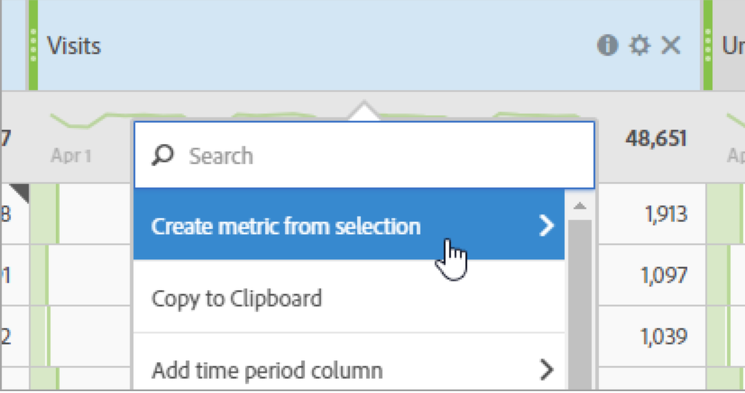

# Metrics

There are two ways to use metrics in Analysis Workspace.

* You can either drag a standard metric, calculated metric, or calculated metric template from the [!UICONTROL Components] menu to the table:

   

   >[!NOTE]
   >
   >While this is seemingly simple, the use of metrics is rather powerful. You can add metrics to a report by dragging the appropriate metric to the metrics section of a table. You can also break down dimensions by metrics, giving you fine-grained control over the table view. Furthermore, you can insert a metric as a dimension and a dimension as a metric to create an overtime report. Play around with the various components and see what you can do. The possibilities are endless.

* Or you can click **[!UICONTROL Components]** > **[!UICONTROL New Metric]**. This will take you to the [Calculated Metric Builder](/help/components/c-calcmetrics/cm-overview.md), where you can build custom metrics from existing metrics.

Here is a video on working with metrics in a Freeform table:

>[!VIDEO](https://video.tv.adobe.com/v/40817/?quality=12)

## Calculated metrics

To make it easier to quickly create calculated metrics, **[!UICONTROL Create metric from selection]** has been added to the column right-click menu in Freeform Tables. This option displays when one or more header column cells are selected.

[Calculated Metrics: Implementation-less metrics](https://experienceleague.adobe.com/docs/analytics-learn/tutorials/components/calculated-metrics/calculated-metrics-implementationless-metrics.html) (3:42)

## Compare metrics with different attribution models

If you'd like to quickly and easily compare one attribution model to another, right click a metric and select **[!UICONTROL Compare Attribution Models]**:

This shortcut lets you quickly and easily compare one attribution model to another without dragging in a metric and configuring it twice.

## Use the [!UICONTROL cumulative average] function to apply metric smoothing

Here is a video on the topic:

>[!VIDEO](https://video.tv.adobe.com/v/27068/?quality=12)
