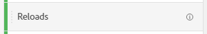
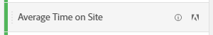
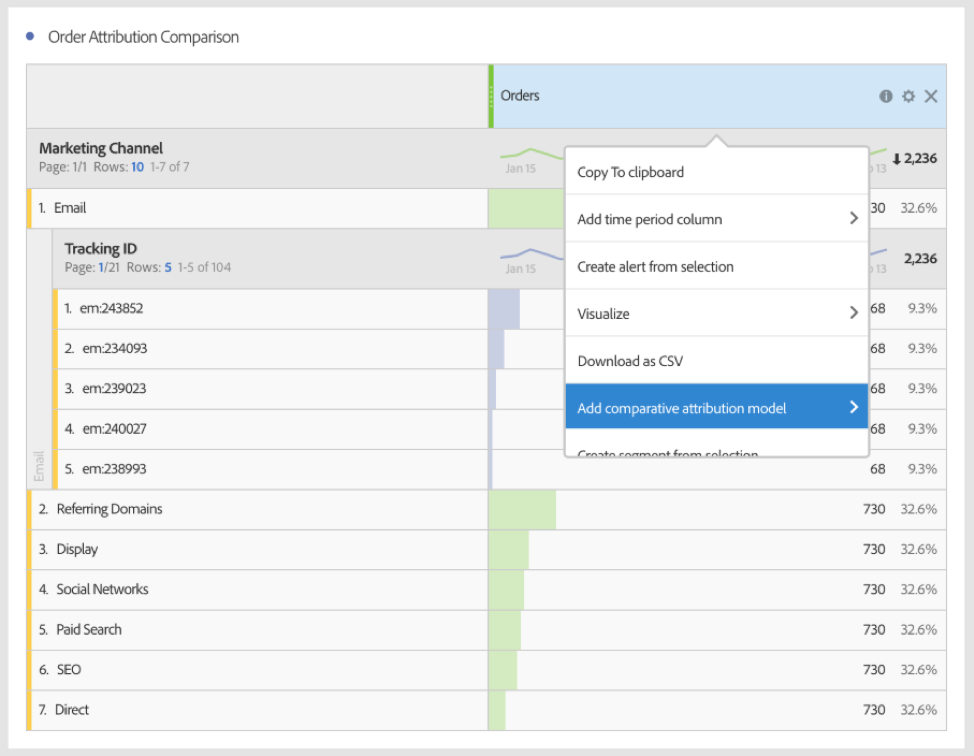

# Metrics

Metrics allow you to quantify data points in Analysis Workspace. They are most commonly used as columns in a visualization and tied to dimensions.

## Types of metrics

Adobe offers several types of metrics for use in Analysis Workspace:

* **Standard metrics**: Most metrics that you use in projects are standard metrics. Examples include [Page views](/help/components/metrics/page-views.md), [Revenue](/help/components/metrics/revenue.md), or [Custom events](/help/components/metrics/custom-events.md). See [Metrics overview](/help/components/metrics/overview.md) in the Components user guide for more information.

  

* **Calculated metrics**: User-defined metrics that are based on standard metrics, static numbers, or algorithmic functions. User-defined calculated metrics show a calculator icon in the list of available components. See [Calculated Metrics overview](/help/components/c-calcmetrics/cm-overview.md) in the Components user guide for more information.

  

* **Calculated metric templates**: Adobe-defined metrics that behave similarly to calculated metrics. You can use them as-is in Workspace projects, or save a copy to customize its logic. Calculated metric templates show an Adobe icon in the list of available components.

  

## Use metrics in Analysis Workspace

Metrics can be used in various ways within Analysis Workspace. You can:

* Drag a metric to an empty Freeform table to see that metric trended over the project's date period. 

* Drag a metric when a dimension is present to see that metric compared to each dimension item. 

* Drag a metric on top of an existing metric header to replace it.

* Drag a metric next to a header to see both metrics side-by-side.

>[!VIDEO](https://video.tv.adobe.com/v/40817/?quality=12)

## Calculated metrics

Calculated metrics allow you to easily see how metrics relate to each other using simple operators or statistical functions. There are several ways to create calculated metrics:

* Click the plus icon next to the Metrics header under the list of components on the left.
* Navigate to **[!UICONTROL Components]** > **[!UICONTROL Calculated Metrics]** > **[!UICONTROL Add]**.
* Right click a column header > **[!UICONTROL Create metric from selection]** when one or more header column cells are selected. This option automatically creates a calculated metric for you without needing to use the Calculated Metric Rule Builder.

[Calculated Metrics: Implementation-less metrics](https://experienceleague.adobe.com/docs/analytics-learn/tutorials/components/calculated-metrics/calculated-metrics-implementationless-metrics.html) (3:42)

## Compare metrics with different attribution models

If you'd like to quickly and easily compare one attribution model to another, right click a metric and select **[!UICONTROL Compare Attribution Models]**:

This shortcut lets you quickly and easily compare one attribution model to another without dragging in a metric and configuring it twice.

## Use the [!UICONTROL cumulative average] function to apply metric smoothing

Here is a video on the topic:

>[!VIDEO](https://video.tv.adobe.com/v/27068/?quality=12)
