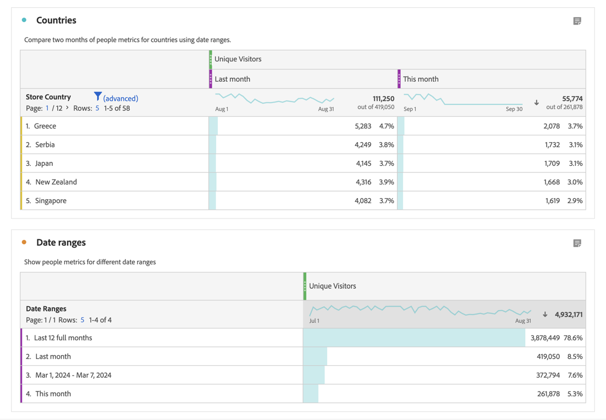

# Date ranges overview

In a Workspace project, you typically use the [calendar in a panel](/help/analyze/analysis-workspace/c-panels/panels.md#calendar) to specify the date range for the visualizations in that panel.

Date range components enable you to define and override the calendar settings for the panel.

<!-- Very old video, should we show it?

+++ View a video illustrating use of calendar and date ranges

>[!VIDEO](https://video.tv.adobe.com/v/24136?format=jpeg)

{{videoaa}}
+++

-->

## Use date ranges

You can use a date range component to redefine the calendar for the panel.

Or, you can use a date range in a Freeform table as a metric or dimension.

- **Metric**. For example, to compare a dimension for two different months for a specific metric.
- **Dimension**. To compare a metric on different dimension items for the date range dimension.

>[!NOTE]
>
>When you use date ranges in a Freeform table, the date ranges override the calendar specified for the panel to which the Freeform table belongs.
>

You use a date range as you would [use any component](/help/analyze/analysis-workspace/components/analysis-workspace-components.md#analysis-workspace-components). You drag the date range from the  **[!UICONTROL Date ranges]** component panel and drop the component on:

- **[!UICONTROL Calendar]**: You  **[!UICONTROL Replace]** the current calendar configuration with the date range.
- **Metric column header**: You  **[!UICONTROL Replace]** the metric, **[!UICONTROL Add]** the date range as a metric, or  **[!UICONTROL Filter]** the metric using the date range component.
- **Dimension column header**: You   **[!UICONTROL Replace]** the current dimensions. The new dimension is now **[!UICONTROL Date ranges]**. Once the dimension is Date ranges, you can **[!UICONTROL Add]** additional date ranges as dimension items.
- **Dimension item**: You  **[!UICONTROL Breakdown]** the specific dimension item by the date range.

You can also add a date range column directly in a Freeform table visualization:

1. In a metric column, select from the context menu:

   - **[!UICONTROL Add time period column]**. You can select between suggested options that are based on the current calendar or create a [custom date range](#custom-date-ranges).
   - **[!UICONTROL Compare time periods]**. You can select between a suggested option that is based on the current calendar or create a [custom date range](#custom-date-ranges).

1. Based upon your selection, additional date range columns are added to the Freeform table.

## Default date ranges

Analysis Workspace provides a number of default date ranges.

| Day | Week | Month | Quarter | Year |
|---|---|---|---|---|
| Today | This week | This month | This quarter | This year |
| Yesterday | This week (excluding today) | This month (excluding today) | This quarter (excluding today) | This year (excluding today) |
| 2 days ago | 2 weeks ago | 2 months ago |   |  |
| 3 days ago | 3 weeks ago | 3 months ago |  | |
| Last 7 days | Last week | Last month |Last quarter | Last year |
| Last 14 days | Last 2 full weeks | Last 2 full months | Last 4 full quarters | |
| Last 30 days | Last 3 full weeks | Last 3 full months | | |
| Last 60 days | Last 4 full weeks | Last 6 full months | | |
| Last 90 days | Last 12 full weeks | Last 12 full months| | | 
| Last 7 full days | Last 52 full weeks | Last 13 full months | | |
| Last 14 full days | | | | |
| Last 30 full days | | | | |
| Last 90 full days | | | | |

<table style="table-layout:fixed">

## Custom date ranges

You can create your own custom date ranges. See [Create date range](create.md) for the various options available to create date ranges. You then build, modify, and save date ranges in the [Date range builder](create.md#date-range-builder).

You use the [Date range manager](manage.md) to manage date ranges.

<!--
# Calendar and date ranges overview {#date-range}

>[!CONTEXTUALHELP]
>id="components_dateranges_endtime"
>title="End time"
>abstract="End times always include 59 seconds."

In the calendar, you can specify dates and date ranges, or select a preset.

>[!BEGINSHADEBOX]

See  [Calendar and date ranges overview](https://video.tv.adobe.com/v/23973?quality=12&learn=on){target="_blank"} for a demo video.

>[!ENDSHADEBOX]

Calendar selections apply at the panel level, but you have the option to apply them to all panels. When you click a date range in Workspace, the interface displays the current calendar month and the previous calendar month. You can adjust these two calendars by clicking the right and left arrows in each respective upper corner.

{width="60%"} 

## Select and apply date ranges {#select-apply}

The first click on a calendar starts a date range selection. The second click completes a date range selection, which becomes highlighted. If the `Shift` key is held down (or right-click is used), it appends to the currently selected range.

You can also drag dates (and time dimensions) into a Workspace project. You can select specific days, weeks, months, years, or a rolling date.

[Using Date Ranges and Calendar in Analysis Workspace](https://experienceleague.adobe.com/docs/analytics-learn/tutorials/analysis-workspace/calendar-and-date-ranges/using-dates-in-analysis-workspace.html) (4:07)

| Setting | Description |
|--- |--- |
|Selected Days|Selected days/weeks/months/years.|
|Make date range components relative to panel calendar| If disabled, any date range components used within a table, visualization, or panel drop zone override the panel calendar. 
If enabled, any date range components used within a table, visualization, or panel drop zone are in relation to the panel date range. For example, if the panel date range is set to November 1 through November 30, and a Last Week date range component is used in a freeform table, the information in the freeform table refers to the last week in October. |
|Use rolling dates| Rolling dates allow you to generate a dynamic report that looks forward or backward for a set period of time based on when you ran the report. For example, if you want to report on all Orders placed "Last Month" (based on the Created Date field) and ran that report in December, you'd see orders placed in November. If you ran that same report in January, you'd see orders placed in December.<ul><li>**[!UICONTROL Date Preview]**: Indicates what time period the rolling calendar encompasses.</li><li>**[!UICONTROL Start]**: You can choose among current day, current week, current month, current quarter, current year.</li><li>**[!UICONTROL End]**: You can choose among current day, current week, current month, current quarter, current year.</li></ul>To view an example, see [Custom date ranges](/help/analyze/analysis-workspace/components/calendar-date-ranges/custom-date-ranges.md).  Selected by default.|
|Date Range|Lets you pick a preset date range. Last 30 days is the default. **[!UICONTROL This week/month/quarter/year (excluding today)]** lets you choose from date ranges that do not include partial-day data from today.|
|Apply to All Panels|Lets you not only change the selected date range for the current panel, but also for all other panels within the project.|
|Apply|Applies the date range to this panel only.|

## About relative panel date ranges {#relative-panel-dates}

If you're working in Workspace, you can make the date range components relative to the panel calendar. 
Three common use cases where you'll see relative panel dates take effect are Combo charts, Key metrics summary, and Freeform table date ranges.

To use relative panel date ranges

1. Select the **Workspace** tab.
1. Select **Blank project**.
1. Add dimensions, metrics, and segments from the left rail. 
1. Click the panel date range field to toggle the relative panel date range setting.
1. Select **Make date range components relative to panel calendar**.
    * Select the option to make the date range components relative to the panel calendar.
        If relative dates are selected, then rolling dates will be based on the start date of the panel calendar and not today's date.
    * If this option isn't selected, then rolling dates will be based on today's date.

    {width="60%"} 

1. Click **Apply**.
    The relative dates are shown in the upper-right.

    

## Guidelines for relative panel date ranges {#guidelines}

Keep in mind the following guidelines when using relative panel date ranges.

### Formulas and relative date ranges {#formula-relative-dates}

If you have relative dates selected, all date formulas will use the panel's start date as the starting point.

### Custom calendars and relative date ranges {#custom-calendar-formulas}

When you use a week-based custom calendar and you add months or years, the formula calculates the offset of the day in the given period. The actual date may be different because of the offset. The formula chooses the day landing in the same place in the custom calendar. For example, the third Friday of the third week in a custom calendar.

### About segments that use rolling dates and relative panel date ranges {#segments-relative-dates}

If you build a segment or use a segment with a rolling date, for example, the Last 7 Days or the Last 2 Weeks, and you click on the segment preview, it will start the rolling date from *Today* instead of the panel start date. As a result the preview for the segment will not match when you actually use the segment in the table. The preview is impacted, not the segment itself. 

## Guidelines for panel date ranges and previews {#guidelines-panel-dates}

* Starting with the February release, component and data previews will be based on the panel date range and not the last 90 days. 
* All components listed in the left rail will be available based on the panel date range. 
* All date previews in the segment and calculated metric builders will be based on the panel date range (unless accessed from the component managers, which do not have an associated panel, they will still be based on the last 90 days). 
* Any data previews will display data or components based on the panel date range.

-->