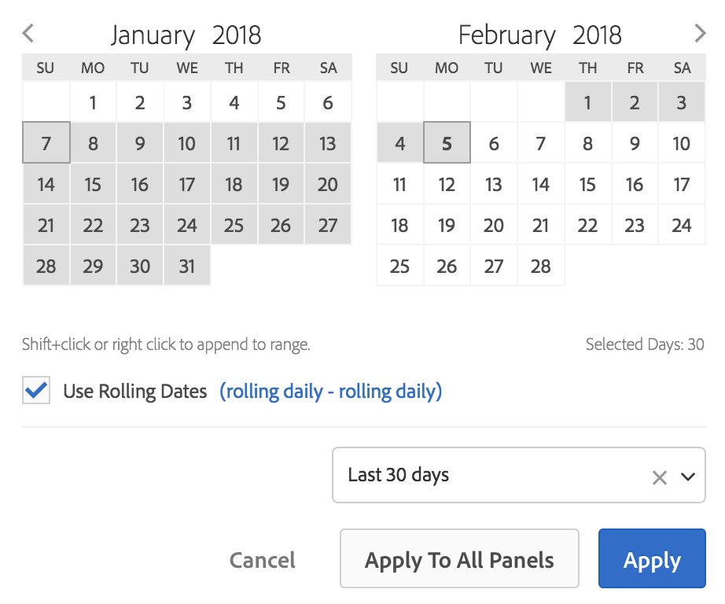

# Calendar and date ranges overview

In the calendar, you can specify dates and date ranges, or select a preset.

Calendar selections apply at the panel level, but you have the option to apply them to all panels. When you click a date range in Workspace, the interface displays the current calendar month and the previous calendar month. You can adjust these two calendars by clicking the right and left arrows in each respective upper corner.

The first click on a calendar starts a date range selection. The second click completes a date range selection, which becomes highlighted. If the `Shift` key is held down (or right-click is used), it appends to the currently selected range.

You can also drag dates (and time dimensions) into a Workspace project. You can select specific days, weeks, months, years, or a rolling date.

[Using Date Ranges and Calendar in Analysis Workspace](https://experienceleague.adobe.com/docs/analytics-learn/tutorials/analysis-workspace/calendar-and-date-ranges/using-dates-in-analysis-workspace.html) (4:07)

| Setting | Description |
|--- |--- |
|Selected Days|Selected days/weeks/months/years.|
|Use Rolling Dates|Rolling dates allow you to generate a dynamic report that looks forward or backward for a set period of time based on when you ran the report. For example, if you want to report on all Orders placed "Last Month" (based on the Created Date field) and ran that report in December, you'd see orders placed in November. If you ran that same report in January, you'd see orders placed in December.<ul><li>**[!UICONTROL Date Preview]**: Indicates what time period the rolling calendar encompasses.</li><li>**[!UICONTROL Start]**: You can choose among current day, current week, current month, current quarter, current year.</li><li>**[!UICONTROL End]**: You can choose among current day, current week, current month, current quarter, current year.</li></ul>For an example, go [here](/help/analyze/analysis-workspace/components/calendar-date-ranges/custom-date-ranges.md).|
|Date Range|Lets you pick a preset date range. Last 30 days is the default. **[!UICONTROL This week/month/quarter/year (excluding today)]** lets you choose from date ranges that do not include partial-day data from today.|
|Apply to All Panels|Lets you not only change the selected date range for the current panel, but also for all other panels within the project.|
|Apply|Applies the date range to this panel only.|
