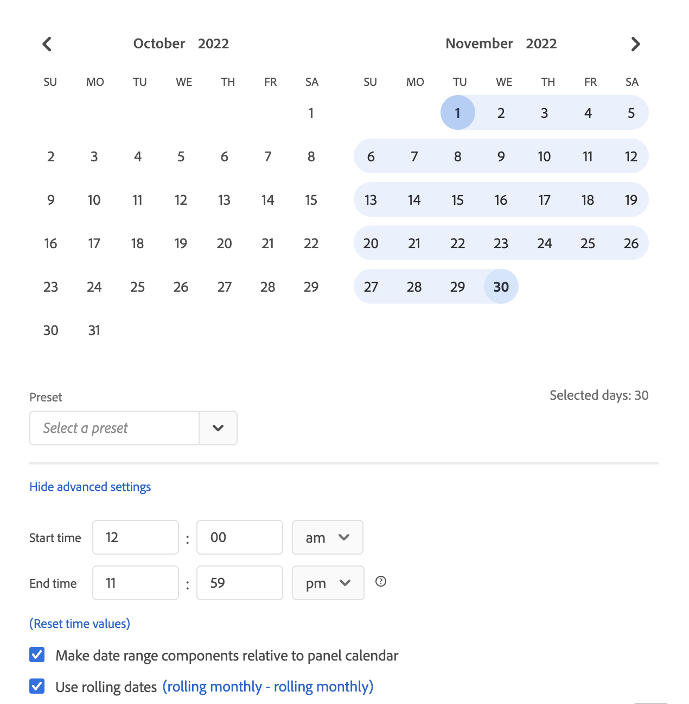
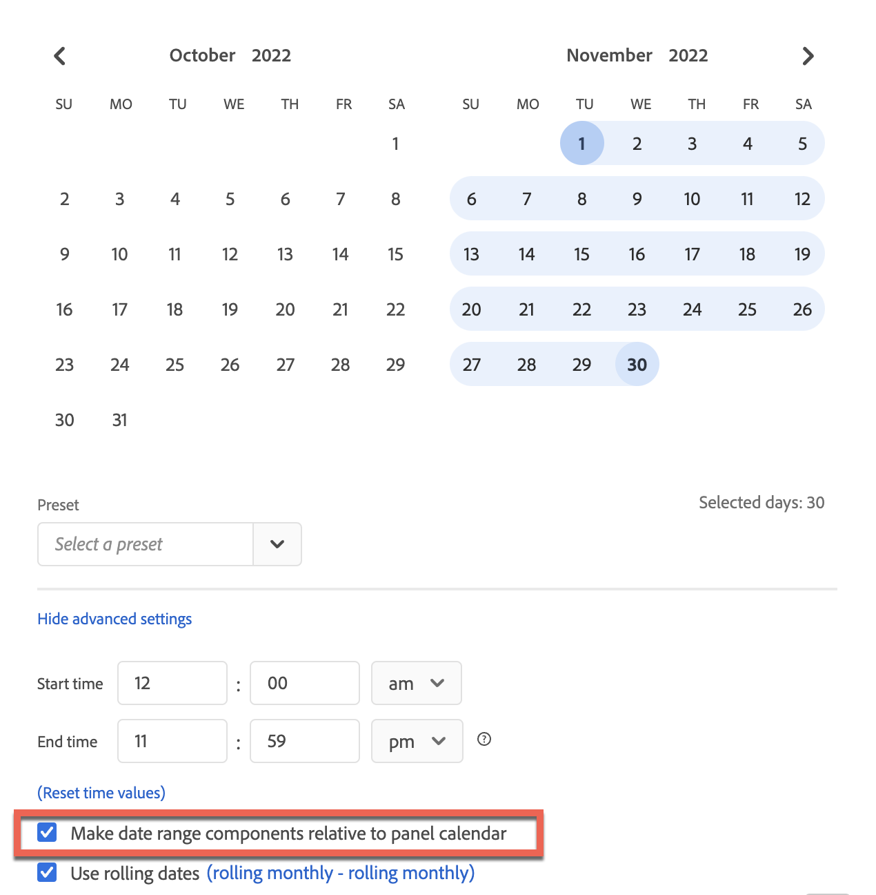
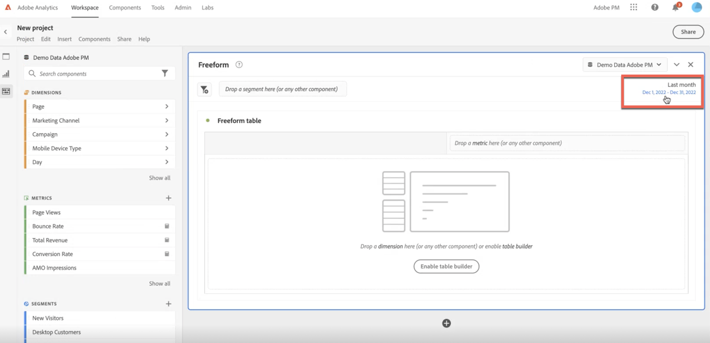

# Calendar and date ranges overview

In the calendar, you can specify dates and date ranges, or select a preset.

Here is a video on using date ranges and calendars in Analysis Workspace:

>[!VIDEO](https://video.tv.adobe.com/v/23973/?quality=12)

Calendar selections apply at the panel level, but you have the option to apply them to all panels. When you click a date range in Workspace, the interface displays the current calendar month and the previous calendar month. You can adjust these two calendars by clicking the right and left arrows in each respective upper corner.

## Select and apply date ranges {#select-apply}

The first click on a calendar starts a date range selection. The second click completes a date range selection, which becomes highlighted. If the `Shift` key is held down (or right-click is used), it appends to the currently selected range.

You can also drag dates (and time dimensions) into a Workspace project. You can select specific days, weeks, months, years, or a rolling date.

[Using Date Ranges and Calendar in Analysis Workspace](https://experienceleague.adobe.com/docs/analytics-learn/tutorials/analysis-workspace/calendar-and-date-ranges/using-dates-in-analysis-workspace.html) (4:07)

| Setting | Description |
|--- |--- |
|Selected Days|Selected days/weeks/months/years.|
|Make date range components relative to panel calendar|Keep dates based on the panel date range consistent.|
|Use Rolling Dates|Rolling dates allow you to generate a dynamic report that looks forward or backward for a set period of time based on when you ran the report. For example, if you want to report on all Orders placed "Last Month" (based on the Created Date field) and ran that report in December, you'd see orders placed in November. If you ran that same report in January, you'd see orders placed in December.<ul><li>**[!UICONTROL Date Preview]**: Indicates what time period the rolling calendar encompasses.</li><li>**[!UICONTROL Start]**: You can choose among current day, current week, current month, current quarter, current year.</li><li>**[!UICONTROL End]**: You can choose among current day, current week, current month, current quarter, current year.</li></ul>To view an example, see [Custom date ranges](/help/analyze/analysis-workspace/components/calendar-date-ranges/custom-date-ranges.md).  Selected by default.|
|Date Range|Lets you pick a preset date range. Last 30 days is the default. **[!UICONTROL This week/month/quarter/year (excluding today)]** lets you choose from date ranges that do not include partial-day data from today.|
|Apply to All Panels|Lets you not only change the selected date range for the current panel, but also for all other panels within the project.|
|Apply|Applies the date range to this panel only.|

## About relative panel date ranges {#relative-panel-dates}

If you're working in Workspace, you can make the date range components relative to the panel calendar. 
Three common use cases where you'll see relative panel dates take effect are combo charts, key metrics summary, and Freeform table date ranges.

To use relative panel date ranges

1.  Select the **Workspace** tab.
1.  Select **Blank project**.
1.  Add dimensions, metrics, and segments from the left rail. 
1.  Click the panel date range field to toggle the relative panel date range setting.
1.  Select **Make date range components relative to panel calendar**.
    *   Select the option to make the date range components relative to the panel calendar.
        If relative dates are selected, then rolling dates will be based on the start date of the panel calendar and not today's date.
    *   If this option isn't selected, then rolling dates will be based on today's date.

    

1.  Click **Apply**.
    The relative dates are shown in the upper-right.

    

## Guidelines for relative panel date ranges {#guidelines}

Keep in mind the following guidelines when using relative panel date ranges.

### Formulas and relative date ranges {#formula-relative-dates}

If you have relative dates selected, all date formulas will use the panel’s start date as the starting point.

### Custom calendars and relative date ranges {#custom-calendar-formulas}

When you use a week-based custom calendar and you add months or years, the formula calculates the offset of the day in the given period. The actual date may be different because of the offset. The formula chooses the day landing in the same place in the custom calendar. For example, the third Friday of the third week in a custom calendar.

### About segments that use rolling dates and relative panel date ranges {#segments-relative-dates}

If you build a segment or use a segment with a rolling date, for example, the Last 7 Days or the Last 2 Weeks, and you click on the segment preview, it will start the rolling date from *Today* instead of the panel start date. As a result the preview for the segment will not match when you actually use the segment in the table. The preview is impacted, not the segment itself. 
