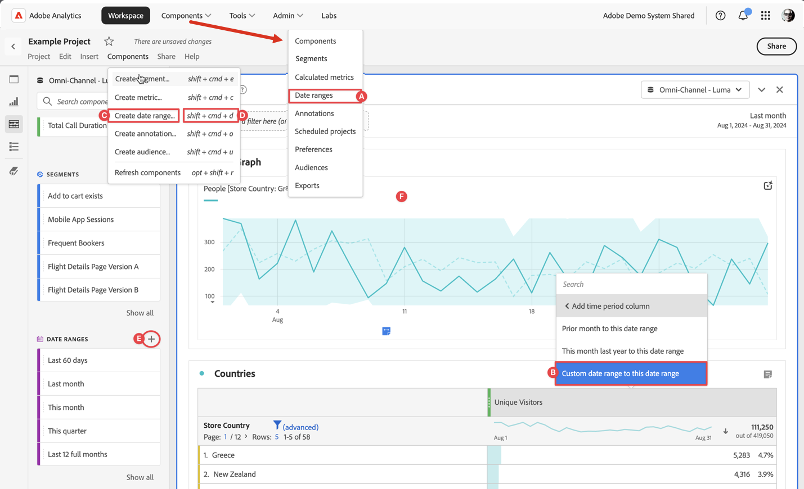
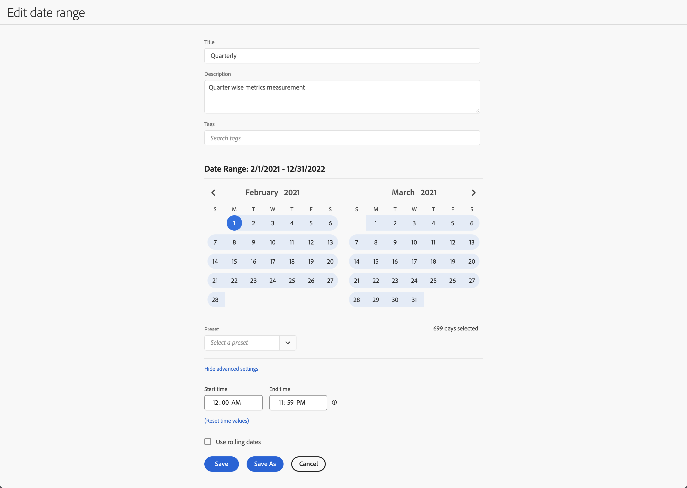

# Create date ranges

Anyone can create a custom date range. You create a date range in the following ways:



* **A** - In the main interface, select **[!UICONTROL Components]** and select **[!UICONTROL Date range]**. Select  **[!UICONTROL Add]** from the [[!UICONTROL Date range] manager](/help/components/date-ranges/manage.md). 
* **B** - In a Workspace project, from the context menu in a visualization, select **[!UICONTROL Custom date range to this date range]**.
* **C** - In a Workspace project, select **[!UICONTROL Components]** from the menu, and select **[!UICONTROL Create date range]**
* **D** - In a Workspace project, use the shortcut **[!UICONTROL ctrl+shift+d]** (Windows) or **[!UICONTROL shift+command+d]** (macOS). 
* **E** - In a Workspace project, from the Components left panel, select  at  **Date ranges**.
* **F** - In a supported visualization, like a line visualization, from the context menu on a data point, select **[!UICONTROL Annotate Selection]**.

To define the annotation, you use the [[!UICONTROL Date range builder]](#annotation-builder):

<!-- Should we really mention API here. If so, we can do it all over the place in the docs...
| **Use the [Customer Journey Analytics Annotations API](https://developer.adobe.com/cja-apis/docs/endpoints/annotations/)** | The Customer Journey Analytics Annotations APIs allow you to create, update, or retrieve annotations programmatically through Adobe Developer. These APIs use the same data and methods that Adobe uses inside the product UI. |
-->


## Date range builder {#date-range-builder}

<!-- markdownlint-disable MD034 -->

>[!CONTEXTUALHELP]
>id="components_dateranges_endtime"
>title="End time"
>abstract="End times always include 59 seconds."

<!-- markdownlint-enable MD034 -->


The **[!UICONTROL New date range]** or **[!UICONTROL Edit date range]** dialog is used to create new or edit existing date ranges.




1. Specify a **[!UICONTROL Title]** for the date range. For example, **[!UICONTROL Quarterly]**.
1. Optionally, specify a **[!UICONTROL Description]**.
1. Organize the segment by creating or applying one or more **[!UICONTROL Tags]**. Start typing to find existing tags you can select. Or press **[!UICONTROL ENTER]** to add a new tag. Select  to remove a tag. |
1. Select a **[!UICONTROL Date Range]** by selecting first the start date and then the end date. 
   Alternatively, you can select a **[!UICONTROL Preset]** from the [!UICONTROL *Select a preset*] drop-down menu.

1. Optionally, select **[!UICONTROL Show advanced settings]** to:

   * Specify **[!UICONTROL Start time]** and **[!UICONTROL End time]** other than the default `12:00 AM` (`0:00`) and `11:59 PM` (`23:59`). End times always include 59 seconds. For a date range that spans many days, the start time applies to the first day of the date range and the end time applies to the last day in your date range. Use **[!UICONTROL (Reset time values)]** to reset start and end time to their defaults.
   * **[!UICONTROL Use rolling dates]**. If enabled, preset date ranges like **[!UICONTROL Last 7 full days]** dynamically update as the current date and time progress. If disabled, such presets are not updated once applied.

     You can select the text in brackets (for example **[!UICONTROL fixed start - rolling quarterly]**) to extend the panel and specify details for **[!UICONTROL Start]** and **[!UICONTROL End]**.

     

     1. Select **[!UICONTROL Start of]**, **[!UICONTROL End of]**, or **[!UICONTROL Fixed day]**.
     1. When you have selected **[!UICONTROL Start of]** or **[!UICONTROL End of]**, you can build a full expression. For example: **[!UICONTROL End of]** **[!UICONTROL current quarter]** **[!UICONTROL minus]** `20` **[!UICONTROL days]**. Pick the appropriate value for each individual part of the expression.
        * Select a value for current. For example, **[!UICONTROL current quarter]**.
        * Select a value for additional calculation. For example, **[!UICONTROL minus]**.
        * When you have specified an additional calculation, specify a value. For example, `20`.
        * When you have specified an additional calculation, select the time period to use for the calculation. For example, **[!UICONTROL days]**.
       
     Select **[!UICONTROL Hide details]** to hide the details for rolling dates calculation.

1. Select :
   * **[!UICONTROL Save]** to save the date range.
   * **[!UICONTROL Save As]** to save a copy of the date range. 
   * **[!UICONTROL Cancel]** to cancel any changes you made to the date range or cancel the creation of a new date range.


<!--


You can create a date range using either of the following two methods:

* Directly in a workspace project by clicking the '`+`' button next to the list of date range components on the left
* Within the date range manager

To create a date range in the date range manager:

1. Log in to [analytics.adobe.com](https://analytics.adobe.com) using your AdobeID credentials.
1. Navigate to [!UICONTROL Components] > [!UICONTROL Date Ranges].
1. Click the [!UICONTROL Add] button to open the modal window that creates a date range.

## Create a date range modal window

The modal window has four fields you can edit:

* **Date range**: The date range you want for this component.
* **Title**: The name you want for this component. The title is used in workspace projects.
* **Description**: The description you want for this component. The description is seen when clicking the  icon.
* **Tags**: Use tags to organize your date ranges. A date range can belong to multiple tags.

## Selecting a date range

When clicking the date range in the modal window, you have several options:

* **Calendar**: Select the start and end date.
* **Use rolling dates**: Check this box if you want the date range to change as time goes on. Do not check this box if you want your date range to remain static.
* **Select preset**: Use this drop-down selection if you want a custom date range based on a range that Adobe offers by default. When you select a preset, you can further customize the date range to suit your needs. It does not affect the preset that Adobe offers.

## Rolling date ranges

If you want a rolling date range, you can customize when it rolls. You can control when the start and end dates roll independently of each other.

* **When the date starts**: Choose if the date starts at the beginning of a time period, at the end of a time period, or use a fixed day.
* **The time period to use**: Choose how often the date range rolls. You can have it roll every day, every week, every month, every quarter, or every year.
* **Offset**: Choose the offset of the date range. You can add or subtract days, weeks, months, quarters, or years.

## Rolling date examples

Some date ranges can be useful in certain reports.

Year-to-date:

```text
Start: Start of current year
End: End of current day
```

Last Thursday to this Thursday:

```text
Start: Start of current week minus 3 days
End: Start of current week plus 4 days
```

Fiscal year (for example, if a fiscal year starts in December)

```text
Start: Start of current year minus 1 month
End: End of current year minus 1 month
```


-->
