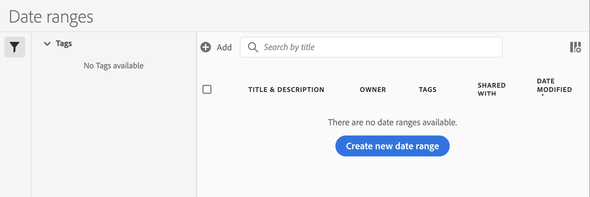

# Create custom date ranges

You can create custom date ranges in Analysis Workspace and save them as Time components. 

For information about adding existing date ranges to a project, see [Calendar and date ranges overview](/help/analyze/analysis-workspace/components/calendar-date-ranges/calendar.md).

To create a custom date range:

 1. In Adobe Analytics, select **[!UICONTROL Components]** > **[!UICONTROL Date ranges]**.

    
 
 1. Select [!UICONTROL **Create new date range**].

 1. In the Date range builder, specify the following information:
    
    |Option | Description | 
    |---------|----------|
    | [!UICONTROL **Title**] | The title of the date range as it will appear when users select it in Analysis Workspace. |
    | [!UICONTROL **Description**] | A description for the date range. | 
    | [!UICONTROL **Tags**] | Any tags you want to apply to the date range. | 
    | [!UICONTROL **Date Range**] | Lets you pick a custom date range. By default, the last 30 days are selected. | 
    | [!UICONTROL **Preset**] | Choose from a list of preset date ranges, such as [!UICONTROL **Yesterday**], [!UICONTROL **Last 7 days**], [!UICONTROL **Last 30 days**], and so forth. | 
    | [!UICONTROL **Start time**] | The time of day that the date range begins. | 
    | [!UICONTROL **End time**] | The time of day that the date range ends. | 
    | [!UICONTROL **Use rolling dates**] | Rolling dates allow you to generate a dynamic report that looks forward or backward for a set period of time based on when you ran the report. For example, if you want to report on all Orders placed "Last Month" (based on the Created Date field) and ran that report in December, you'd see orders placed in November. If you ran that same report in January, you'd see orders placed in December.<ul><li>**[!UICONTROL Date Preview]**: Indicates what time period the rolling calendar encompasses.</li><li>**[!UICONTROL Start]**: You can choose among current day, current week, current month, current quarter, current year.</li><li>**[!UICONTROL End]**: You can choose among current day, current week, current month, current quarter, current year.</li></ul> Selected by default. | 

 1. Select [!UICONTROL **Save**]. 

## Example: Date range for "two months ago" {#section_C4109C57CB444BB2A79CC8082BD67294}

The following custom date range shows a date range for "two months ago," with a Summary Change visualization showing directional change.

The custom date range is displayed at the top of the [!UICONTROL Date Range] component panel in your project:

You can drag this custom date range into a column alongside a custom, monthly rolling date range using the Last Month preset for a comparison. Add a Summary Change visualization and select the totals from each column to show directional change:

## Example: Use a 7-day rolling date range {#section_7EF63B2E9FF54D2E9144C4F76956A8DD}

You can create a date range that specifies a 7-day rolling window that ends one week ago:

Use *`rolling daily`*.

* The Start settings would be *`current day minus 6 days`*.

* The End settings would be *`current day minus 7 days`*.

This date range can be a component that you drag onto any freeform table.
