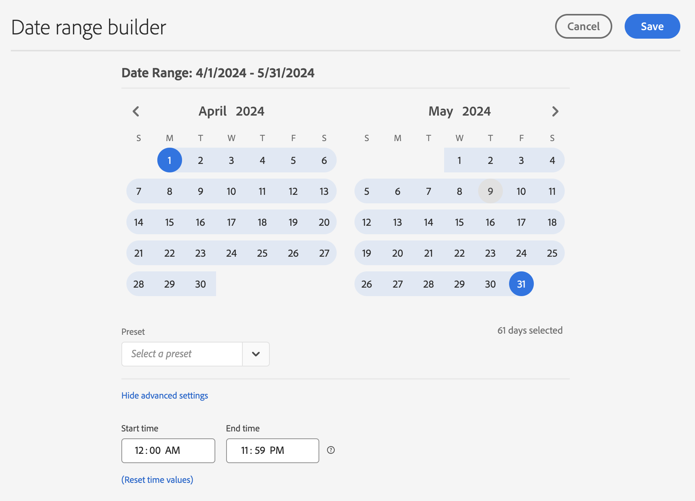
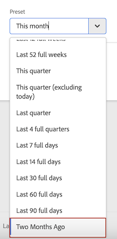
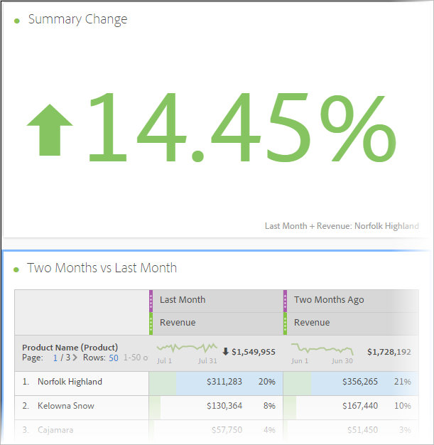
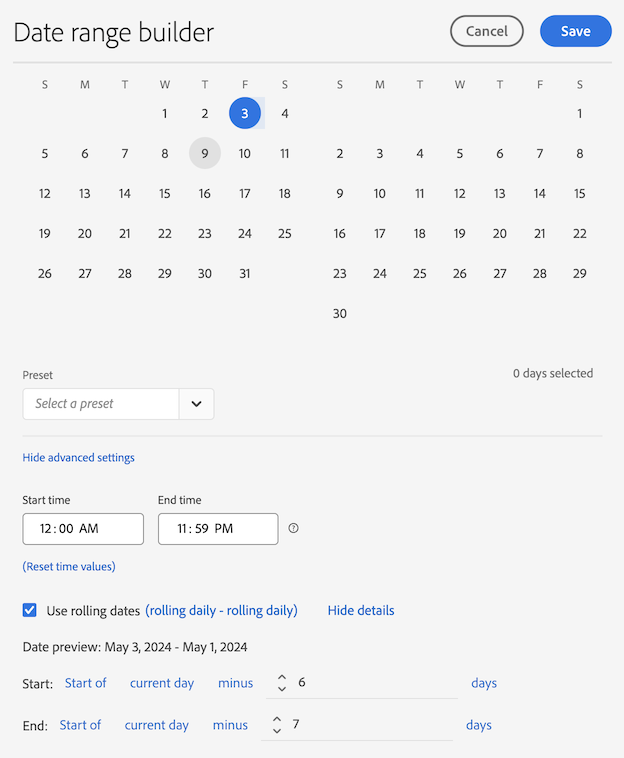

# Create custom date ranges

Create custom date ranges in Analysis Workspace, and save them as Time components.

 **[!UICONTROL Components]** > **[!UICONTROL New Date Range]**

A date range applies at the panel level. To add a date range to your project, click **Panels** > *`<select panel>`*, and specify a new date range.

## Date range for "two months ago" {#section_C4109C57CB444BB2A79CC8082BD67294}

The following custom date range shows a date range for "two months ago," with a Summary Change visualization showing directional change.

The custom date range is displayed at the top of the [!UICONTROL Date Range] component panel in your project:

You can drag this custom date range into a column alongside a custom, monthly rolling date range using the Last Month preset for a comparison. Add a Summary Change visualization and select the totals from each column to show directional change:

## Use a 7-day rolling date range {#section_7EF63B2E9FF54D2E9144C4F76956A8DD}

A date range applies to the panel level. To add a date range to your project, click **Actions** > **Add Panel**, and specify a new date range.

In the Date Range Builder, you can create a custom date range that displays in the Components panel with other date ranges.

For example, you can create a date range that specifies a 7-day rolling window that ends one week ago:

Use *`rolling daily`*.

* The Start settings would be *`current day minus 14 days`*.

* The End settings would be *`current day minus 7 days`*.

This date range can be a component that you drag onto any freeform table.
