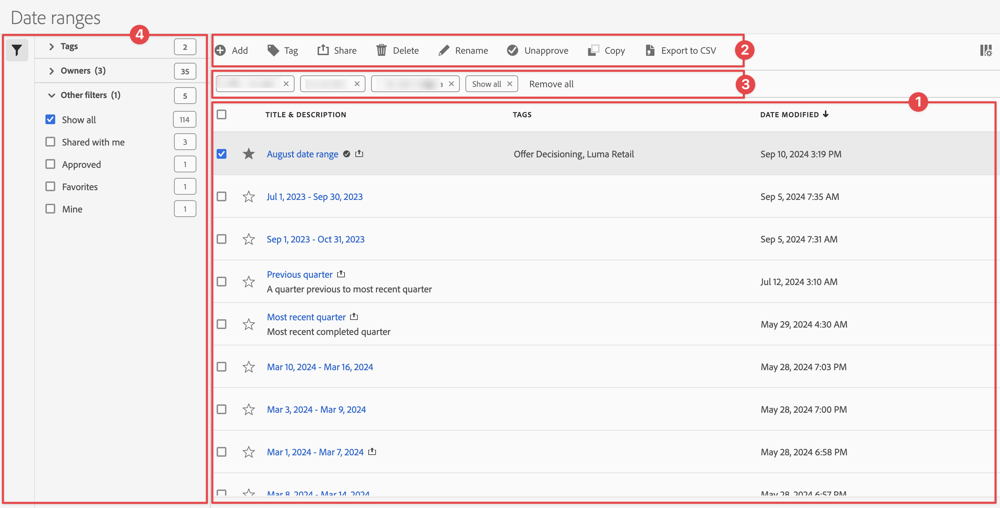

# Manage date ranges

You can share, filter, tag, approve, copy, share, and delete date ranges and mark date ranges as favorite from a central [!UICONTROL Date ranges] management interface. To manage date ranges:

* Select **[!UICONTROL Components]** in the main interface, then select **[!UICONTROL Date ranges]**.

## Date ranges manager

The Date ranges manager has the following interface elements:

### Date ranges list

The date ranges list ➊ displays all the date ranges. The list has the following columns:

| Column | Description |
| --- | --- | 
|   | Select to favor  or un-favor  a date range. |
| **[!UICONTROL Title and description]** | To edit the title and description, select the title link, which opens the [Date range builder](create.md#date-range-builder). |
| **[!UICONTROL Owner]** | The owner of the date range. |
| **[!UICONTROL Tags]** | The tags for this date range. |
| **[!UICONTROL Shared with]** | The individuals or groups that you shared the date range with. Select to open the **[!UICONTROL Share Date range]** dialog. |
| **[!UICONTROL Date modified]** | Displays the date and time that the date range was last modified. |

{style="table-layout:auto"}

Use  to specify which columns you want to display.

### Action bar

You can action on date ranges using the action bar ➋. The action bar contains the following actions:

| Icon | Action | Description |
|:---:|---|---|
| | **[!UICONTROL Add]** | Add another date range, using the [Date range builder](create.md#date-range-builder). |
| | [!UICONTROL *Search by title*] | When no date range is selected in the list, search for date ranges using this search field. |
| | **[!UICONTROL Tag]** | Tag the selected date ranges. In the **[!UICONTROL Tag Date range]** dialog, select or de-select the tags for the selected date ranges. Select **[!UICONTROL Save]** to save the tags for the selected date ranges. |
| | **[!UICONTROL Share]** | Share the selected date ranges. In the **[!UICONTROL Share Date range]** dialog, you can  *Search individuals or groups* or you can select **[!UICONTROL Organization]** or **[!UICONTROL Groups]**. Select **[!UICONTROL Save]** to save share details for the selected date ranges. |
|  |**[!UICONTROL Delete]** | Delete the selected date ranges. You are prompted for a confirmation. |
| | **[!UICONTROL Rename]** | Rename a single selected date range. When selected, you can rename the date range inline. |
| | **[!UICONTROL Approve]** | Approve the selected date ranges. | 
| |  **[!UICONTROL Copy]** | Copy the selected date ranges. New date ranges are created with the same name and suffix (Copy) | 
| | **[!UICONTROL Export to CSV]** | Export the selected date ranges to a `Date ranges List.csv` file. |

### Active filter bar

The filter bar ➌ shows the active filters (if any). You can quickly remove a filter using . If more than one filter is specified, use **[!UICONTROL Remove all]** to remove all filters.

### Filter panel

You can filter date ranges using the **[!UICONTROL Filter]** left panel ➍. The filter panel displays the type of filter and the number of date ranges that honor the filter. Select  to toggle the display of the filter panel. 

To filter the list of filters:

1. Select  to open the Filters panel. If you need more space for the Filters list, you can select  once more to close the panel.
1. You can filter the date ranges using any of the available [filter sections](#filter-sections). 

   >[!INFO]
   >
   >*Items* refer to the date range items displayed in the [Date ranges list](#date-ranges-list).
   > 

#### Filter sections

{{tagfiltersection}}
{{ownerfiltersection}}
{{otherfiltersfiltersection}}

The [Date ranges list](#date-ranges-list) is automatically updated based on your filter configuration. You can see the configured filters in the [Active filter bar](#active-filter-bar).

## Edit date ranges

You edit a date range in two ways:

* In a Workspace project, use the [Component info](/help/analyze/analysis-workspace/components/use-components-in-workspace.md#component-info) icon.

* In the [[!UICONTROL Date ranges] list](#date-ranges-list), select the title of the date range.

You use the [Date range builder](create.md#date-range-builder) to edit the date range.

Use the date range manager to share, rename, or delete date ranges. To reach the date manager:

1. Log in to [analytics.adobe.com](https://analytics.adobe.com) using your AdobeID credentials.
1. Navigate to [!UICONTROL Components] > [!UICONTROL Date Ranges].

<!--

## Interface

The date range manager includes the following options:

* **Add**: Create a new date range. See [create a date range](create.md) for more information.
* **Search by title**: Search for a date range by title. Results are filtered based on text entered here.
* **Filter**: Filter date ranges using the left column. You can filter by custom tag, owner, created by you, your favorites, approved, or shared with you. You can also search for desired filters.
* **Favorite**: Click the  icon next to a date range to add it to your favorites.
* **Customize columns**: Click the  icon to show or hide columns in the date range manager.

Click the checkbox next to one or more date ranges for more options.

* **Tag**: Apply a tag to all selected date ranges. Tags help you organize date ranges, and let you filter them using the left column.
* **Share**: Share a date range to other Experience Cloud users. If you are a product administrator, you can also share to the entire organization or groups. Date ranges that are shared to other users in your organization include a  icon next to the title.
* **Delete**: Permanently delete the selected date range(s).
* **Rename**: If a single date range is selected, you can change its title.
* **Approve**: If you are a product admin, you can add a stamp of approval to a date range. Approved date ranges inform users in your organization that they are 'official', differentiating them from date ranges created by other users in your organization. Approved date ranges include a  icon next to the title.
* **Unapprove**: If you are a product admin and select a date range that is already approved, you can unapprove it.
* **Copy**: Create a copy of the selected date range(s). Copying date ranges appends `(Copy)` to the end of the title of the newly copied date range(s).
* **Export to CSV**: Exports all selected date ranges into a CSV file. Columns in the resulting CSV file include all visible columns in the date range manager.
-->