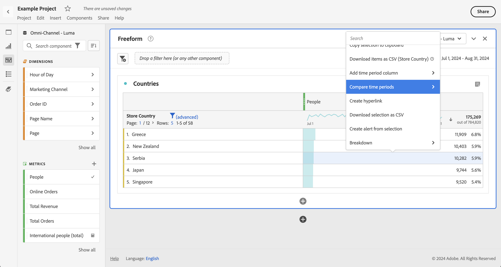
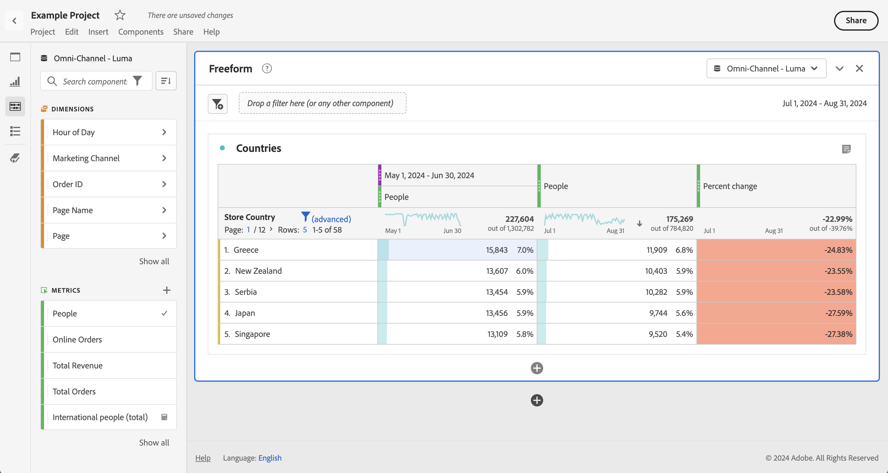
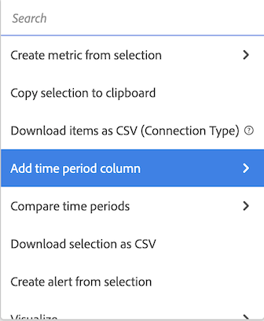
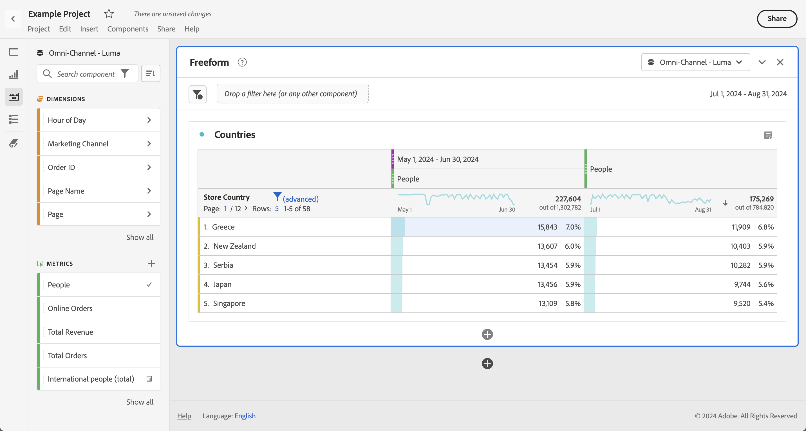
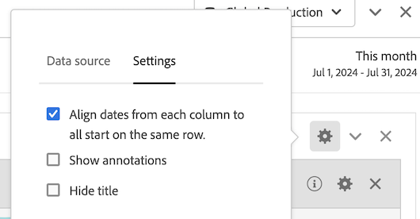

# Date comparison

Date Comparison in Analysis Workspace lets you take any column containing a date range and create a common date comparison, such as: year-over-year, quarter-over-quarter, month-over-month, etc.

## Compare time periods {#section_C4E36BFE0F5C4378A74E705747C9DEE4}

>[!NOTE]
>[!UICONTROL Compare Time Periods] leverages advanced Calculated Metrics. As a result, it is available only to customers with Analytics Select, Prime, and Ultimate SKUs. 

Analysis requires context, and often that context is provided by a previous time period. For example, the question "How much better/worse are we doing than at this time last year?" is fundamental to understanding your business. Date Comparison automatically include a "difference" column, which shows the percentage change compared to a specified time period.

1. Create a Freeform table, with any dimensions and metrics you want to compare over a time period.
1. Right-click a table row and select **[!UICONTROL Compare Time Periods]**.

   

   >[!IMPORTANT]
   >
   >This right-click option is disabled for metric rows, date range rows, and time dimension rows.

1. Depending on how you have set the table's date range, you have these options for comparison: 

   |  Option  | Description  |
   |---|---|
   | **[!UICONTROL Prior week/month/quarter/year to this date range]** | Compares to the week/month/etc. immediately before this date range.  |
   | **[!UICONTROL This week/month/quarter/year last year]** | Compares to the same date range a year ago.  |
   | **[!UICONTROL Select range]** | Lets you select a custom date range.  |

   >[!NOTE]
   >
   >When you select a custom number of days, for example October 7 - October 20 (a 14-day range), you will get only 2 options: **[!UICONTROL Prior 14 days before this date range]**, and **[!UICONTROL Select range]**.

1. The resulting comparison looks like this:

   

   Rows in the Percent Change column appear red for negative values and green for positive values.

1. (Optional) As in any other Workspace projects, you can create visualizations based on these time comparisons. For example, here is a Bar graph:

   

   Note that in order to show the percentage change in the bar chart, you have to have the [!UICONTROL Percentages] setting checked in the [!UICONTROL Visualization Settings].

## Add a time period column for comparison {#section_93CC2B4F48504125BEC104046A32EB93}

You can now add a time period to each column in a table, enabling you to add a time period that is different from the one your calendar is set to. This is another way you can compare dates.

1. Right-click a column in the table and select **[!UICONTROL Add Time Period Column]** 

1. Depending on how you have set the table's date range, you have these options for comparison: 

   |  Option  | Description  |
   |---|---|
   | **[!UICONTROL Prior week/month/quarter/year to this date range]** | Adds a column with the week/month/etc. immediately before this date range.  |
   | **[!UICONTROL This week/month/quarter/year last year]** | Adds the same date range a year ago.  |
   | **[!UICONTROL Select range]** | Lets you select a custom date range.  |

   >[!NOTE]
   >
   >When you select a custom number of days, for example October 7 - October 20 (a 14-day range), you will get only 2 options: **[!UICONTROL Prior 14 days before this date range]**, and **[!UICONTROL Select range]**.

1. The time period will be inserted on top of the column you selected:

   

1. You can add as many time columns as you want, as well as mix and match different date ranges:

   

1. In addition, you can sort on each column, which will change the order of days depending on the column you are sorting on.

## Align column dates to start on same row {#section_5085E200082048CB899C3F355062A733}

A new setting for all tables lets you **[!UICONTROL Align Dates from each column to all start on the same row (applies to entire table)]**. "Applies to entire table" means that if you do, for example, a breakdown in the table, and if you change this setting for the breakdown, it will change the setting for the entire table.

>[!IMPORTANT]
>
>This setting is **disabled** (unchecked) for all existing projects and **enabled** (checked) for all new projects.

Example: When you choose to align the dates, if you do a month-over-month comparison between October and September 2016, the left column will start with October 1 and the right column will start with September 1:

<!-- 

See Jonny Moon's email from November 3. 

 -->
