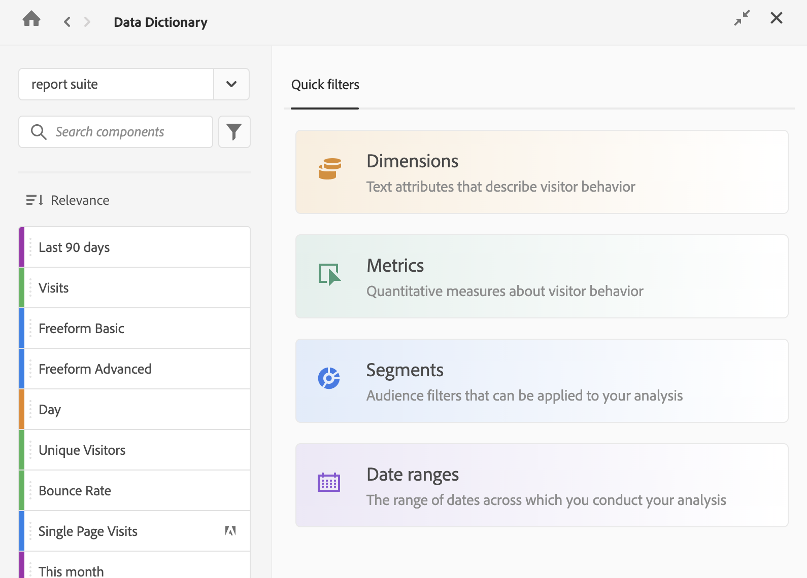

## Add component descriptions

Analytics administrators can add descriptions for dimensions and other components either within the Report Suite or directly within Analysis Workspace.

### Add descriptions to components in a Report Suite

The following video describes how to add dimension and metric descriptions in a Report Suite:

>[!VIDEO](https://video.tv.adobe.com/v/25453/?quality=12)

### Add descriptions to components in Analysis Workspace {#add-descriptions}

The Data Dictionary in Analysis Workspace helps both users and administrators keep track of and better understand the components in their Analytics environment. 

Part of this is the ability for Analytics administrators to add descriptions for components directly within Analysis Workspace. 

For more information about the Data Dictionary, see [Data Dictionary overview](/help/analyze/analysis-workspace/data-dictionary/data-dictionary-overview.md).

To add descriptions for components using the Data Dictionary:

1. Go to the Analysis Workspace project that contains the component for which you want to add a description.

1. Select the Data Dictionary icon on the left side of Analysis Workspace.

   The Data Dictionary window displays.

   

1. Ensure the correct Report Suite is selected in the drop-down menu. 

1. In the search field, search for the component that you want to add the description to, then select it when it appears. 

1. Select the **Edit** icon, update the [!UICONTROL **Description**] field, then select [!UICONTROL **Save**]. <!-- Check this step -->