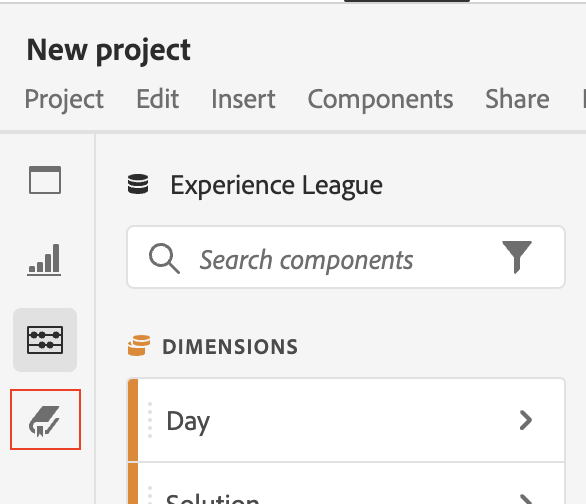
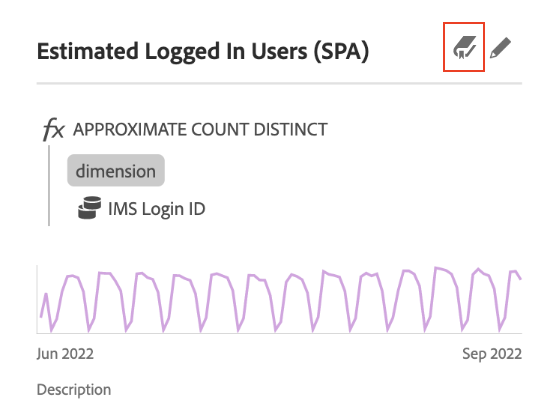

# Data Dictionary overview

The Data Dictionary in Analysis Workspace helps both users and administrators keep track of and better understand the components in their Analytics environment.   

System administrators are responsible for curating this information about each component in the Data Dictionary and making it available to users.

## Benefits and uses of the Data Dictionary

* [Benefits for users](#benefits-for-users)

* [Benefits for administrators](#benefits-for-administrators)

### Benefits for users

 The Data Dictionary helps users gain a better understanding of each component that is available to them. 

Some benefits for users of the Data Dictionary include: 

* The component's function and intended use

* Related components that the component is typically used with

* Components that are similar to the one you are viewing

* Whether the component is approved by the system administrator 

### Benefits for administrators

The Data Dictionary helps system administrators keep track of and curate the components in their Analytics environment. 

Some benefits for administrators of the Data Dictionary include: 

* Identifies duplicate components that need to be consolidated.

* Identifies components that aren't collecting any data so they can be either updated or deleted.

* Shows components that are not yet approved.

* Allows you to update component descriptions directly in Analysis Workspace, and any updates you make are reflected in the Report Suite.

  Similarly, any updates you make to component descriptions in the Report Suite are reflected in Analysis Workspace.

  For more information about adding component descriptions in either Analysis Workspace or in a Report Suite, see [Add component descriptions](/help/analyze/analysis-workspace/components/add-component-descriptions.md).

## Access the Data Dictionary

You can access the Data Dictionary in any of the following ways from Analysis Workspace:

* From the **Data Dictionary** icon in the left rail.

  

* From the **Data Dictionary** icon within the info popover of a component. 

  
<!--update screenshot; this was taken from a mock-->

* From the menu: [!UICONTROL **Help**] > [!UICONTROL **Data Dictionary**].

  <!--add screenshot-->

## Move, minimize, or close the Data Dictionary

When you open the Data Dictionary (as described in [Access the Data Dictionary](#access-the-data-dictionary)), it displays as a window on top of Analysis Workspace. 

You can manipulate the Data Dictionary window in any of the following ways:

* Drag it to any area within Analysis Workspace 

  If you close and re-open Analysis Workspace, the Data Dictionary window remains in the location where you last moved it. <!--True?-->

* Minimize it

  When minimized, the Data Dictionary appears as a blue tab in the lower-right corner of Analysis Workspace.

  When you select the blue tab, the Data Dictionary opens to the component you were viewing when you minimized it. 

* Close it
