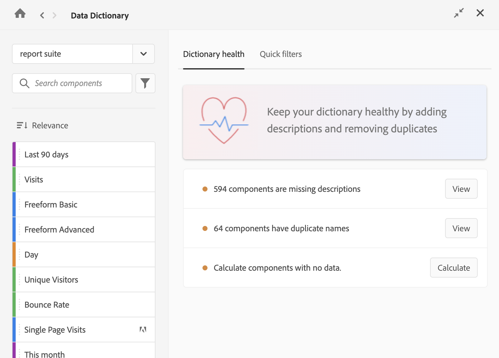

# Edit component entries in the Data Dictionary

Analytics administrators can edit component entries in the Data Dictionary for a given Report Suite. Any changes made are visible to all users of the Report Suite.

To edit a component in the Data Dictionary:

1. Go to the Analysis Workspace project that contains the component that you want to edit.

1. Select the **Data Dictionary** icon in the left rail of Analysis Workspace. (Alternate ways of accessing the Data Dictionary are described in "Access the Data Dictionary" in [Data Dictionary overview](/help/analyze/analysis-workspace/components/data-dictionary/data-dictionary-overview.md).)

   The Data Dictionary window displays.

   

1. Ensure that the correct Report Suite is selected in the drop-down menu. By default, the report suite that you are already in is displayed. 

1. (Optional) In the search field, begin typing the name of the component you want to edit.

    The type of component can be identified by both color and icon. **Dimensions**  are orange, **Segments**  are blue, **Date ranges**  are purple, and **Metrics**  are green. The Adobe icon  indicates either a calculated metric template or a segment template, and the calculator icon  indicated a calculated metric that was created by an Analytics administrator in your organization. 

{{dd-filter-criteria}}

1. (Optional) Select the **Sort** icon , then select any of the following filter options to sort the list of components:

   {{components-sort-options}}

1. From the list of components, select the component you want to edit.

1. Select the **Edit** icon  next to the component name. 

1. Edit any of the following information about the component:

   {{dd-component-information}}

1. Click the **Save** icon  to save your changes.
