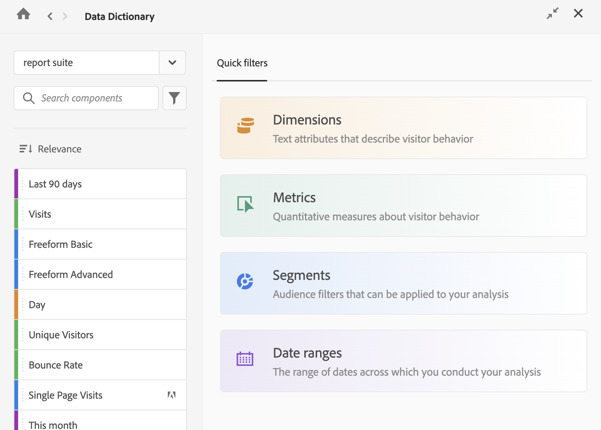

# View component information in the Data Dictionary

The Data Dictionary allows you to view information about a component, including the component description, similar components, other components a component is frequently used with, and more.

To view information about a component in the Data Dictionary:

1. Go to the Analysis Workspace project that contains the component that you want to view.

1. Select the [!UICONTROL **Data Dictionary**] icon in the left rail of Analysis Workspace. (Alternate ways of accessing the Data Dictionary are described in "Access the Data Dictionary" in [Data Dictionary overview](/help/analyze/analysis-workspace/components/data-dictionary/data-dictionary-overview.md).)

   The Data Dictionary window displays.

   

   <!--double-check this screenshot. I mocked the admin view up a bit to get rid of the Dictionary health tab.-->

1. Ensure that the Report Suite that contains the component you want to view is selected in the drop-down menu. By default, the report suite that you are already in is displayed.

1. (Optional) In the search field, begin typing the name of the component you want to view.

   The type of component can be identified by both color and icon. **Dimensions**  are orange, **Segments**  are blue, **Date ranges**  are purple, and **Metrics**  are green. The Adobe icon  indicates either a calculated metric template or a segment template, and the calculator icon  indicated a calculated metric that was created by an Analytics administrator in your organization.  

{{dd-filter-criteria}}

1. From the list of components, select the component you want to view.

   The following information about the component is displayed:

   {{dd-component-information}}

1. (Optional) Drag a component from the Data Dictionary into Analysis Workspace. 